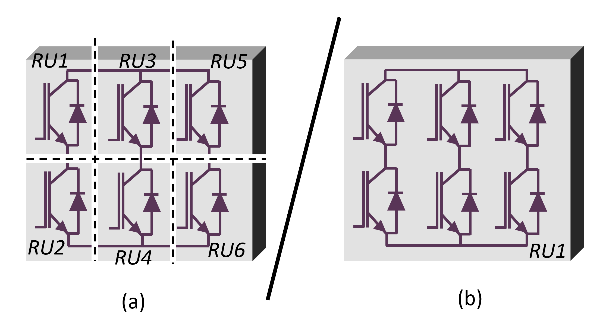
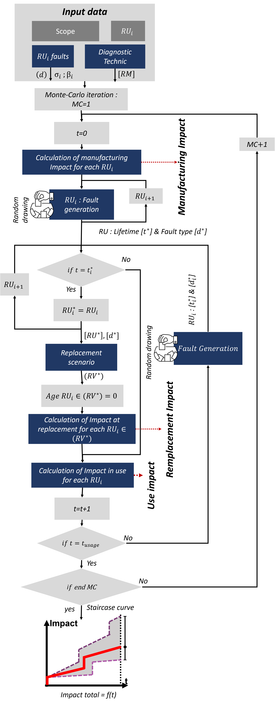
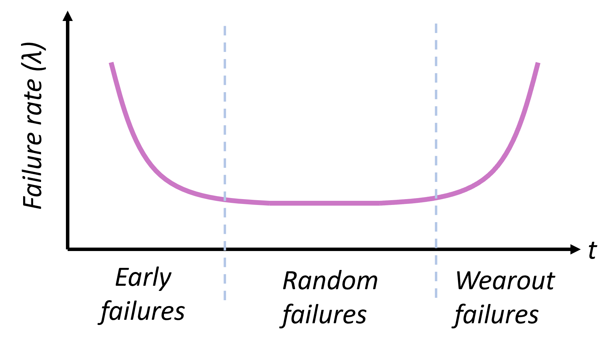
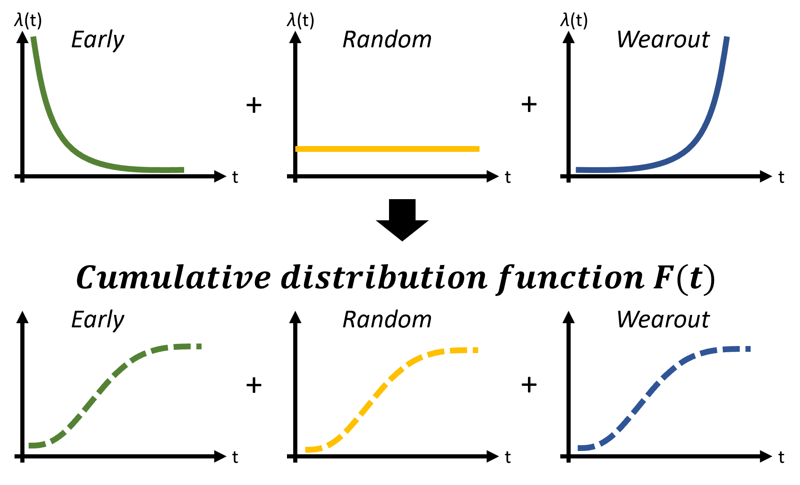

# Explanation of the algorithm

## Table of Contents
- [General](#general)
- [Manufacture & Use: quantifying Impacts](#manufacture-and-use-quantifying-impacts)
- [Fault model](#fault-model)
- [Diagnosis: replacement matrix (RM)](#Diagnosis-replacement-matrix-RM)
- [Fault generation](#Fault-generation)
- [Replacement: quantifying Impacts](#Replacement-quantifying-Impacts)

## General
In order to make the method more accessible, the general algorithm is presented in Figure 2. The parts colored in blue are developed in detail later.

The concept of a Replacement Unit (RU) is used. It represents the maximum level of modularity of the system that can be replaced; for example, a replacement unit can be an integrated module or a discrete component. When a UR is replaced, its age resets to zero. Consider the following example, Figure 2: In case (a), an inverter has 6 Replacement Units (RUs), allowing it to replace specific power chips individually. In contrast, case (b) consists of a single Replacement Unit, meaning that if a fault occurs, the entire system must be replaced.

    
    
Fig 1. Example of Replacement Unit (RU) representation.

 

First, a list of faults is established (d), along with the failure parameters (σ and β) for each replacement unit (RUi), as well as the replacement matrix [RM]. Then, at t = 0, the environmental impacts of the entire system at the manufacturing stage are calculated. Next, for each RUi, the time of occurrence and type of fault are generated randomly. This results in a lifetime vector [t*] and a fault type vector [d*] containing the information for each RUi.

In the time loop, if at a given moment ti equals t, this means a fault appears. At t = t, a list of all faulty RUi, RU*, is established. Then, depending on the fault, RUi, and diagnostics, a replacement scenario is defined for the URs that will be replaced at t = t*, forming the vector RV*.

This allows the calculation of the environmental impacts at the replacement of the faulty RUi. Next, the impacts during use over the period are calculated. Finally, the time advances to t + 1. This loop is repeated until the end of the chosen usage period, with a Monte Carlo sub-loop until the final number of iterations is reached.

    
    
Fig 2. Product life modelling with replacement and diagnostic.

## Manufacture & Use: quantifying Impacts
To quantify the impacts related to both manufacturing and use, an inventory for both aspects must be provided. As outlined in the README.md, the tool has been developed using the Python library Brightway2. Therefore, the input Excel file must follow a specific template for the inventory sections (sheets "Inventory - Manufacturing" and "Inventory - Use"). This template is the Brightway template; for more details, please refer to the specific library documentation.

For each inventory sheet, you need to create as many activities as there are unit processes (RUs). For instance, in the "Inventory - Manufacturing" sheet, the first activity represents the manufacturing of RU1, contructed with the "exchanges" flows. In the "Inventory - Use" sheet, each activity corresponds to the energy consumption of each RU during 1 hour of operation.

The tool, using the Brightway library, then enables the environmental impact quantification based on the selected impacts in the "LCIA" sheet.

## Fault model
Il a été remarqué que la dynamique du taux de défaillance dans le domaine de l'électronique suit une tendance illustrée par ce que l'on nomme communément la "courbe en baignoire", figure 3. Cette courbe caractérise les différentes phases de défaillance au cours de la DDV d'un dispositif, englobant ainsi la phase "jeunesse" (liée à des problèmes de conception ou de fabrication insuffisamment maîtrisés), la période de fonctionnement "vie utile" (où les défaillances surviennent de manière aléatoire) ainsi que le stade du "vieillissement" (résultant de l'usure).

    
    
Fig 3. Bathtub curve.

Pour évaluer la fiabilité des composants, des lois statistiques sont couramment utilisées. La fonction de Weibull est celle sélectionnée dans l'outil, car elle permet de reproduire la "courbe en baignoire". Elle est définie par deux paramètres σ and β le paramètre de forme. Le paramètre $\beta$ est lié à une période de la vie du composant. C’est-à-dire, les défaillances liées à la jeunesse ont un paramètre $\beta<1$, les défaillances aléatoires $\beta=1$, et les défaillances fin de vie $\beta>1$, figure \ref{weibull}. L’addition des trois fonctions de Weibull correspondant aux défauts jeunesse, de vie utile et de fin de vie permet de recréer la courbe en baignoire comme illustrée dans la figure \ref{ERW}

    
    
Fig 3. Modélisation de la courbe en baignoire à partir de trois fonctions défaut..

##  Diagnosis: replacement matrix (RM)

##  Fault generation

##  Replacement: quantifying Impacts

