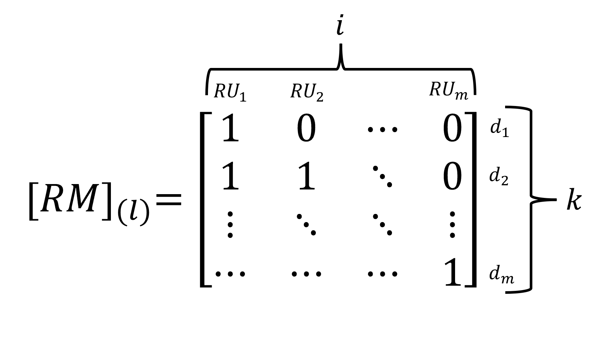
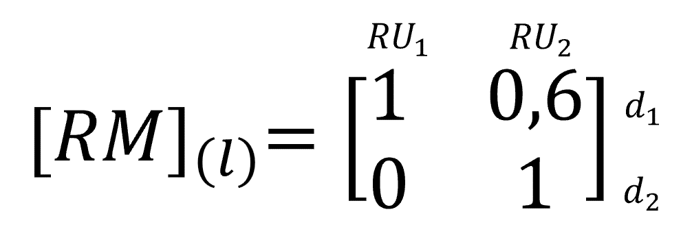
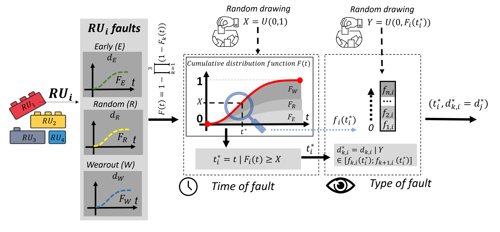
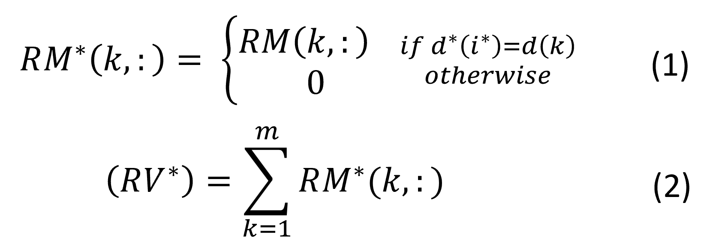
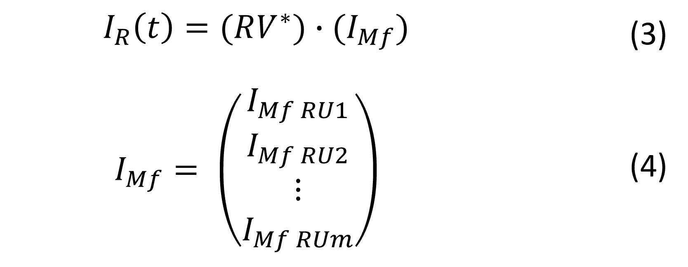

# Explanation of the algorithm

## Table of Contents
- [General](#general)
- [Manufacture & Use: quantifying Impacts](#manufacture-and-use-quantifying-impacts)
- [Fault model](#fault-model)
- [Diagnosis: replacement matrix (RM)](#Diagnosis-replacement-matrix-RM)
- [Fault generation](#Fault-generation)
- [Replacement: quantifying Impacts](#Replacement-quantifying-Impacts)

## General
In order to make the method more accessible, the general algorithm is presented in Figure 2. The parts colored in blue are developed in detail later.

The concept of a Replacement Unit (RU) is used. It represents the maximum level of modularity of the system that can be replaced; for example, a replacement unit can be an integrated module or a discrete component. When a UR is replaced, its age resets to zero. Consider the following example, Figure 2. In case (a), an inverter has 6 Replacement Units (RUs), allowing it to replace specific power chips individually. In contrast, case (b) consists of a single Replacement Unit, meaning that if a fault occurs, the entire system must be replaced.

    
    
Fig 1. Example of Replacement Unit (RU) representation.

 

First, a list of faults is established (d), along with the failure parameters (σ and β) for each replacement unit (RUi), as well as the replacement matrix [RM]. Then, at t = 0, the environmental impacts of the entire system at the manufacturing stage are calculated. Next, for each RUi, the time of occurrence and type of fault are generated randomly. This results in a lifetime vector [t*] and a fault type vector [d*] containing the information for each RUi.

In the time loop, if at a given moment ti equals t, this means a fault appears. At t = t, a list of all faulty RUi, RU*, is established. Then, depending on the fault, RUi, and diagnostics, a replacement scenario is defined for the URs that will be replaced at t = t*, forming the vector RV*.

This allows the calculation of the environmental impacts at the replacement of the faulty RUi. Next, the impacts during use over the period are calculated. Finally, the time advances to t + 1. This loop is repeated until the end of the chosen usage period, with a Monte Carlo sub-loop until the final number of iterations is reached.

    
    
Fig 2. Product life modelling with replacement and diagnostic.

## Manufacture & Use: quantifying Impacts
To quantify the impacts related to both manufacturing and use, an inventory for both aspects must be provided. As outlined in the README.md, the tool has been developed using the Python library Brightway2. Therefore, the input Excel file must follow a specific template for the inventory sections (sheets "Inventory - Manufacturing" and "Inventory - Use"). This template is the Brightway template; for more details, please refer to the specific library documentation.

For each inventory sheet, you need to create as many activities as there are unit processes (RUs). For instance, in the "Inventory - Manufacturing" sheet, the first activity represents the manufacturing of RU1, contructed with the "exchanges" flows. In the "Inventory - Use" sheet, each activity corresponds to the energy consumption of each RU during 1 hour of operation.

The tool, using the Brightway library, then enables the environmental impact quantification based on the selected impacts in the "LCIA" sheet.

## Fault model
It has been observed that the failure rate dynamics in the electronics field follow a trend commonly illustrated by the "bathtub curve," as shown in Figure 3. This curve characterizes the different failure phases during a component's lifecycle, encompassing the "Early" phase (related to issues from inadequate design or manufacturing), the "Random" phase (where failures occur randomly), and the "wearout" phase (resulting from aging).

    
    
Fig 3. Bathtub curve.

To assess component reliability, statistical laws are commonly used. The Weibull distribution is employed in this tool because it can replicate the "bathtub curve." It is defined by two parameters: σ (scale parameter) and β (shape parameter). The β parameter is associated with different phases of the component's life. Specifically, β<1 corresponds to the early phase, β=1 to the random failures during the useful life, and β>1 to the wearout phase. By combining three Weibull functions representing early, random, and wearout failures, the bathtub curve can be reconstructed, as illustrated in Figure 4.

    
    
Fig 4. Modeling the bathtub curve using three failure functions.

Each Reliability Unit (RU) thus has three failure functions, and the parameters to be selected are found in the "Faults" sheet.

##  Diagnosis: replacement matrix (RM)
The tool allows models the diagnosis associated with the system, specifically detailing the replacement scenarios when a fault occurs. This includes identifying what components are replaced within the system, To achieve this, this sheet constructs the Replacement Matrix (RM). 
To develop the Replacement Matrix, it is necessary to model the diagnostic observation for each type of fault (Early, Random, and Wearout). Depending on the type of fault detected, the diagnosis can infer the location of the failure. The inferred part is then replaced, forming a replacement scenario. Understanding the consequences of the mentioned faults and the diagnostic perspective is crucial. A fault tree can be constructed to link the fault, its effects, observations of these effects, and the replacement scenario.
The numbers in the matrix represent the average proportion of each component replaced when a fault occurs in a specific Reliability Unit (RU), with values ranging from 0 to 1. The Replacement Matrix [RM] specific to a diagnostic technique (l) can be constructed as shown in Figure 5. RUi represents the replacement unit i, ranging from 1 to m, and dk represents fault k of the replacement unit i. The columns of the matrix are labeled i and represent the RUs to be replaced (e.g., RU1), while the rows k represent faults in a specific RU (e.g., Fault RU1).

    
    
Fig 5. Replacement Matrix [RM] for a specific diagnosis (l).
    

For clarity, consider an example with 2 RUs, resulting in a 2x2 matrix, as shown in Figure 6. In this example, if the value in the first row, first column (Fault RU1; RU1) is 1, and the value in the first row, second column (Fault RU1; RU2) is 0.6, this indicates that when a fault occurs in RU1, 100% of RU1 and 60% of RU2 are replaced according to the diagnosis.

    
    
Fig 6. Example with 2 RUs, Replacement Matrix [RM] for a specific diagnosis (l).

##  Fault generation
In this section, we will detail how we determine the occurrence time of faults for each RU. Figure 7 illustrates the algorithm for determining the type of fault.

    
    
Fig 7. Fault generation algorithm.

Initially, the global distribution function of the RU must be found. It is necessary to associate faults within a replacement unit. Faults can be associated in series, meaning all subsystems must function for the overall system to be operational.
Once the distribution function is established, it is compared to a random number between 0 and 1, generated according to a uniform distribution. This comparison helps determine the fault time (ti*) for the RUi. If the random number is less than the distribution function, it indicates the fault time ti*.

##  Replacement: quantifying Impacts
The previous sections describe, on one hand, the creation of the replacement matrix based on faults and diagnostics for the input data, and on the other hand, the fault generation. To calculate the Impact related to replacement (IR), it remains to link the two. For this purpose, depending on the fault at a given time t, we will generate a replacement vector (RV), which is mathematically expressed as follows:

    
    
Fig 8. Equation to quantify replacement.

Where i* represents the RUi in fault, d* the faults at t, and d the vector of all faults. RV* represents the replacement vector when a fault occurs at t*, and RM*(k,:) is the k-th row of RM*.

Then, to quantify the impact of replacement IR, simply perform the matrix calculation of the replacement vector with the impact matrix for the manufacturing of each component:

    
    
Fig 9. Equation to quantify impact of replacement.

Where Imf represents the environmental impacts during manufacturing.
