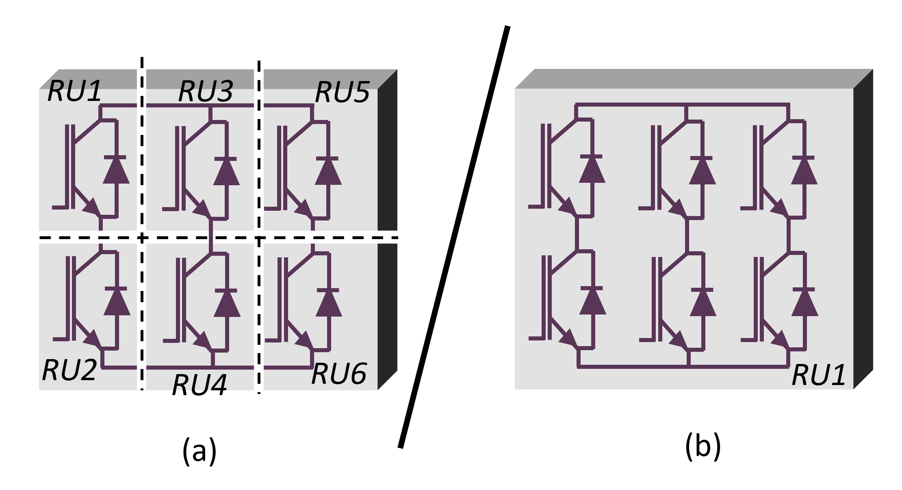
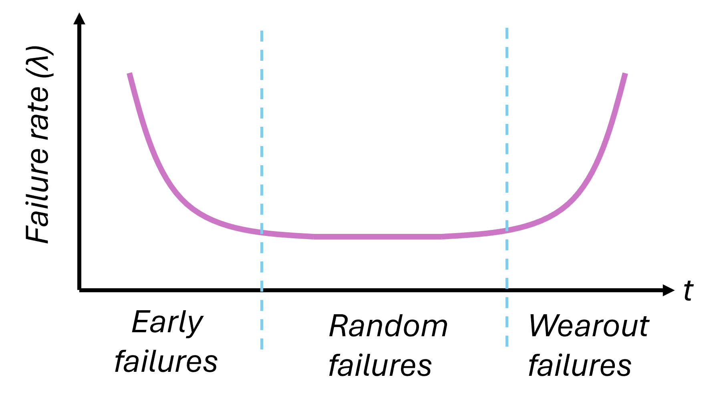
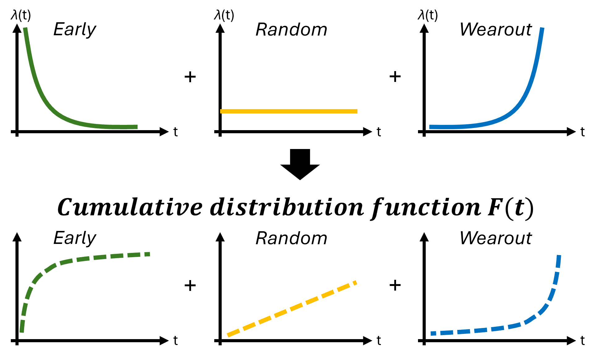
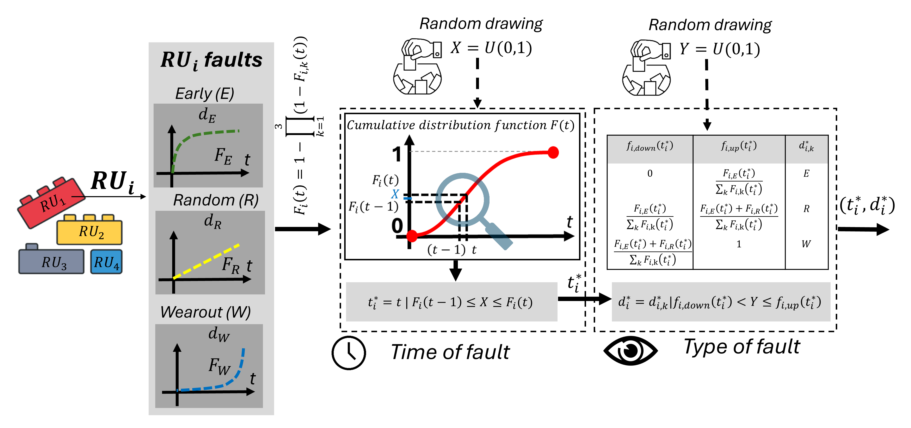
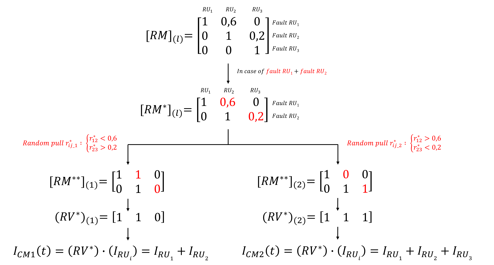

# Explanation of the algorithm

## Table of Contents
- [General](#general)
- [Manufacture & Use : quantifying Impacts](#manufacture--use-quantifying-impacts)
- [Fault model](#fault-model)
- [Fault generation](#fault-generation)
- [Curative Maintenance: replacement matrix (RM) & quantifying impacts](#curative-maintenance-replacement-matrix-rm--quantifying-impacts)

## General
The PELCA algorithm is based on the concept of Replacement Unit (RU). It represents the maximum level of modularity of the system that can be dismantled and replaced; for example, a RU can be an integrated module or a discrete component (assuming they can be dismantled). When a RU is replaced, its age is reset to zero.

Consider the example of an inverter in Figure 1: in case (a), the inverter has 6 RUs, allowing to replace a specific power switch individually. In contrast, case (b) consists of a single RU-inverter, meaning that if a fault occurs, the entire system must be replaced.

    
      Fig. 1 : Example of Replacement Unit (RU) representation.

The general algorithm of PELCA is presented in Figure 2 and applies to each RU and Monte-Carlo iteration in parallel.

At t = 0, the environmental and economic impacts of the entire system at the manufacturing stage are calculated based on the ‘Inventory – manufacturing’ and the *‘Cost – price’* inputs of the input Excel file.

At each Monte-Carlo iteration, random pulls are performed at different steps of the algorithm to determine, for each RUi :

1.	The time occurrence of faults _[ti*]_ and the type of fault _[di*]_ (early, random, or wear-out) ; this results in a lifetime vector _[t*]_ and a fault type vector _[d*]_ containing the information for each RUi ;

2. The replacement of the concerned RU when it fails or when other RUs fail, based on the replacement matrix (RM) ; this results in a replacement ratios vector _[ri,j*]_ containing the information for each RUi.

Such random pulls are performed at several steps of the algorithm :
-	At the beginning of each Monte Carlo iteration ;
-	If the RU is replaced due to preventive maintenance, at the end of the preventive maintenance step ;
-	If the RU is replaced due to curative maintenance, at the end of the curative maintenance step.

The PELCA algorithm includes two types of maintenance (carried out sequentially in the following order) :

-	**Preventive maintenance** : based on schedule (year of maintenance) ; this type of maintenance can be enabled or disabled and fine-tuned by the user in the input Excel file (see sheet ‘_Staircase_’ to enable / disable and sheet ‘_Faults & Prev. Maint._’, respectively).

When a preventive maintenance occurs, the concerned RU is replaced by a new one. Thus, the environmental impacts induced by the manufacturing of the RU and economic impact induced by the maintenance operation, calculated as the sum of the raw RU price, assembly and disassembly costs, are append to their respective totals. Those cost / price information can be fine-tuned by the user in the ‘_Cost - Price_’ sheet of the input Excel file (see [Example Overview]("ExampleOverview.md")).

After a preventive maintenance step, the age of the RU that has been replaced is reset to 0. 

If the preventive maintenance is deactivated by the user, the time loop bypasses the preventive maintenance and moves directly to curative maintenance.

-	**Curative maintenance** : based on faults and diagnosis, it consists in replacing one or several units when one unit fails, according to the replacement matrix (RM) coefficients (sheet ’_Cur. Maint. (replac. matrix)_’ of the input Excel file) ;

In the time loop, if at a given moment _ti*_ equals _t_, this means a fault appears. At _t = t*_, a list of all faulty _RUi_, _RU*_, is established. Then, depending on the faults and diagnoses, a replacement scenario is defined for the RUs that will be replaced at _t = t*_, forming the vector _RV*_. This allows the calculation of the environmental and economic impacts at the replacement of the faulty _RUi_.

Therefore, when a curative maintenance occurs, the different RUs are replaced based on the coefficients of the replacement matrix (RM, see section Diagnosis & Curative Maintenance below). Similarly to the preventive maintenance, when a RU is replaced based on curative maintenance, the environmental impacts induced by the manufacturing of the RU and economic impact induced by the maintenance operation, calculated as the sum of the raw RU price, assembly and disassembly costs, are append to their respective totals. After a curative maintenance step, the age of the RUs that have been replaced are reset to 0.

Additionally, the environmental and economic impacts during use are calculated.

Finally, the time advances to t + 1. This loop is repeated until the end of the chosen usage period, with a Monte Carlo sub-loop until the final number of iterations is reached.

    
      Fig. 2 : PELCA algorithm - Product life modelling with replacement and diagnostic.

## Manufacture & Use: quantifying Impacts
To quantify the impacts related to both manufacturing and use, an inventory for both aspects must be provided. As outlined in the readMe.md, the tool has been developed using the Python library Brightway2. Therefore, the input Excel file must follow a specific template for the inventory sections (sheets ’_Inventory - Manufacturing_’ and ’_Inventory - Use_’). This template is the Brightway template ; for more details, please refer to the specific library documentation.

For each inventory sheet, you need to create as many activities as there are RUs. For instance, in the ’_Inventory - Manufacturing_’ sheet, the first activity represents the manufacturing of RU1, constructed with the "exchanges" flows. In the ’_Inventory - Use_’ sheet, each activity corresponds to the energy consumption of each RU during 1 hour of operation.

The tool, using the Brightway library, then enables the environmental impact quantification based on the impact categories listed in the ’_LCIA_’ sheet of the input Excel file.

## Fault model
It has been observed that the failure rate dynamics in the electronics field follow a trend commonly illustrated by the "bathtub curve", as shown in Figure 3. This curve characterizes the different failure phases during a component's lifecycle, encompassing the "Early" phase (related to issues from inadequate design or manufacturing), the "Random" phase (where failures occur randomly), and the "Wear-out" phase (resulting from ageing).

    
      Fig. 3 : Bathtub curve.

To assess component reliability, statistical laws are commonly used. The Weibull distribution is employed in this tool because it can replicate the "bathtub curve". It is defined by two parameters : σ (scale parameter) and β (shape parameter). The β parameter is associated with different phases of the component's life. Specifically, β < 1 corresponds to the early phase, β = 1 to the random failures during the useful life, and β > 1 to the wear-out phase. By combining three Weibull functions representing early, random, and wear-out failures, the bathtub curve can be reconstructed, as illustrated in Figure 4. 

    
      Fig. 4 : Modeling the bathtub curve using three failure functions.

Each RU thus has three failure functions. The three types of failure can be enabled / disabled and the values of the Weibull parameters can be fine-tuned by the user in the ‘_Staircase_’ and ’_Faults and Prev. Maint._’ sheets of the input Excel file, respectively.

## Fault generation
In this section, we will detail how we determine the occurrence time of faults and the type of fault for each RU. Figure 5 illustrates the algorithm for determining the time and type of fault.

    
      Fig. 5 : Fault generation algorithm.

Initially, the total cumulative distribution function (CDF) _Fi_ of each _RUi_ accounting for early, random and wear-out faults must be determined. It is necessary to associate faults within a replacement unit. Faults can be associated in series, meaning all subsystems must function for the overall system to be operational. Once the cumulative distribution function is established, a random number _X_ is drawn between 0 and 1 according to a uniform distribution. If the condition _Fi (t −1)_ < _X_ ≤ _Fi (t)_ is satisfied, time step t is considered to be a fault time for _RUi_, denoted as _ti*_. A second random number _Y_ is used to determine the fault type (i.e. early, random or wear-out) _di*_, based on the probabilities associated with each fault type at the time of the fault.

This algorithm allows for determining, for each RU, both the time at which a fault occurs (_ti*_) and the type of fault that occurs (_di*_). This enables the generation of two vectors, _t*_ and _d*_, of size _m_, representing the occurrence times and fault types for each RU, respectively.

## Curative Maintenance: replacement matrix (RM) & quantifying impacts
PELCA allows modelling the ability of a system composed of several RUs to diagnostic a fault and to be repaired based in this diagnosis (curative maintenance) through the replacement matrix (RM), which details the replacement scenarios (i.e. which RU is replaced) when a fault occurs.  

The numbers in the RM represent the probability to replace each RU when a fault occurs in a specific RU, with values ranging from 0 to 1.

For clarity, consider an example with 3 RUs, resulting in a 3 x 3 matrix, as shown in Figure 6. 

    
      Fig. 6 : Replacement Matrix [RM] - Example with 3 RUs.

The columns of the matrix represent the RUs and the rows represent the faults. In this example, the first row, second column (_Fault RU1_, _RU2_) is 0,6 ; the second row, third column (_Fault RU2_, _RU3_) is 0,2. Note that the values in the diagonal of the matrix are always 1 since each _RUi_ is replaced with 100 % probability when _Fault RUi_ occurs.

Those values indicate that : 
-	When a fault occurs in _RU1_ : _RU1_ is replaced with 100 % probability and _RU2_ is replaced with 60 % probability ;
-	When a fault occurs in _RU2_ : _RU2_ is replaced with 100 % probability and _RU3_ is replaced with 20 % probability ;
-	When a fault occurs in _RU3_ : _RU3_ is replaced with 100 % probability.

Based on this _RM_, a fault generation random pull and a replacement ratios random pull are carried out in parallel (see Fig. 2).

Based on the result of the fault generation random pull, a reduced replacement matrix [_RM*_] is extracted from replacement matrix [_RM_], which only contains the lines corresponding to faulty RUs. In Fig. 6, the result of this random pull is ‘_Fault RU1 + Fault RU2_’, which leads to a 2 x 3 [_RM*_] matrix.

Based on this _RM*_ matrix, Fig. 6 attempts to illustrate the impact of two different replacement ratios random pulls (although only one replacement ratios random pull is carried out at each curative maintenance step) :

1. Random pull _r*ij_1_ : 
   - The drawn number for _r*12_ is located between 0 and 0,6 => _RU2_ is replaced when _Fault RU1_ occurs => _RM**12_ = 1
   - The drawn number for _r*23_ is located above 0,2 => _RU3_ is not replaced when _Fault RU2_ occurs => _RM**23_ = 0

2. Random pull _r*ij_2_ :
   - The drawn number for _r*12_ is located above 0,6 => _RU2_ is not replaced when _Fault RU1_ occurs => _RM**12_ = 0
   - The drawn number for _r*23_ is located between 0 and 0,2 => _RU3_ is replaced when Fault RU2 occurs => _RM**23_ = 1

This leads to the calculation of two replacement vectors (_RV*_) of 1 x 3 dimensions ; each column of (_RV*_) is calculated by adding the values in each column of the [_RM**_] matrix ; if the sum is higher than 1, the value of the corresponding column in (_RV*_) is set to 1. 

Based on (_RV*_), the impacts (including both environmental and economic impacts) of the curative maintenance step (_ICM_) are calculated based on the following approach :  

- The environmental impact (_EI_) of the replacement of RUi based on curative maintenance equals the manufacturing impact of the raw unit ;

- The economic impact (cost/price) of the replacement of RUi based on curative maintenance is equal to the sum of the costs of the raw unit, of disassembly, and of assembly.

For each _RUi_, such calculation of the impacts of curative maintenance is carried out as many times as there are Monte Carlo iterations to be ran.