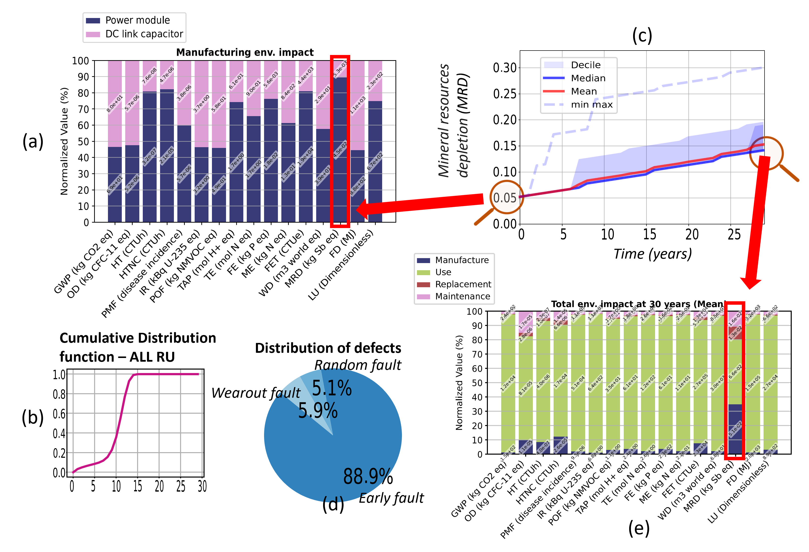

## Example Overview

This example is inspired by the case study presented in the thesis:
[Consult the thesis](https://theses.hal.science/tel-04659788)

The example is based on a two-Replacement Unit (RU) system:
- An IGBT power module (750V; 820A)
- A DC bus filtering capacitor

The data used are provided in the `Input - Example.xlsx` file. In the Excel file, modify the red-highlighted cells in the 'LCA' sheet to ensure the example works correctly.
The example was calculated using the Ecoinvent library "ecoinvent 3.9_cutoff_ecoSpold02".
<div align="center">
    
</div>
<div align="center">
    
</div>

### Fault Selection

In this first example, only the faults are selected. Therefore, the "Maintenance" cell in the "Staircase" sheet (B14) is set to "False". The "Early failure", "Random failure", and "Wearout failure" cells are set to "True", as illustrated in the following figure. We can also observe the values of the Weibull functions for the three types of failures, sheet "Faults & Maintenance". It is important to note that the values in the "Maintenance (year)" column are not considered, as "Maintenance" has been set to "False". Additionally, we can see the chosen diagnosis in the "Replac. Matrix" sheet. In this case, it is a poor diagnosis because when one RU fails, all RU1 and RU2 are replaced at 100%.
<div align="center">
    
</div>

### Running the Tool

Upon launching the tool, you will see the following interface:

<div align="center">
    
</div> 

Click on `Browse` to select the `Input - Example.xlsx` file, file provided in the Example folder of the repository, then press the `Run Script` button.

The terminal on the left will show the script execution process. When the calculation is complete, you will see the message "PELCA executed successfully". Additionally, various plots will be displayed as follows:

<div align="center">
    
</div>

Calculation results will be located in the `Results PELCA` folder.

<div align="center">
    
</div>

### Explanation of the graphs
The following Figure presents the types of results and graphs that can be generated with PELCA. Figure (a) shows the environmental impacts related to the manufacturing of each Replacement Unit, i.e., the power module and the DC link capacitor. Figure 4 (b) displays the distribution function, representing the probability of failure between 0 and 1 over time, plotted for the complete system. Figure (c) illustrates the evolution of the Mineral resources depletion (MRD) impact over time, considering probabilistic failures and replacements based on the level of diagnosability. This Figure (c) is explained with Figure (d), which shows the distribution of failures at 30 years, where the majority of failures are due to wearout. This explains why, in Figure (c), the median curve has a step at 12 years, corresponding to the wearout failure of the capacitor. The step indicates the replacement of the entire system since the chosen diagnostic does not allow for the precise identification of the failure's location. Figure (e) presents the median impacts at 30 years, with proportions related to manufacturing, use, and replacement.

<div align="center">
    
</div>

### Implementing Maintenance

Now we will implement maintenance. In the "Staircase" sheet, we set maintenance to "True", as shown in the following figure. In the "Faults & Maintenance" sheet, we set a preventive maintenance schedule for RU1 at 35 years and for RU2 at 8 years before its wearout, where sigma is set to 12 years for RU2.

<div align="center">
    
</div>

The results obtained are as follows:

<div align="center">
    
</div>

We can see that there are significantly fewer failures related to wearout, as RU2 is replaced through preventive maintenance before reaching its wearout. This allows the MRD at 30 years to be reduced in this example by -32% compared to the case without preventive maintenance.

### Saving Data

You can navigate between plots using the `Next` and `Previous` buttons or by clicking directly on the plot image. To save a specific plot, display the chosen plot and click the `Save` button. To save all plots, click the `Save All` button. The plots will be saved in the same directory as `Input - Example.xlsx`.

You can also choose to save lifecycle data for all RUs across all Monte Carlo iterations. The data options include total impacts, manufacturing-only impacts, usage-only impacts, faluts causes or RU age. Select the data you wish to save and click the `Save Data` button. This will open a folder selector, allowing you to save the data in your chosen location.

To reuse the data in Python, you can use the following code (the `recover_data.py` function can be found in the example folder):

```python
import recover_data
data_example=recover_data._rd_np(path_example,"data_example.npy")
```
