<p align="center">
    
</p>

# Example Overview

## Input Excel file example


An input Excel file example is provided in the ‘Input Example’ folder of the repository for the user to be able to run PELCA : _inputExample_v1.3.0_PowerModuleAndCapacitor.xlsx_

This example is inspired by the case study presented in the Ph.D. thesis of Briac Baudais: [Consult the thesis](https://theses.hal.science/tel-04659788)

The example is based on a two-Replacement Unit (RU) power electronic system composed of :

- An IGBT power module (750 V ; 820 A) ;
- A DC bus filtering capacitor.

The inventories of the manufacturing and use phase of both RUs are included in the ‘_Inventory – Manufacturing’ and ‘Inventory – Use_’ sheets of the example input Excel file, respectively:

<p align="center">
    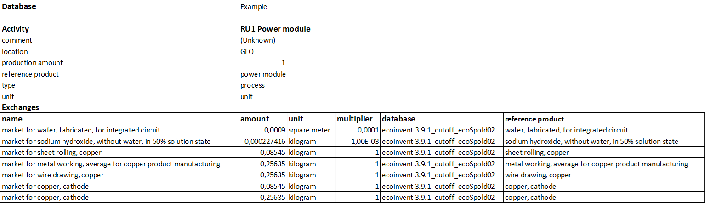
    <br>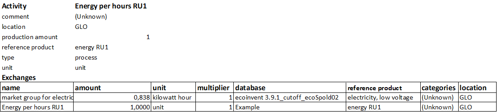
    <br> Fig. 1 : Views of the ‘Inventory – Manufacturing’ (top) and ‘Inventory – Use’ (bottom) sheets of the input Excel file
</p>

Those manufacturing and use inventories are based on the ecoinvent database _ecoinvent 3.9.1_cutoff_ecoSpold02_. Details on how to download and install the database can be found in the installation guide of PELCA ([README](README.md)).

In the ‘_LCA_’ sheet of the input Excel file, the user has to modify the cells in red before running PELCA:


<p align="center">
    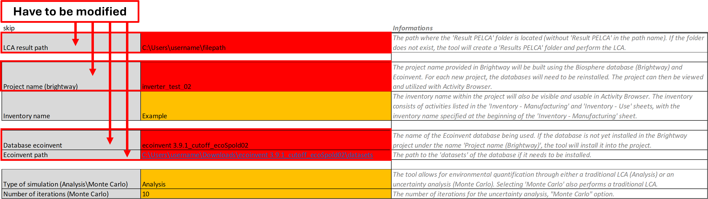
    <br> Fig. 2 : View of the ‘LCA’ sheet of the input Excel file
</p>

| Parameter | Example | Description |
|-----------|---------|-------------|
| **LCA result path** | `C:\Users\username\filepath` | Path where the _'Results PELCA'_ folder will be created. If the folder doesn’t exist, it will be created automatically. |
| **Project name (Brightway)** | `inverter_test_02` | Name of the project in Brightway. Databases must be reinstalled for each new project. |
| **Database ecoinvent** | `ecoinvent 3.9.1_cutoff_ecoSpold02` | Name of the Ecoinvent database used in Brightway. |
| **Ecoinvent path** | `C:\Users\username\Downloads\ecoinvent 3.9.1_cutoff_ecoSpold02\datasets` | Path to the `datasets` folder of the Ecoinvent database. |


## Selection of faults & maintenance configuration


In the ‘_Staircase_’ sheet of the input example provided, only the faults are activated. Therefore, the ’_Preventive maintenance_’ cell (B14) is set to ’_False_’ while the ’_Early failure_’(B10), ’_Random failure_’ (B11), and ’_Wearout failure_’ (B12) cells are set to ’_True_’, as shown in the following figure. 

<p align="center">
    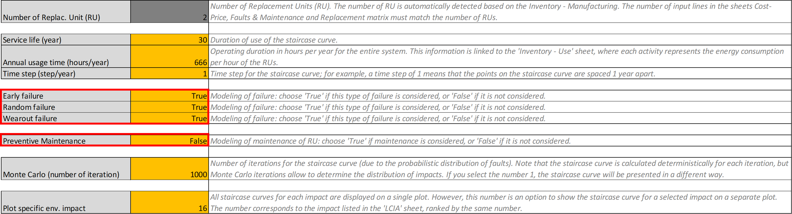
    <br> Fig. 3 : View of the ‘Staircase’ sheet of the input Excel file
</p>

In the ‘_Faults & Prev. Maint._’ Sheet of the input Excel file, one can also observe the values of the Weibull parameters (sigma & beta) for the three types of failures. It is important to note that the values in the ’Prev. Maintenance (year)’ column are not considered, as ’_Preventive Maintenance_’ has been set to ’_False_’ in the ‘_Staircase_’ sheet of the input Excel file (see Fig. 3).

<p align="center">
    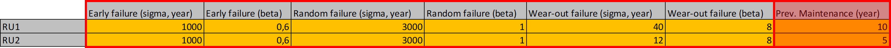
    <br> Fig. 4 : View of the ‘_Faults & Prev. Maint._’ sheet of the input Excel file
</p>

Additionally, we can see the chosen diagnosis & curative maintenance configuration in the ’_Cur. Maint. (replac. matrix)_’ sheet of the input Excel file. In this case, it is a poor diagnosis because when one RU fails, all RU1 and RU2 are replaced at 100%. 

<p align="center">
    
    <br> Fig. 5 : View of the ‘Cur. Maint. (replac. matrix)’ sheet of the input Excel file
</p>

More details regarding the replacement matrix and the impact of its content on the PELCA simulation can be found in the _Algorithm.md_ file.

## Running the Tool


Upon launching the tool (either by launching the executable application or by running the _main.py_ Python script), the following graphical user interface will pop-up:

<p align="center">
    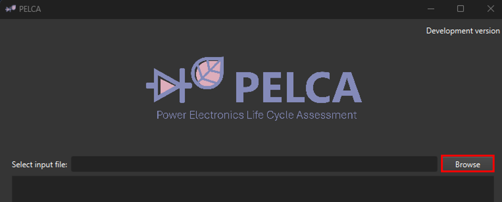
    <br> Fig. 6 : View of the main graphical user interface (GUI) of PELCA
</p>

Click on ‘_Browse_’ to select the _inputExample_v1.3.0_PowerModuleAndCapacitor.xlsx_ file, provided in the ‘_Example_’ folder of the repository.

Once the Excel file has been browsed, the user has two options : 
1.	Run PELCA by clicking on the ‘Run LCA + Staircase’ button => this option will launch the calculation of the manufacturing & use phases LCA (which will be compiled in the ‘LCA output’ results Excel file stored in the ‘Results PELCA’ folder) and the calculation of the staircase curves (which will be compiled in the ‘Staircase output’ results Excel file stored in the ‘Results PELCA’ folder) ;


2. Run PELCA by clicking on the ‘Run Staircase only’ button  this option will launch only the calculation of the staircase curves, based on an existing ‘LCA output’ results Excel file, and leads to the creation of a ‘Staircase output’ results Excel file stored in the ‘Results PELCA’ folder.

<p align="center">
    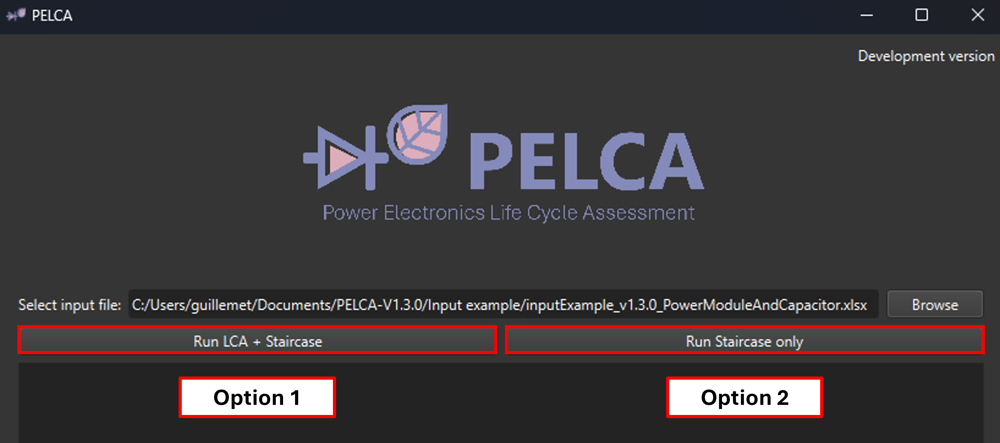
    <br> Fig. 7 : View of the two options to run PELCA once the input Excel file has been browsed.
</p>

The terminal will show the script execution process. When the calculation is complete, you will see the messages ‘Analysis completed’ and ’Script executed successfully in the worker thread’ written in the main terminal :

<p align="center">
    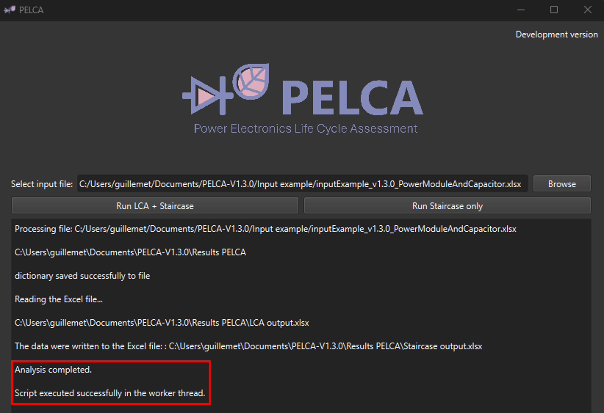
    <br> Fig. 8 : View of the main terminal after execution of PELCA by clicking the ‘Run Staircase only’ button  
</p>

Additionally, a second window will appear displaying various result graphs, as shown below :

<p align="center">
    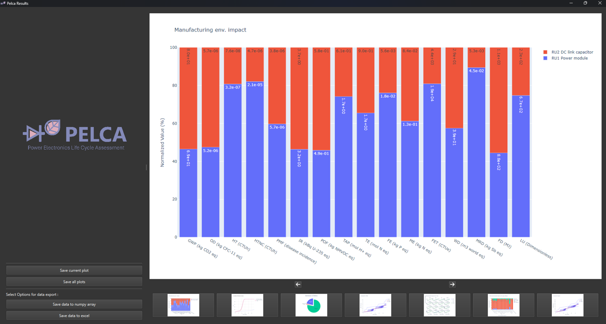
    <br> Fig. 9 : View of the PELCA results window displaying the different graphs generated after execution. 
</p>

The user can navigate between the plots using the next and previous arrow buttons or by clicking directly on the plot image. 

## Saving Data

The calculation results Excel files (‘LCA outpout’ and ‘Staircase output’) and all saved data from the PELCA simulation will be located in the ‘Results PELCA’ folder, of which location has been set by the user in the ‘LCA’ sheet of the input Excel file (cell B2, see Fig. 2).

```Results PELCA```

In the graphical results window of PELCA (Fig. 9), the user can save a specific plot by displaying the chosen plot and clicking on the ‘Save current plot’ button. 

To save all plots, click on the ‘Save all plots’ button. 

By default, the plots will be saved in HTML, PNG, and SVG formats, in three dedicated subfolders located in the ‘plots’ folder located in the ‘Results PELCA’ folder :


```plots```
- [X] ```html```
- [X] ```png```
- [X] ```svg```

The user can also save lifecycle data for all RUs across all Monte Carlo iterations by clicking the ‘_Save data to numpy array_’ or ‘_Save data to excel_’ buttons, in either numpy data format or Excel format, respectively. The data will be automatically saved in dedicated ‘_excel_’ and ‘_numpy_’ folders located in the ‘_Results PELCA_’ folder :

- [X] ```excel```
- [X] ```numpy```

The data options include : distribution of defects (‘_fault_cause.xlsx_’), manufacturing-only impacts (‘_Impact_manu.xlsx_’), usage-only impacts (‘_Impact_use.xlsx_’), total impacts (manufacturing + usage) (‘_Impact_total.xlsx_’), and RU age data (‘_RU_age.xlsx_’) :

- [X] ```fault_cause```
- [X] ```Impact_manu```
- [X] ```Impact_total```
- [X] ```Impact_use```
- [X] ```RU_age```

However please note that the formating of the output data in Excel format is not optimized yet ; this will be consolidated in a future release of PELCA.
To reuse the data in Python, you can use the following code (the recover_data.py function can be found in the ‘Input example’ folder) :

```python
import recover_data
data_example=recover_data._rd_np(path_example,"data_example.npy")
```

## Explanation of the graphs

Figure 10 presents the types of results and graphs that can be generated with PELCA. In this example, the preventive maintenance is deactivated (set to ‘False’ in the ‘Staircase’ sheet of the input Excel file) and the system relies only on curative maintenance based on faults and diagnosis.

Below are the graphs details :

(a) shows the environmental impacts related to the manufacturing of each Replacement Unit, i.e., the power module and the DC link capacitor ;

(b) displays the distribution function, representing the probability of failure between 0 and 1 over time, plotted for the complete system ;

(c) illustrates the evolution of the Mineral resources depletion (MRD) impact over time, considering probabilistic failures and replacements based on the level of diagnosticability ;

(c) is explained with (d), which shows the distribution of failures at 30 years, where the majority of failures are due to wear-out. This explains why, in (c), the median curve has a step at 12 years, corresponding to the wear-out failure of the capacitor. The step indicates the replacement of the entire system since the chosen diagnostic does not allow for the precise identification of the failure's location ;

(e) presents the median impacts at 30 years, with proportions related to manufacturing, use, and replacement.

<p align="center">
    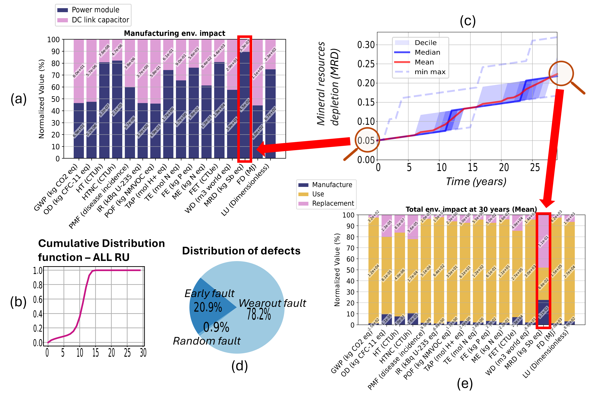
    <br> Fig. 10 :  View of the different types of figures which can be generated by PELCA ; example without preventive maintenance
</p>

## Implementing Preventive Maintenance

The user can implement preventive maintenance by setting to ‘_True_’ the Preventive Maintenance cell (B14) of the ‘_Staircase_’ sheet of the input Excel file : 

<p align="center">
    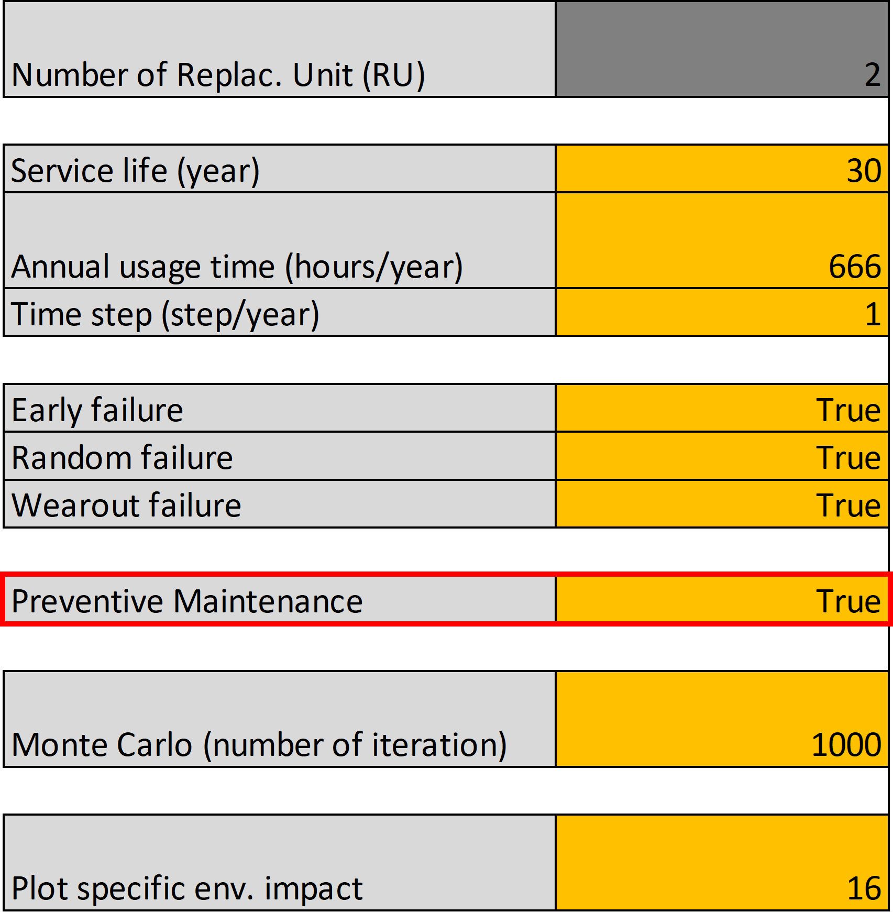
    <br> Fig. 11 : View of the ‘Staircase’ sheet of the input Excel file with preventive maintenance ON
</p>

In the ‘_Faults & Prev. Main._’ sheet of the input Excel file, the user is invited to provide time inputs (in years) for the preventive maintenance schedule. In the figure below, the preventive maintenance schedule is set to 35 years for RU1 and 8 years for RU2, while the sigma Weibull parameter of RU2 is set to 12 years (cell F6, Fig. 4): 

<p align="center">
    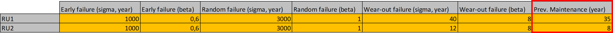
    <br> Fig. 12 : View of the ‘Faults & Prev. Maint.’ sheet of the input Excel file with preventive maintenance schedule
</p>

The results obtained are as follows :

<p align="center">
    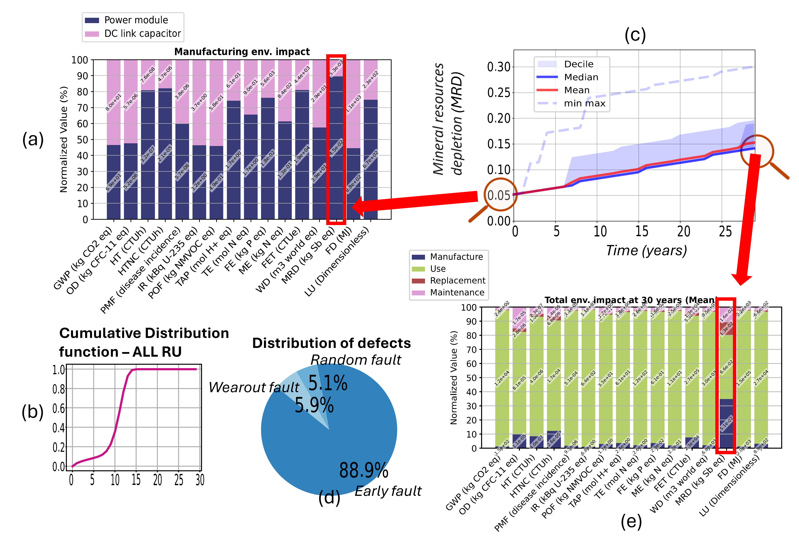
    <br> Fig. 13 : View of the different types of figures which can be generated by PELCA ; example with preventive maintenance
</p>

We can see that there are significantly fewer failures related to wear-out, as RU2 is replaced through preventive maintenance before reaching its wear-out. This allows the MRD at 30 years to be reduced in this example by -32% compared to the case without preventive maintenance.

It should be noted that for both of the previous examples, with and without preventive maintenance, the diagnosticability and curative maintenance capability of the system is set to zero (i.e. the replacement matrix is filled with 100 % in all cells) : 

<p align="center">
    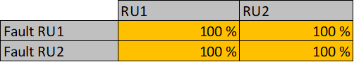
    <br> Fig. 14 : View of the ‘Cur. Maint. (replac. matrix)’ sheet of the input Excel file
</p>

## Economic impact assessment

The version 1.3.0 of the PELCA software allows the assessment, in addition to the 16 environmental impacts of the PEF method, of the economic impact of the life cycle of a system.

This feature is illustrated by the ‘_Cost – Price_’ sheet of the input Excel file :

<p align="center">
    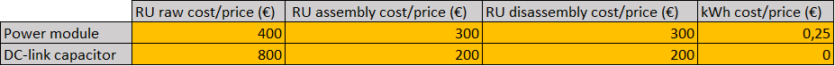
    <br> Fig. 15 : View of the ‘Cost - Price’ sheet of the input Excel file
</p>

The user is invited to provide the following cost / price inputs (in euros) :
-	Cost / price of raw RU ;
-	Cost / price of assembly ;
-	Cost / price of disassembly ;
-	Cost / price of energy use.

Those cost / price inputs lead to the generation by PELCA of a staircase curve describing, similarly to the environmental impacts assessment, the evolution of the economic impact of the system along its life cycle, taking into account the failures rates, preventive maintenance, and curative maintenance inputs provided by the user :

<p align="center">
    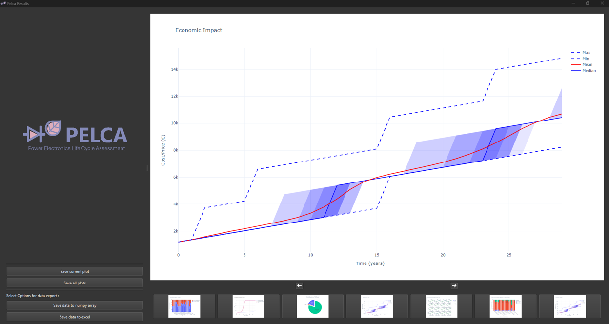
    <br> Fig. 16 : View of the ‘economic impact’ staircase curve generated by PELCA
</p>

Complementary to this graphical output, the economic impact results of a PELCA simulation, providing the cost / price of the manufacturing (‘_Manufacture_’), use (‘_Use_’), curative maintenance (‘_Replacement_’) and preventive maintenance (‘_Maintenance_’) can be found in the ‘Staircase output’ results excel file :

<p align="center">
    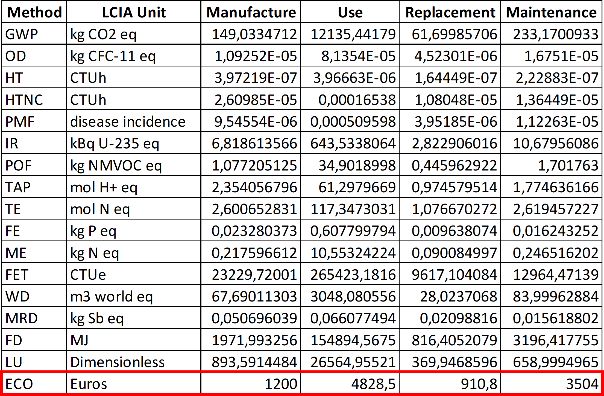
    <br> Fig. 17 : View of the ‘Staircase output’ Excel file with the economic impact results
</p>

More details regarding the calculation of the economic impact along the life cycle of the system can be found in the _Algorithm.md_ file.

## LCA output Excel file example

If the user cannot download the ecoinvent database (which requires registration), an LCA output Excel file example is provided, containing the LCA impacts assessment results of both manufacturing and use phases for both RUs of the example system : 

```LCAoutputExample_v1.3.0_PowerModuleAndCapacitor.xlsx```

This output Excel file can be used to run PELCA without ecoinvent database registration by clicking the ‘_Run staircase only_’ button ; it will replace the ‘_LCA output_’ results file that is automatically generated by PELCA when running the full LCA calculation by pressing the ‘_Run LCA + staircase_’ button.

<p align="center">
    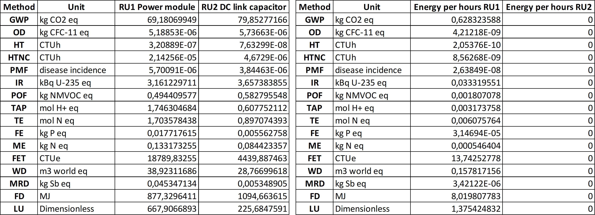
    <br> Fig. 18 : Views of the ‘Manufacturing’ (left) and ‘Use’  (right) sheets of the output Excel file example
</p>


For this output Excel file to be taken into account by PELCA when launching a calculation using the ‘_Run staircase only_’ button, it is necessary that the user first copy-paste the Excel file into a folder named ‘_Results PELCA_’, located at the LCA result path location indicated in the LCA sheet of the input Excel file (see Fig. 2), and rename it ‘_LCA output_’.

Note that the economic impact (‘_ECO_’) is not included in this ‘_LCA output_’ Excel file example since this impact is included in the ‘Staircase output’ results Excel file generated after running the simulation (see Fig. 17).