# How to use the **PELCA Device Designer** tools ?

## Introduction

Complementary to the PELCA software, which allows to simulate the environmental and economic impacts of power electronic (PE) systems throughout their life cycle, the PELCA Device Designer tools allow to compute the environmental impacts of the manufacturing phase of different semiconductor power devices, which are know to represent a significant share of the manufacturing impacts of PE systems ([Baudais et al., 2024](https://doi.org/10.3390/en16052192)). 

Once computed, the manufacturing impacts of the semiconductor power devices can then be reinjected into the PELCA tool to account for more accurate manufacturing impact assessment of PE systems.

The PELCA Device Designer tools address the following types of power semiconductors:
- Silicon-based insulated gate bipolar transistor (IGBT).

An open-source publication detailing the PELCA IGBT Designer tool is available online to get more acquainted with its structure and underlying impact assessment methodology: 

Guillemet, T.; Pichon, P.-Y.; Degrenne, N. An Open-Source Life Cycle Inventory (LCI) Model to Assess the Environmental Impacts of IGBT Power Semiconductor Manufacturing. Sustainability 2026, 18, 2663. https://doi.org/10.3390/su18052663

# Table of Contents

- [Manufacturing model](#manufacturing-model)
- [Impact assessment methodology](#impact-assessment-methodology)
- [How to run the code ?](#how-to-run-the-code-)
- [Results file & associated graphical outputs](#results-file--associated-graphical-outputs)
- [Contribution](#contribution)
- [Disclaimer](#disclaimer)
- [Licence](#license)
- [Contact](#contact)

## Manufacturing model

The PELCA Device Designer tools are based on a cradle-to-gate life cycle inventory (LCI) approach which includes:
- The production of the raw silicon wafers used as substrates (dark blue), considered as an activity external to the wafer fab;
- The wafer process steps carried out to produce the power devices onto the wafers (orange);
- The cleanroom facilities & infrastructures operating to run the different utilities and maintain the production environment (light green).

<p align="center">
    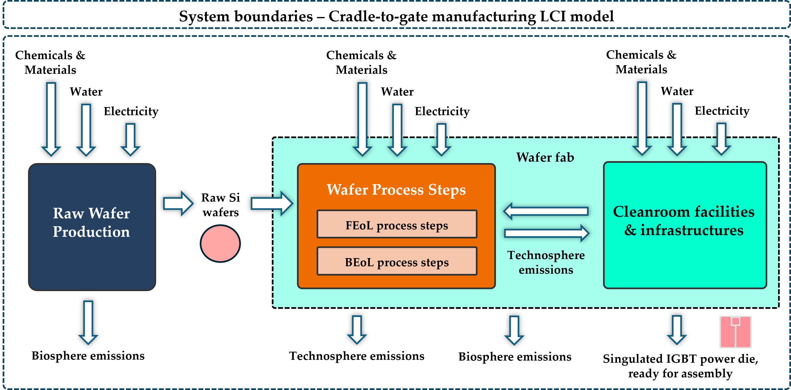
    <br> Fig. 1: System boundaries of the PELCA Device Designer tools, including the production of raw wafer substrates (dark blue), wafer process steps (orange), and cleanroom facilities and infrastructures (light green)
</p>

For illustration purposes, Figure 2 provides a schematic view of the device on which is based the PELCA Device Designer tool dedicated to IGBT power transistors. The device is a silicon-based vertical trench field-stop ultrathin IGBT power device, with voltage and current ratings of 750 V and 270 A, respectively:

<p align="center">
    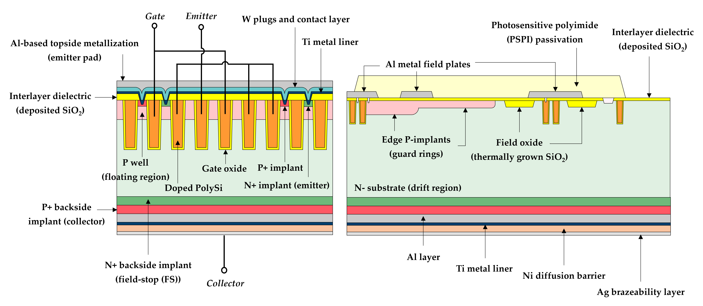
    <br> Fig. 2: Cross-section schematic of the IGBT power transistor used as reference device to build the PELCA IGBT Designer tool
</p>

The PELCA Device Designer tools allows the user to fine-tune the inventory to its own manufacturing use case through the following parameters:
- Die dimensions (length, width, thickness) (mm);
- Wafer diameter (150 mm, 200 mm, or 300 mm);
- Wafer 'killer defect' density (cm-2) and associated front-end yield model;
- Probing yield (%);
- Dicing yield (%);
- Wafer fab location and associated local electricity mix;
- Wafer fab cleanliness level (ISO class);
- Wafer fab throughput (wafers/month);
- Abatement efficiency of fluorinated gases (%);
- Wastewater recycling yield (%).

Those manufacturing parameters are accessible and fine-tunable in the 'USER INPUTS' sheet of the inventory Excel file:

<p align="center">
    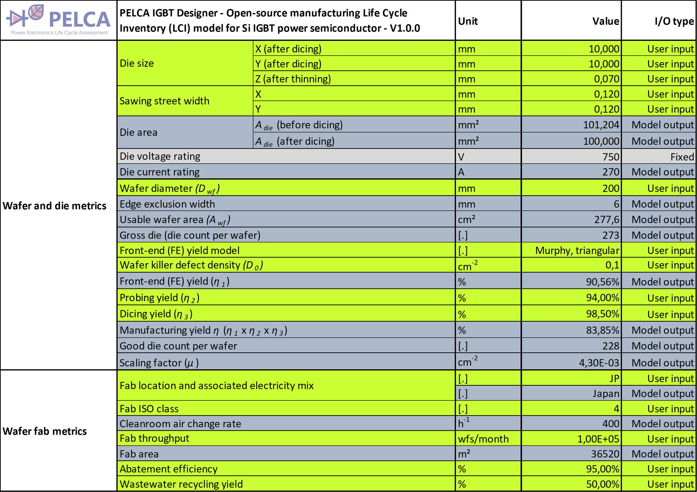
    <br> Fig. 3: 'USER INPUTS' sheet of the manufacturing inventory Excel file allowing the user to fine-tune the manufacturing inventory
</p>

Figure 4 shows a schematic of the computation architecture of the manufacturing inventory model, showing the relationships between the user inputs and the model outputs:

<p align="center">
    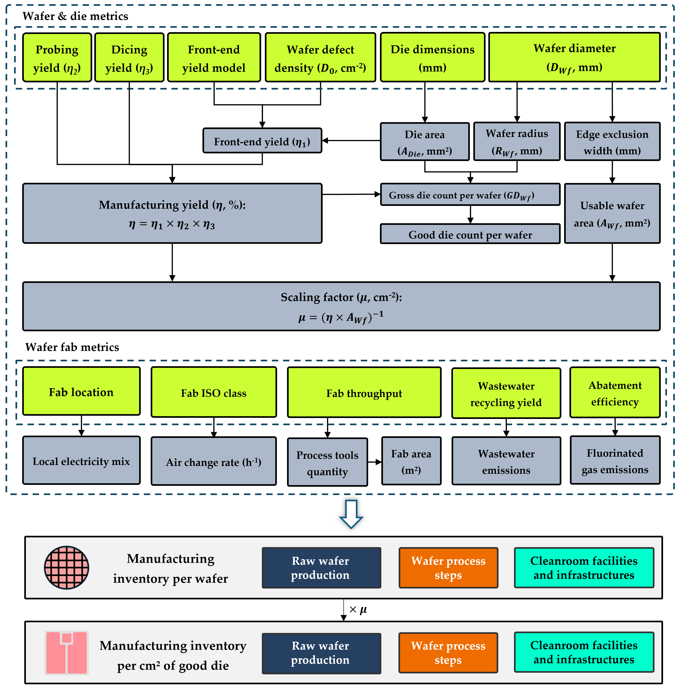
    <br> Fig. 4: Computation architecture of the manufacturing inventory model
</p>

The wafer process steps of the power device manufacturing model are splitted in the following 12 activites:
- Photolithography;
- Wet clean;
- Wet etch;
- Dry etch;
- Ion implant;
- Thermal processes;
- PVD;
- CVD;
- CMP;
- Thinning;
- Dicing;
- Probing.

More details on how are modeled the production of the raw silicon wafer substrates, the different wafer process steps, and the cleanroom facilites and infrastructures are available in the manufacturing inventory Excel file and in the [associated publication](https://doi.org/10.3390/su18052663).

Although the inventory model has been built based on a fixed device technology, the user is also able to fine-tune the manufacturing inventory by adjusting, in the 'PROCESS RECAP' sheet of the inventory Excel file, and for each sub-process step included in the model, the following parameters:
- Equipment nominal electrical power (kW);
- Power Correction Factor (PCF), allowing to account for more realistic electrical power consumption of the process tools;
- Number of iterations of each wafer sub-process step along the process flow.

<p align="center">
    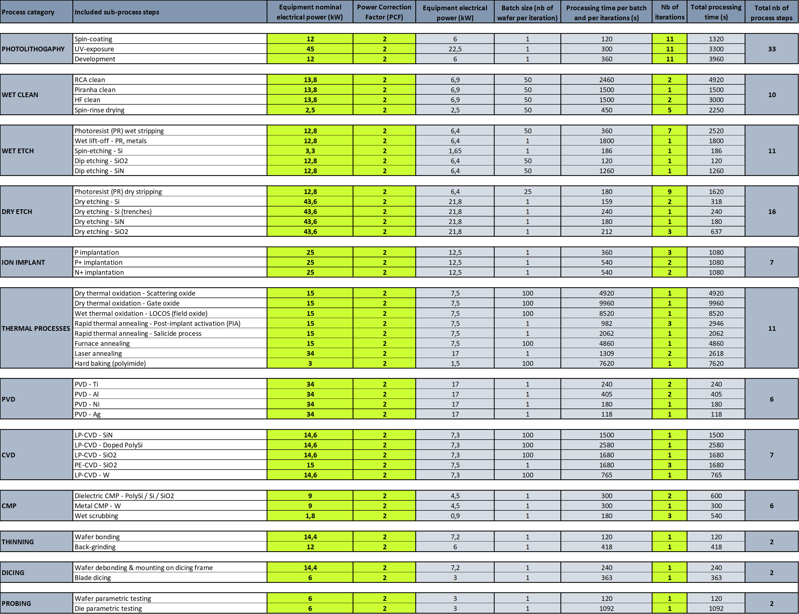
    <br> Fig. 5: 'PROCESS RECAP' sheet of the manufacturing inventory Excel file allowing the user to fine-tune the manufacturing inventory
</p>

Based on the number of each sub-process step fixed by the user, the manufacturing inventory model also provides an overview of the number of steps per process category in the 'PROCESS RECAP' sheet:

<p align="center">
    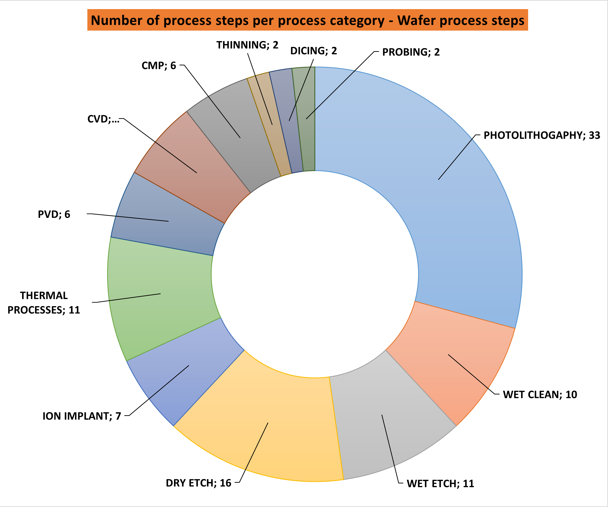
    <br> Fig. 6: Number of process steps per wafer process category
</p>

Overall, the fine-tuning by the user of the manufacturing parameters included in the 'USER INPUTS' and 'PROCESS RECAP' sheets of the inventory Excel file automatically adjust the manufacturing inventory summarized in the 'SUMMARY LCI' sheet of the manufacturing Excel file:

<p align="center">
    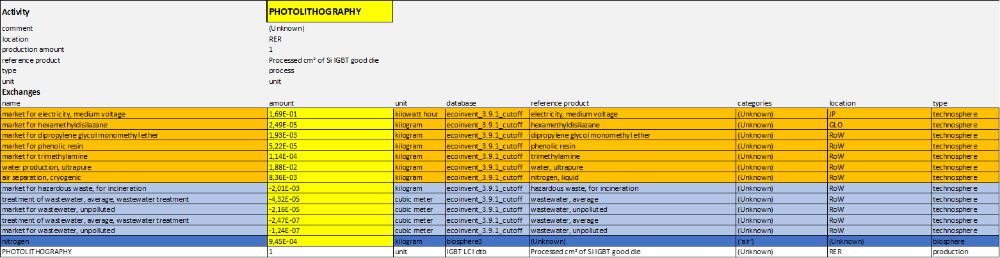
    <br> Fig. 7: View of the 'SUMMARY_LCI' sheet of the manufacturing inventory Excel file
</p>

The manufacturing inventory model also provides the bill of materials (BoM) of the different wafer process steps involved in the manufacturing of the semiconductor power device (see 'BoM' sheet of the inventory Excel file):

<p align="center">
    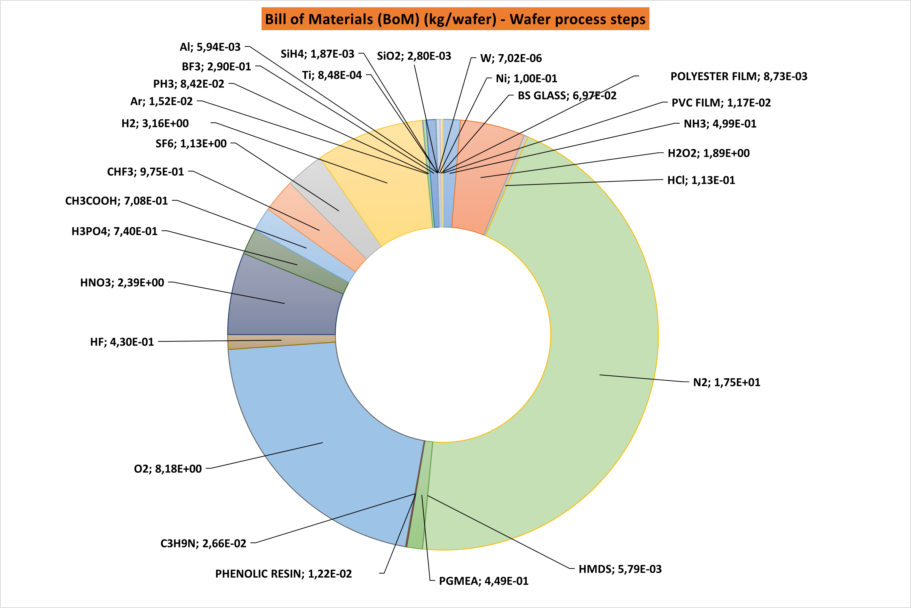
    <br> Fig. 8: Bill of Materials (BoM) of the wafer process steps (ultrapure water (UPW) excluded)
</p>

Similarly, the manufacturing inventory Excel file provides the Bill of Energy (BoE) showing the respective contributions of the production of the raw wafer substrates (in dark blue), the wafer process steps (in orange), and the cleanroom facilities & infrastructures (in light green) to the overall electrical consumption of the semiconductor manufacturing process, per wafer and per cm² of good die:

<p align="center">
    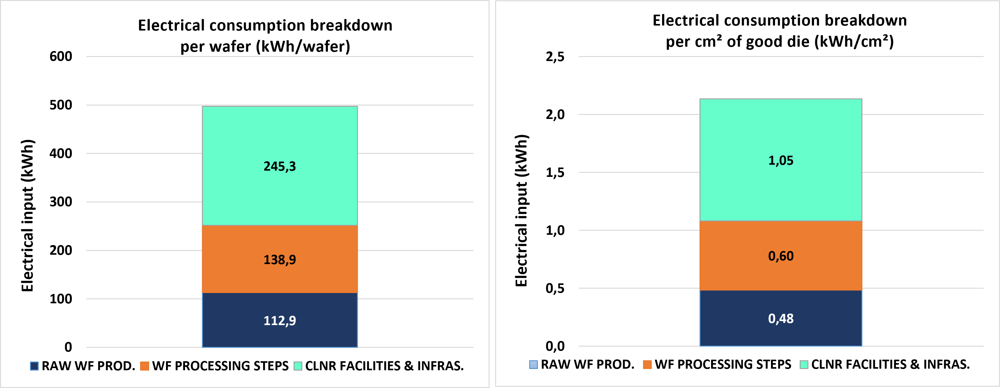
    <br> Fig. 9: Electrical breakdown structure of the semiconductor manufacturing process, including the produciton of the raw wafer substrate (dark blue), the wafer process steps (orange), and the cleanroom facilities & infrastructures (light green) 
</p>

The electrical breakdown structure of the wafer process steps and of the cleanroom facilities & infrastuctures are also provided in the 'BoE' sheet of the manufacturing Excel file:

<p align="center">
    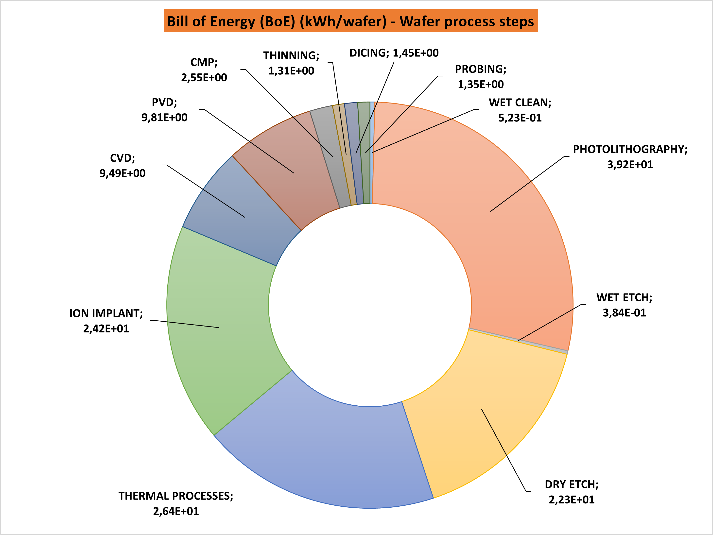
    <br> Fig. 10: Electrical breakdown structure of the wafer process steps
</p>

<p align="center">
    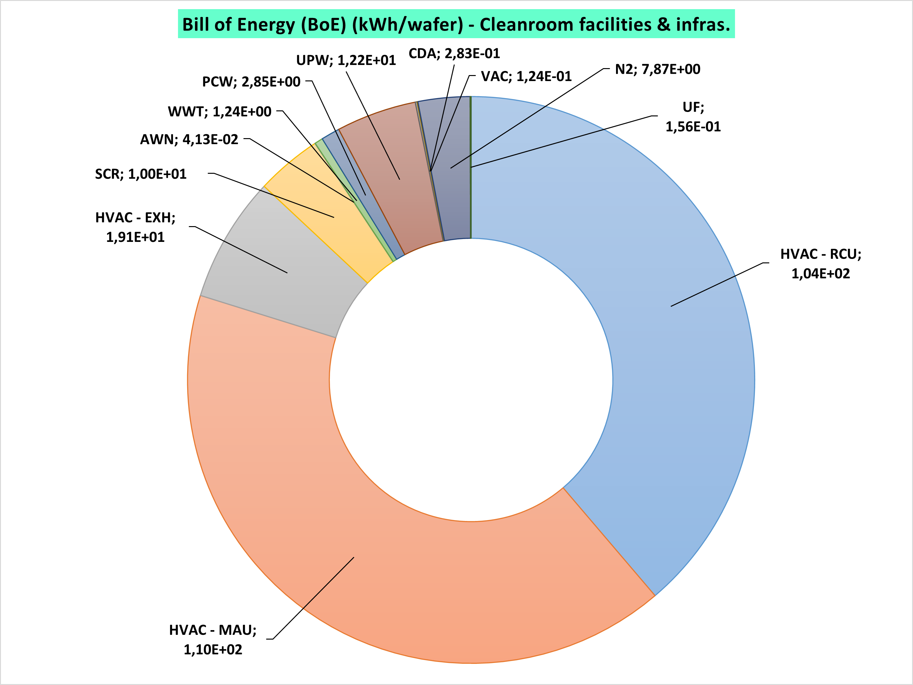
    <br> Fig. 11: Electrical breakdown structure of the cleanroom facilities & infrastructures
</p>

## Impact assessment methodology

In line with the PELCA software, the PELCA Device Designer tools are based on the Product Environmental Footprint (PEF) impact assessment method, allowing to assess the manufacturing impacts following 16 midpoint indicators. Figure X provides a schematic view of the software architecture of the PELCA Device Designer tools:

<p align="center">
    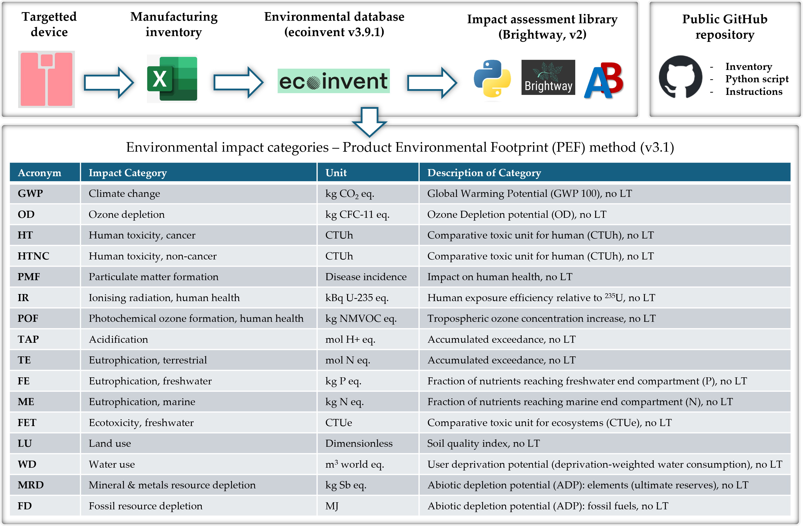
    <br> Fig. 12: Software architecture of the PELCA Device Designer tools and list of the impact categories of the PEF impact assessment method
</p>

## How to run the code ?

The PELCA Device Designer tools are stand-alone tools which can be used outside of the PELCA environment. They simply lie on an Excel file as the parametrizable manufacturing inventory and a Python script to connect the inventory to the ecoinvent database and assess the environmental impacts using the Brightway library.

1. **Install Python 3.11**

First, download and install Python 3.11 from the official website: [👉 Download Python 3.11](https://www.python.org/ftp/python/3.11.9/python-3.11.9-amd64.exe)

2. **Install the required packages to run the code**

Once Python 3.11 has been installed, follow these steps:

   - Download the **PELCA Device Designer** files (inventory (.xlsx), python script (.py), requirements (.txt));
   - Navigate to the folder where you have placed the **PELCA Device Designer files**;
   - Right-click in the file explorer and select `Open in Terminal`;
   - Copy/paste and execute one by one the following commands in the terminal window:

```bash
# Create a virtual environment (named here 'venv') using Python 3.11
& "$env:LOCALAPPDATA\Programs\Python\Python311\python.exe" -m venv .venv

# Change the execution policy to activate the virtual environment
Set-ExecutionPolicy Unrestricted -Scope Process
    
# Activate the virtual environment
.\.venv\Scripts\activate

# Upgrade pip to avoid compatibility issues
python.exe -m pip install --upgrade pip

# Install the project dependencies (this takes about 5 minutes)
pip install -r requirements.txt
```
3. **Download the ecoinvent database**

To assess the environmental impacts, the **ecoinvent** database is used. You need to download the following file:  

📥 **Required file**: `ecoinvent 3.9.1_cutoff_ecoSpold02.7z`  
🔗 **Download link**: [Download ecoinvent 3.9.1](https://ecoquery.ecoinvent.org/3.9.1/cutoff/files)

ℹ️ **Note**: The ecoinvent version used is **3.9.1**. Any version higher than this is not compatible. Indeed, as PELCA, the PELCA Device Designer tools lie on the Brightway librairy, which faces compatibility issues with ecoinvent starting from version 3.10. More information here: [StackOverflow Discussion](https://stackoverflow.com/questions/77697351/brightway2-and-ecoinvent-3-10-unlinked-exchanges)

4. **Open and configure the Python script**

Using an IDE (sush as [VSC](https://code.visualstudio.com/download)), open the [impact assessment Python script](PELCADeviceDesigner.py), and configure it by following the instructions below:

```bash
#_______________________Variable definition____________________________#

# Indicate name of device under test (DUT) #
DUT = "IGBT die"

# Select impact assessment method / PEF: Product Environmental Footprint / CED : Cumulative Energy Demand #
type_method = "PEF"
# type_method='CED'

# Indicate path and name of the inventory Excel file #
path_ex = r"/Users/username/Documents/PELCADeviceDesigner/"
name_ex = "IGBTDesigner_v1.0.0_ManufacturingInventory.xlsx"

# Indicate path and version of the Ecoinvent database #
path_datasetEcoinvent = r"/Users/username/Downloads/"
VersionEcoinvent = "ecoinvent 3.9.1_cutoff_ecoSpold02"

# Indicate a name of the associated Brightway project #
proj_name = "IGBT Designer"

# Indicate the name of the database as it appears in the inventory Excel file (sheet 'SUMMARY_LCI', box B1)
db_name = "IGBT LCI dtb"

simulation = "Analysis"

# Indicate paths and name of the result files #
path_result = path_ex
filename_result = "IGBTDesigner_v1.0.0_ManufacturingImpacts.xlsx"
```
5. **Run the Python script**

In the terminal, type the command below to run the script and generate the impact assessment results Excel file:

```bash
# run the script
python PELCADeviceDesigner.py
```

## Results file & associated graphical outputs

### 1. Impact assessment results 

Once the [PELCADeviceDesigner](PELCADeviceDesigner.py) script has been ran, a results Excel file is generated, named and located based on the indications provided by the user in the Python script. The results Excel file includes different sheets:

   - *Sheet 1* : environmental impacts assessed based on the PEF method;
   - *Sheet 'norm_global'*: assessed environmental impacts normalized with respect to global normalisation factors;
   - *Sheet 'norm_planet_bound'*: assessed environmental impacts normalized with respect to planetary boundaries factors;
   - *Sheet 'weight_global'*: assessed environmental impacts normalized & weighted with respect to global normalisation factors;
   - *Sheet 'weight-planet_bound'*: assessed environmental impacts normalized & weighted with respect to planetary boundaries factors.

The normalisation factors, weighting factors, and planetary bounds can be found in the following references: [Andreasi et al., 2023](https://doi.org/10.2760/798894), [Sala et al., 2020](https://doi.org/10.1016/j.jenvman.2020.110686), and [Sala et al., 2018](doi:10.2760/945290).

Figure 13 shows a view of the first sheet of the impact assessment results Excel file, compiling the respective contribution of each activity included in the semiconductor manufacturing model with respect to the 16 environmental indicators of the PEF method: 

<p align="center">
    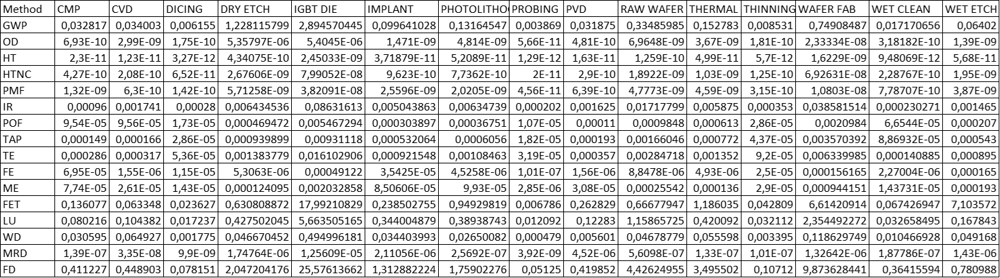
    <br> Fig. 13: View of the raw impact assessment results generated in the results Excel file (Sheet 1)
</p>

Based on the raw impact assessment results Excel file, the user is able to generate different associated plots, such as contribution analyses, sensitivity analyses, or impacts assessment with respect to planetary limits.

The results of Figure 13 and the plots and charts illustrated in the following sections have been obtained based on the following manufacturing hypotheses in the inventory Excel file : IGBT die size: 100 mm², wafer diameter: 200 mm, wafer defect density: 0.1 cm−2, manufacturing yield: 83.8%, abatement efficiency: 95%, wastewater recycling yield: 50%, throughput: 100,000 wafers/month, ISO 4 wafer fab, located in Japan.

### 2. Contribution analyses

Based on the results Excel file, a first bar chart can be obtained by plotting the respective contribution of the production of the raw wafer substrate (dark blue), the wafer process steps (orange) and the cleanroom facilities & infrastructures (light green) to the 16 environmental impacts assessed in the frame of the PEF method: 

<p align="center">
    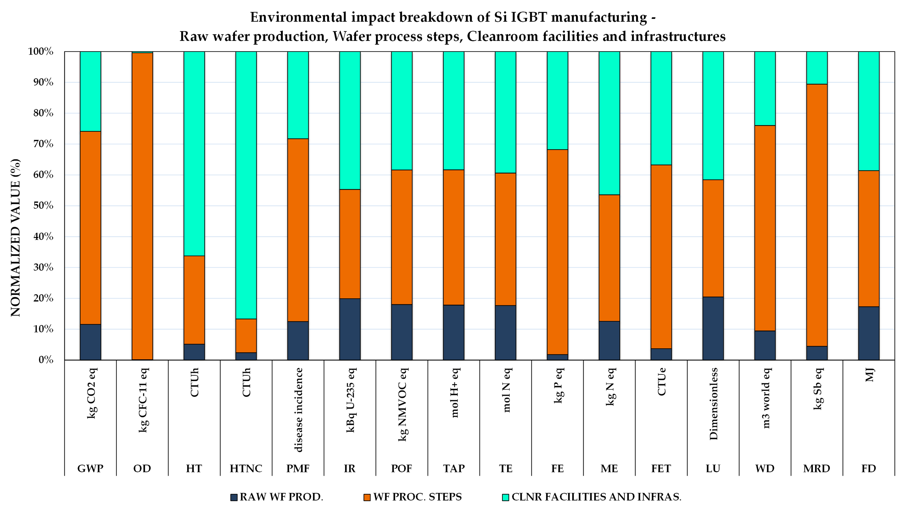
    <br> Fig. 14: Normalized bar graph showing the respective contributions of raw wafer production (dark blue), wafer process steps (orange), and cleanroom facilities and infrastructures (light green) to the 16 environmental impacts of the PEF method 
</p>

A second bar graph can be plotted, showing the respective contributions of the different wafer process steps to the 16 environmental impacts assessed in the frame of the PEF method:

<p align="center">
    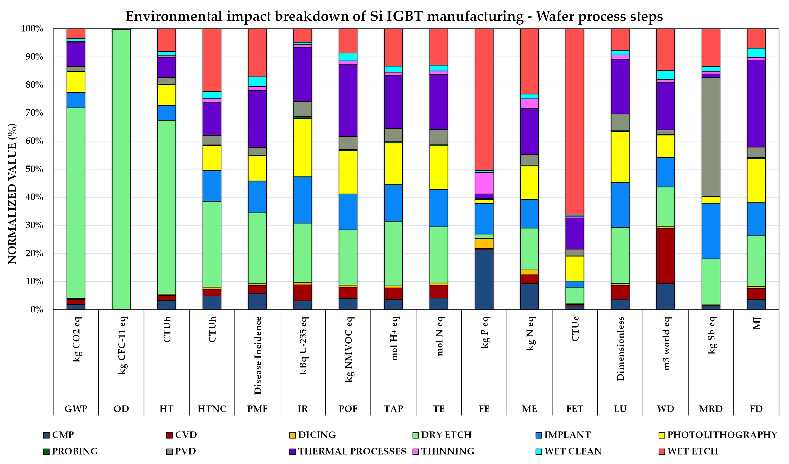
    <br> Fig. 15: Normalized bar graph showing the respective contributions of the different wafer process steps to the 16 environmental impacts of the PEF method 
</p>

### 3. Sensitivity analyses

By fine-tuning the parameters of the 'USER INPUTS' sheet of the manufacturing inventory Excel file, additional analyses can be carried out to investigate the sensitivity of the inventory model to different input parameters such as die size, wafer diameter, wafer defect density, and wafer fab location.

Figure 16 shows a sensitivity analysis focusing on the influence of die size and wafer diameter on manufacturing yield and climate change impact (GWP, kg CO2 eq./cm²) of the IGBT production process: 

<p align="center">
    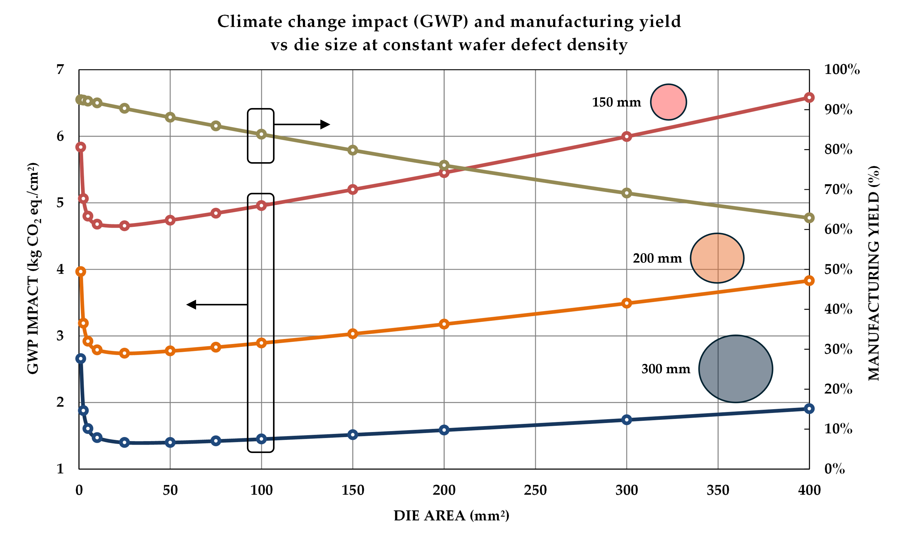
    <br> Fig. 16:  Line plot showing the influence of die size on the climate change (GWP) impact per cm² of good die and on the manufacturing yield of the IGBT production process for 150 mm (red line), 200 mm (orange line), and 300 mm diameter (blue line)wafers at a fixed defect density
</p>

In a similar manner, Figure 17 shows a sensitivity analysis focusing on the influence of wafer 'killer defect' density and wafer diameter on manufacturing yield and climate change impact (GWP, kg CO2 eq./cm²) of the IGBT production process:

<p align="center">
    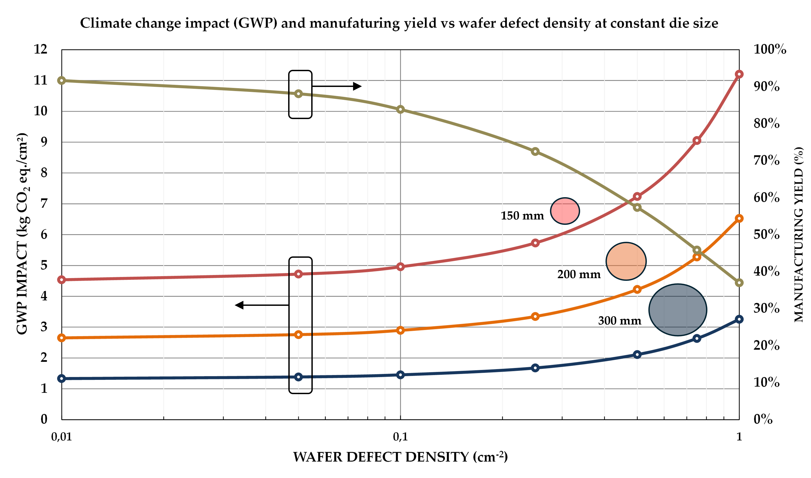
    <br> Fig. 17:  Line plot showing the influence of wafer defect density (cm−2) on the climate change (GWP) impact per cm² of good die and on the manufacturing yield of the IGBT production process for wafers with diameter of 150 mm (red line), 200 mm (orange line), and 300 mm (blue line) at a fixed die size
</p>

Finally, it can also be interesting to evaluate the influence of the wafer fab location and of the associated electricity mix on the environmental impacts of the IGBT production process. 

Due to the significant share of electrical energy consumption on the environmental impacts of semiconductor fabrication, it is worth investigating the impact of the wafer fab location and of the associated local electricity mix on the impact assessment results. In the ‘USER INPUTS’ sheet of the inventory Excel file, the user can choose from different wafer fab locations, including global {GLO}, Europe without Switzerland {RER}, Japan {JP}, China {CN}, United States {US}, and Switzerland {CH}. The selection of one location by the user automatically parametrizes the inventory with the associated electricity mix from the ecoinvent database for all activities listed in the inventory (i.e., the electrical energy source is assumed to be the same to produce the raw silicon wafers, to carry out the wafer
processing steps, and to feed the cleanroom facilities and infrastructures).

Figure 18 shows a radar chart displaying the assessed environmental impacts of
IGBT wafer production with a facility located in different geographical areas and impacts normalized with respect to the global {GLO} dataset, viewed here as a worldwide average electricity mix:

<p align="center">
    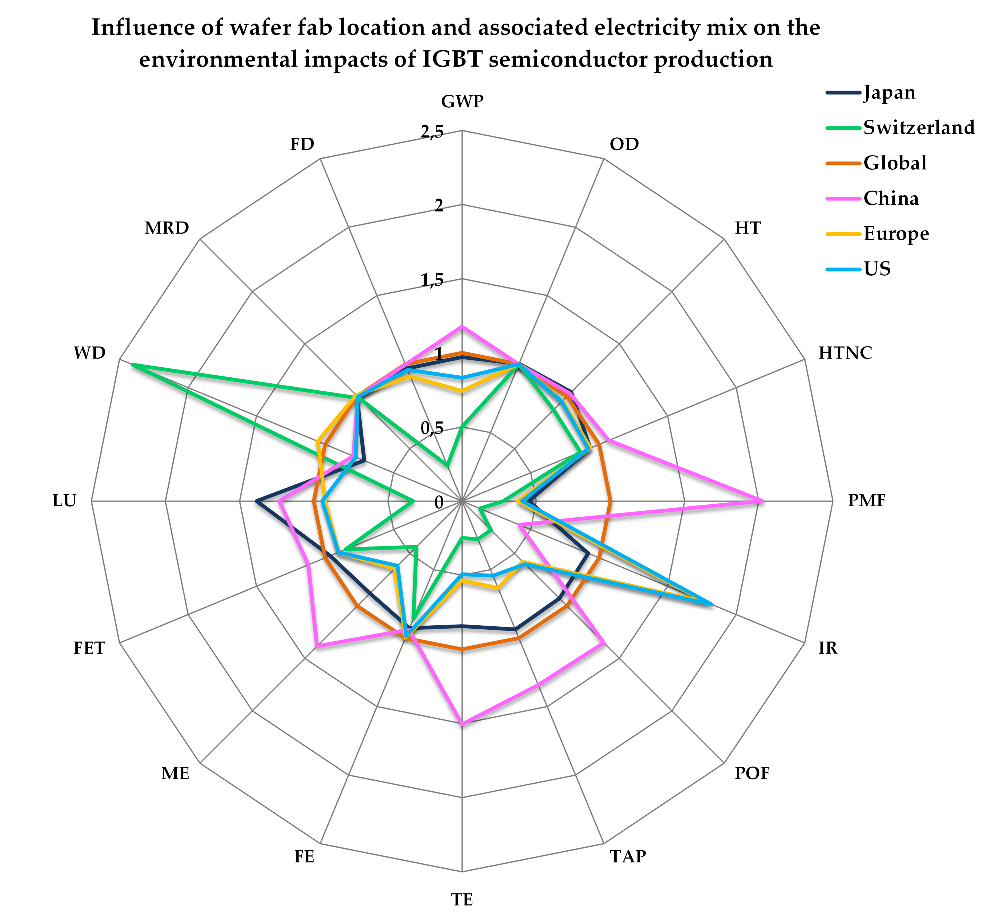
    <br> Fig. 18:  Normalized radar chart showing the influence of the wafer fab location and associated electricity mix on the 16 environmental impact categories of the PEF method
</p>

### 4. Impacts with respect to planetary bounds

Based on the results provided by the IGBT manufacturing inventory model, it is also possible to investigate the relative contribution of each of the 16 impact categories assessed with respect to the planetary limits, as per defined by the International Panel on Climate Change (IPCC) and recommended by the Joint Research Center (JRC) of the European Commission. This approach establishes, for
each of the 16 environmental impact categories of the PEF method, normalization factors and weighting factors, allowing the environmental impacts of the IGBT manufacturing process to be scaled with respect to peer-reviewed planetary bounds. Such analysis can be a complement of interest to identify the most prominent environmental impact categories of a product or a process. This analysis, applied to the IGBT production process, is shown in Figure 19:

<p align="center">
    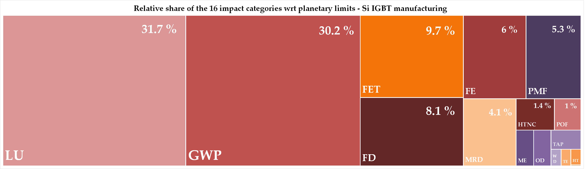
    <br> Fig. 19:  Chart showing the normalized relative contributions of the 16 environmental impact categories of the PEF method with respect to planetary limits
</p>

## Contribution
We welcome all kinds of contributions! To contribute to the project, start by dowloading the files, make your proposed changes in a new branch, and create a pull request. Make sure your code is readable and well-documented. Include unit tests if possible.

You can also contribute by submitting bug reports, feature requests, and following the issues.

## Disclaimer
This code is intended for use in a research environment only. We disclaim any responsibility for the results obtained and any subsequent use of them.

## License
This code is licensed under LGPL-3.0-only or LGPL-3.0-or-later, and also uses other python libraries which also have their own licenses.

## Contact
PELCA@fr.merce.mee.com