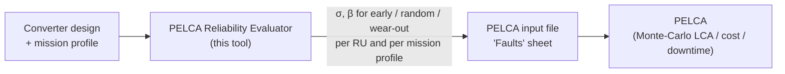
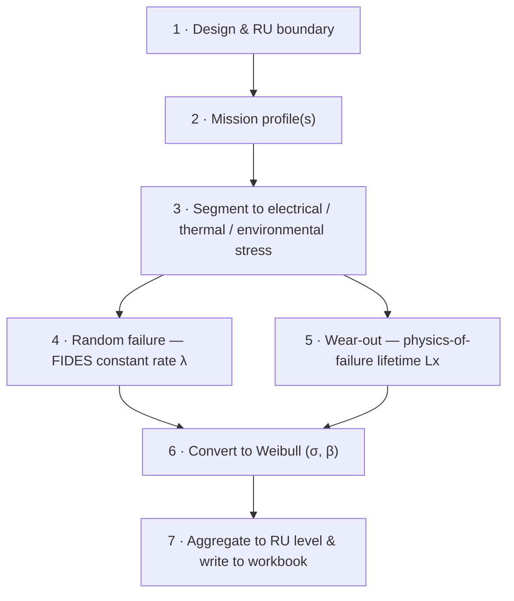
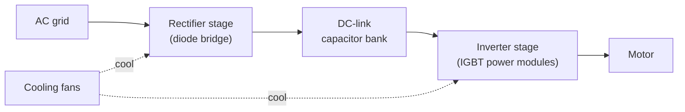

# PELCA Reliability Evaluator — Algorithm

**Applies to:** PELCA Reliability Evaluator `v1.0.0`

## Table of Contents

- [Overview](#overview)
- [Position in the PELCA ecosystem](#position-in-the-pelca-ecosystem)
- [Fault model: bathtub curve and three Weibull functions](#fault-model-bathtub-curve-and-three-weibull-functions)
- [General evaluation pipeline](#general-evaluation-pipeline)
- [Step 1 — Design and replacement-unit boundary](#step-1--design-and-replacement-unit-boundary)
- [Step 2 — Mission profiles](#step-2--mission-profiles)
- [Step 3 — Mission-profile segment to stresses](#step-3--mission-profile-segment-to-stresses)
- [Step 4 — Random failure (FIDES model)](#step-4--random-failure-fides-model)
- [Step 5 — Wear-out failure (physics-of-failure lifetime models)](#step-5--wear-out-failure-physics-of-failure-lifetime-models)
- [Step 6 — Conversion to Weibull parameters](#step-6--conversion-to-weibull-parameters)
- [Step 7 — Replacement-unit aggregation and write-back](#step-7--replacement-unit-aggregation-and-write-back)
- [Subsystem summary](#subsystem-summary)
- [Worked reference: the variable-speed drive](#worked-reference-the-variable-speed-drive)
- [Assumptions and limitations](#assumptions-and-limitations)
- [References](#references)

---

## Overview

The **PELCA Reliability Evaluator** estimates the reliability parameters of the
main **replaceable units (RUs)** of a power converter — cooling fans, the
DC-link capacitor bank, the inverter power-module stage and the rectifier diode
stage.

For every replaceable unit and every mission profile, the tool produces a set of
**Weibull parameters** (scale `σ` in years, shape `β` dimensionless) describing
three failure mechanisms:

| Mechanism | Meaning | Typical `β` |
| --- | --- | --- |
| Early (infant mortality) | Design or manufacturing escapes | `β < 1` (default `0.6`) |
| Random (useful life) | Constant-hazard failures | `β = 1` |
| Wear-out (ageing) | End-of-life degradation | `β > 1` (typically `2.2`–`3`) |

These parameters are the direct input of the **`Faults` sheet** of a PELCA
life-cycle input file. The goal is **not** to predict absolute field reliability
but to give a **consistent engineering basis** for comparing design options,
mission profiles, modularity choices and maintenance strategies inside PELCA.

## Position in the PELCA ecosystem



PELCA itself performs the Monte-Carlo life-cycle simulation: at each iteration it
uses the Weibull cumulative distribution functions (CDF) of each RU to draw a
fault time `tᵢ*` and a fault type `dᵢ*`, then simulates planned and curative
maintenance. See the main
[PELCA Algorithm](https://github.com/merce-fra/PELCA) documentation, sections
*Fault model* and *Fault generation*, for how the parameters produced here are
consumed downstream.

The Reliability Evaluator replaces the manual, expert-based filling of the
`Faults` sheet with a **repeatable, mission-profile-driven calculation**.

## Fault model: bathtub curve and three Weibull functions

The instantaneous failure rate `λ(t)` of power-electronic parts follows the
classic **bathtub curve**: a decreasing *early* region, a flat *random* region
and an increasing *wear-out* region.

Each RU is described by three **Weibull CDFs**, one per mechanism:

```
F(t) = 1 − exp( −(t / σ)^β )
```

- **Early** — `β_early = 0.6`, `σ_early ≈ 3424 years` by default. Infant
  mortality is **not** evaluated from physics in `v1.0.0` (no field-return data);
  a conservative fixed pair is emitted so the mechanism can be enabled or
  overridden manually in PELCA.
- **Random** — `β_random = 1`. The scale `σ_random` is the mean time to failure
  (MTTF) derived from the FIDES constant failure rate (see Step 4).
- **Wear-out** — `β_wearout` between `2.2` and `3` depending on the subsystem
  (slow vs. fast ageing). The scale `σ_wearout` is derived from a
  physics-of-failure **lifetime** `Lₓ` (see Step 5).

Combining the three CDFs reconstructs the bathtub curve for the RU, exactly as in
the main PELCA fault model.

## General evaluation pipeline

Every subsystem evaluator follows the same seven steps:



Steps 4 and 5 are independent mechanisms and are always reported separately.

## Step 1 — Design and replacement-unit boundary

The replaceable unit is the part that is dismounted and replaced **as a whole**
during a maintenance operation. It defines the granularity of the reliability
result and must match the RU granularity used later in the PELCA inventories.

| Subsystem | Replaceable unit | Key topology inputs |
| --- | --- | --- |
| Fan | The set of cooling fans replaced together | `num_identical_fans` |
| Capacitor bank | The complete DC-link bank | parallel strings × series capacitors (`nb_capacitors`) |
| Inverter | The inverter power-module set | parallel switches `nb_parallel_sw` → `3 × nb_parallel_sw` half-bridge modules |
| Rectifier | The rectifier diode stage | number of parallel paths |

When several identical items form the RU, the tool assumes they must **all**
survive for the RU to survive (series-reliability within the RU); redundancy is
handled by the aggregation formula of Step 7.

## Step 2 — Mission profiles

A **mission profile** is an ordered list of **operating phases** that together
represent one representative year of service. A workbook may contain **several**
mission profiles (e.g. a light-duty and a heavy-duty use case); each one produces
its own set of Weibull parameters, and PELCA can then randomly select between
them per Monte-Carlo iteration.

Each phase carries, among others:

- an `operating_phase` flag (True = the converter is delivering power);
- relative speed / relative torque (or load);
- ambient or local board temperature;
- thermal-cycling amplitude `ΔT_cycling`, maximum cycling temperature
  `T_max_cycling`, number of cycles `N_cy`, cycle duration `θ_cy`;
- operating hours per year;
- humidity `RH_ambient` and vibration `G_RMS` when the model uses them.

Phases are **time-weighted** by their fraction of the 8760 h year. Non-operating
phases still contribute to thermal cycling and calendar ageing but not to
load-driven stress.

## Step 3 — Mission-profile segment to stresses

For each phase the evaluator derives the physical stresses that drive the
reliability models:

- **Electrical operating point** — from relative speed/torque (or applied
  voltage) and the converter ratings, the tool reconstructs currents, voltages
  and, where relevant, the modulation operating point.
- **Losses** — conduction and switching losses for semiconductor stages, ripple
  and ESR losses for the capacitor bank. (Fan losses are neglected in `v1.0.0`.)
- **Thermal state** — losses are converted to junction / hot-spot / core
  temperatures through the subsystem thermal model (steady-state or transient
  Foster/Cauer networks for the inverter, thermal-resistance models for the
  rectifier and capacitor).
- **Environmental stress** — ambient temperature, humidity and vibration are
  taken directly from the phase.

> The `thermal_data` output sheet stores these intermediate values so the
> stress assumptions can be reviewed.

## Step 4 — Random failure (FIDES model)

The **random** (constant-hazard) failure rate is estimated with the
**FIDES 2009** physics-of-failure methodology. FIDES expresses the failure rate
as a *physical* base rate modulated by stress factors `Π` and by
process/quality factors.

For each operating phase `i`, a set of dimensionless stress contributions is
computed. The exact list depends on the subsystem; the fan model, for example,
uses:

| Contribution | Driver | Form (schematic) |
| --- | --- | --- |
| `Π_thermal` | phase temperature | `γ_Th · exp( 11604 · Ea · (1/293 − 1/(T+273)) )` |
| `Π_thermal_cycling` | `N_cy`, `θ_cy`, `ΔT_cycling`, `T_max_cycling` | `γ_Tcy · (12·N_cy/8760) · (min(θ_cy,2)/2)^{1/3} · (ΔT/20)^{1.9} · exp(1414·(1/313 − 1/(T_max+273)))` |
| `Π_mechanical` | vibration `G_RMS` | `γ_M · (G_RMS/0.5)^{1.5}` |
| `Π_humidity` | `RH_ambient`, `T` | `γ_Rh · (RH/70)^{4.4} · exp(11604·0.8·(1/293 − 1/(T+273)))` |

The capacitor-bank model replaces the thermal term by a **thermo-electrical**
term that also depends on the applied-to-rated voltage ratio
`( (1/S_ref) · V_applied / V_rated )^3` and drops the humidity term; the inverter
and rectifier models add semiconductor-specific terms. All models share the same
assembly:

```
λ_physical      = λ0 · Σ_i [ (hours_i / 8760) · (Π_thermal,i + Π_cycling,i + Π_mech,i + Π_humidity,i) ] · Π_induced
λ_random(FIT)   = λ_physical · Π_PM · Π_process
MTTF (hours)    = 1e9 / λ_random          (λ_random expressed per 1e9 h)
```

where

- `λ0` is the technology base failure rate (e.g. `0.21 FIT` for a liquid
  aluminium electrolytic capacitor, `0.17` for the fan model);
- `Π_induced` is the FIDES *induced-factor* term built from placement,
  application and hardening factors and the part sensitivity `C_sensitivity`:
  `(Π_placement · Π_application · Π_hardening)^{0.511 · ln(C_sensitivity)}`;
- `Π_PM` reflects the maturity of the manufacturer's quality management;
- `Π_process` (score `L4 = 4` in the default workbooks) reflects how completely
  the FIDES reliability recommendations are applied.

The default FIDES constants live **in code**, next to each subsystem model, and
are documented in the corresponding subsystem `README.md`. Mission-profile and
topology data come from the workbook.

## Step 5 — Wear-out failure (physics-of-failure lifetime models)

Wear-out is modelled independently, from a **calendar lifetime** `Lₓ`
(the age at which a defined fraction — typically 10 %, "`L10`" — of the
population has failed by ageing). Each subsystem uses the lifetime relationship
appropriate to its dominant ageing mechanism:

| Subsystem | Dominant ageing mechanism | Lifetime relationship (schematic) |
| --- | --- | --- |
| Fan | Bearing grease depletion | `L10 = 79200 · Π_type · (3.53 − 0.744·ln B) · exp(−Ea·11604·(1/313 − 1/(T+273))) · (rpm/3000)^{−m}` |
| Capacitor bank | Electrolyte loss / dielectric ageing | Arrhenius + voltage-derating life law, `L = L_ref · 2^{(T_ref − T_core)/10} · (V_rated/V_applied)^{n}` (technology-dependent) |
| Inverter | Bond-wire / solder fatigue from power cycling | Coffin-Manson / LESIT-type `N_f = A · ΔT_j^{−α} · exp(Ea/(k·T_jm))`, combined with cycle count via Miner's rule |
| Rectifier | Diode thermo-mechanical fatigue | analogous power-cycling / ageing law on the diode junction |

For each phase the instantaneous ageing rate `1/L10,i` is accumulated
**pro-rata of the operating hours**, giving a mission-level calendar life:

```
1 / L10_calendar = Σ_i ( hours_i / 8760 ) · ( 1 / L10,i )
```

This harmonic-type weighting means the harshest phases dominate the wear-out
result, as expected physically.

## Step 6 — Conversion to Weibull parameters

The random and wear-out results are converted to the `(σ, β)` pairs PELCA
expects.

**Random part**

```
β_random = 1
σ_random = MTTF (converted to years) = 1e9 / λ_random / 8760
```

A Weibull law with `β = 1` is an exponential law whose scale equals the MTTF, so
the constant FIDES hazard maps exactly.

**Wear-out part**

```
β_wearout ∈ {2.2 (fan), 3 (capacitor, inverter, rectifier)}
σ_wearout = Lₓ · scaling_factor(N, β_wearout)
scaling_factor(N, β) = 1 / ( Γ(1 + 1/β) · N^{1/β} )
```

The `Γ(1 + 1/β)` term converts a *mean* life `Lₓ` into a Weibull *scale*
parameter. The `N^{1/β}` term is the redundancy/series scaling of Step 7 (see
below). `Γ` is the gamma function.

**Early part**

```
β_early = 0.6
σ_early = 3424 years / N^{1/β_early}
```

Fixed default; intended to be reviewed manually in PELCA if infant-mortality
data becomes available.

## Step 7 — Replacement-unit aggregation and write-back

When an RU is made of `N` identical items that must all survive (fans in a
tray, capacitors in a bank, half-bridge modules in an inverter), the RU
reliability is the product of the individual reliabilities:

```
R_RU(t) = R_item(t)^N
```

Applied to a Weibull item law this gives a Weibull RU law with the **same shape**
`β` and a **reduced scale**:

```
σ_RU = σ_item / N^{1/β}
```

which is exactly the `N^{1/β}` factor embedded in the conversion of Step 6. For
the random part (`β = 1`) this reduces to `σ_RU = σ_item / N`, i.e. failure rates
simply add.

Each evaluator then writes, per mission profile, into the workbook result sheet:

| Column | Content |
| --- | --- |
| Early failure `(σ, year)` / `(β)` | `σ_early`, `0.6` |
| Random failure `(σ, year)` / `(β)` | `σ_random`, `1` |
| Wear-out failure `(σ, year)` / `(β)` | `σ_wearout`, `2.2`–`3` |

plus a lifetime summary and (optionally) the `thermal_data` intermediate values.
When a workbook contains several mission profiles, one row is produced per
profile, ready to be transferred to the multi-mission-profile format of the
PELCA `Faults` sheet.

## Subsystem summary

| Subsystem | Random failure | Wear-out | `β_wearout` | Redundancy `N` |
| --- | --- | --- | --- | --- |
| **Fan** | FIDES (thermal, cycling, mechanical, humidity, induced) | Bearing `L10` (Arrhenius + speed law) | 2.2 | number of identical fans |
| **Capacitor bank** | FIDES (thermo-electrical, cycling, mechanical) | Electrolyte/dielectric life law (Arrhenius + voltage derating) | 3 | series × parallel capacitors |
| **Inverter** | FIDES (semiconductor, thermal, cycling) applied per half-bridge | Power-cycling fatigue (Coffin-Manson / LESIT + Miner) | 3 | `3 × nb_parallel_sw` half-bridge modules |
| **Rectifier** | FIDES (diode, thermal, cycling) | Diode power-cycling / ageing law | 3 | parallel diode paths |

The inverter and rectifier evaluators share operating-point and loss helpers
(`igbt_reliability/`).

## Worked reference: the variable-speed drive

The four default workbooks describe the same physical object — a
**variable-speed motor drive** — decomposed into its replaceable units:



Running the orchestrator evaluates all four RUs with the mission profiles stored
in their workbooks and prints, for each, the per-mission-profile Weibull
parameters. The
[Instructions](Instructions.md) document walks through this run and shows how to
copy the results into a PELCA input file.

> **Thermal coupling (planned, not in `v1.0.0`)** — the stages are thermally
> coupled: losses in the rectifier and inverter raise the air temperature seen
> by the capacitor bank and by the downstream fan. `v1.0.0` evaluates each stage
> with the temperatures given in its own mission profile; propagating stage
> losses into the next stage's ambient temperature is a documented future
> extension (see the `TO DO` note in `run_reliability_evaluation.py`).

## Assumptions and limitations

- **Comparative use only.** Absolute values depend heavily on mission-profile
  quality, thermal assumptions, model constants and RU boundaries. Use the
  outputs to compare scenarios under a **consistent** set of assumptions.
- **Early failures are not modelled from physics** — a fixed default pair is
  emitted.
- **Wear-out shape `β` is assumed**, not fitted (`2.2` for fans, `3` elsewhere).
- **Monte-Carlo negative-value issues** in the downstream Brightway/PELCA chain
  are outside the scope of this tool.
- **FIDES constants are embedded in code.** Changing technology, cooling concept
  or topology family may require revisiting them; they are documented per
  subsystem.
- **Redundancy model is "all items must survive"** within an RU; k-out-of-n
  redundancy is not modelled.

## References

- FIDES Group, *FIDES Guide 2009 — Reliability Methodology for Electronic
  Systems*.
- Main PELCA documentation — *Algorithm* and *Instructions*
  (<https://github.com/merce-fra/PELCA>).
- Subsystem model notes: `fan_reliability/README.md`,
  `capacitor_bank_reliability/README.md`, `inverter_reliability/README.md`,
  `rectifier_reliability/README.md`.
