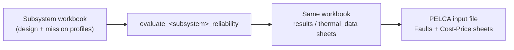

# PELCA Reliability Evaluator — Instructions

**Applies to:** PELCA Reliability Evaluator `v1.0.0`

This document explains how to use the tool on the bundled **variable-speed drive**
examples and how to transfer the results into a PELCA life-cycle input file.
For the reliability methodology itself, see [Algorithm.md](Algorithm.md).

## Table of Contents

- [What the tool does](#what-the-tool-does)
- [Installation and execution](#installation-and-execution)
- [The input / output workbook](#the-input--output-workbook)
- [Workbook structure](#workbook-structure)
  - [Common sheets](#common-sheets)
  - [Per-subsystem sheet names](#per-subsystem-sheet-names)
  - [`parameters` sheet](#parameters-sheet)
  - [Mission-profile sheet](#mission-profile-sheet)
  - [`options` sheet](#options-sheet)
  - [`Replacement` sheet](#replacement-sheet)
- [Worked example: the variable-speed drive](#worked-example-the-variable-speed-drive)
  - [Run all four replaceable units](#run-all-four-replaceable-units)
  - [Reading the `results` sheet](#reading-the-results-sheet)
  - [Console output](#console-output)
- [Transferring the results into PELCA](#transferring-the-results-into-pelca)
- [Running a single subsystem or a custom workbook](#running-a-single-subsystem-or-a-custom-workbook)
- [Creating a new scenario](#creating-a-new-scenario)
- [Troubleshooting](#troubleshooting)

---

## What the tool does

For each **replaceable unit (RU)** of a power converter and for each **mission
profile** stored in its workbook, the tool computes the **Weibull parameters**
(`σ` in years, `β` dimensionless) of three failure mechanisms — early, random and
wear-out — plus replacement-unit cost data.



The four subsystems (`fan`, `capacitor_bank`, `inverter`, `rectifier`) together
describe one physical object: a motor drive made of a rectifier stage, a DC-link
capacitor bank, an inverter stage and cooling fans.

## Installation and execution

Full step-by-step instructions for **Windows**, **Linux** and **macOS** (Python
3.12, virtual environment, dependencies) are in the top-level
[`README.md`](../README.md).

Once the environment is set up and **activated**, run the whole workflow from the
repository root:

```bash
python run_reliability_evaluation.py
```

> On Windows the interpreter is `python`, **not** `python3` (`python3` opens the
> Microsoft Store).

`run_reliability_evaluation.py` evaluates **every** subsystem with its default
versioned workbook. Comment out a line in that script to skip a subsystem.

## The input / output workbook

Each subsystem has **one** Excel workbook that is used **both as input and as
output**:

| Subsystem | Default workbook |
| --- | --- |
| Fan | `fan_reliability/data/PELCA_Reliability_v1.0.0_Fan.xlsx` |
| Capacitor bank | `capacitor_bank_reliability/data/PELCA_Reliability_v1.0.0_CapacitorBank.xlsx` |
| Inverter | `inverter_reliability/data/PELCA_Reliability_v1.0.0_Inverter.xlsx` |
| Rectifier | `rectifier_reliability/data/PELCA_Reliability_v1.0.0_Rectifier.xlsx` |

The version number in the file name follows the same convention as the other
PELCA tools (`PELCA_v2.0.0_PowerModuleAndCapacitor.xlsx`) and is defined once in
`common/__init__.py`.

> **Close the workbook in Excel before running the tool**, otherwise the result
> sheets cannot be written back.

## Workbook structure

### Common sheets

Every workbook contains, under slightly different names:

| Purpose | Typical sheet name |
| --- | --- |
| Human-readable description | `comment` / `comments` |
| Design constants, ratings, model factors, topology | `parameters` / `Parameters` |
| Plot / debug switches | `options` |
| Operating phases (one or more mission profiles) | `mission_profile` / `Inputs` |
| Replacement-unit cost and labour data | `Replacement` |
| **Output** — Weibull parameters + lifetime summary | `results` / `Analysis_Results` |
| **Output** — intermediate thermal / stress values | `thermal_data` |

### Per-subsystem sheet names

| Subsystem | Input sheets | Output sheets |
| --- | --- | --- |
| Fan | `Parameters`, `options`, `mission_profile`, `Replacement` | `results`, `Replacement` |
| Capacitor bank | `parameters`, `options`, `mission_profile`, `tables`, `Replacement` | `results`, `thermal_data`, `Replacement` |
| Inverter | `parameters`, `options`, `mission_profile`, `Replacement` | `results`, `thermal_data`, `comparison_pwm_iec` |
| Rectifier | `Parameters`, `options`, `Inputs`, `Replacement` | `Analysis_Results`, `thermal_data`, `Feuil1` |

Keep the sheet names and column names of the default workbooks unless you also
update the code.

### `parameters` sheet

A key / value / comment block (read by `common/excel_parameters.py`). It holds
the design data the mission profile cannot carry, for example (capacitor bank):

| Key | Example | Meaning |
| --- | --- | --- |
| `PN` | `200000` | nominal output power (W) |
| `Vin` | `230` | input voltage (Vrms) |
| `Iripple_nom`, `ESR_120`, `KFL`, `KFH` | — | ripple-current model data |
| `Vrated` | `450` | capacitor rated voltage |
| `nb_capacitors` | `4` | capacitors in the bank (series × parallel) |

Analogous keys exist for the other subsystems (rated apparent/active power,
parallel-switch count, thermal-model parameters, process factors, ageing
constants…). See each subsystem `README.md` for the full list.

### Mission-profile sheet

Each mission profile starts with a **numeric identifier** in the `MP` column;
the following rows (identifier left blank) are the **operating phases** of that
profile. A workbook can hold several mission profiles one after another.

Columns used by the models (capacitor-bank example — other subsystems are very
close):

| Column | Meaning |
| --- | --- |
| `MP` | mission-profile identifier (first row of each profile only) |
| `operating_phase` | `true` = converter delivering power, `false` = idle/off |
| `Rel_Speed_i` | relative speed (0–1) |
| `Rel_Torque_i` | relative torque / load (0–1) |
| `Tx` / `T` | ambient or local board temperature (°C) |
| `delta_T_cycling` | thermal-cycling amplitude ΔT (°C) |
| `T_max_cycling` | maximum temperature reached during a cycle (°C) |
| `Operating_Hours_per_Year` | hours spent in this phase per year |
| `N_cy` | number of thermal cycles in this phase per year |
| `theta_cy` | cycle duration / weighting |
| `G_RMS` | vibration level (g RMS), when used |
| `Pi_application` | FIDES application factor |
| `RH_ambient` | relative humidity (%), when used (fan) |

Rules of thumb:

- The operating hours of all phases of one mission profile should sum to **8760
  h** (one year).
- Use one row per operating phase; keep units consistent between phases.
- Use a **separate mission-profile identifier** for each distinct use case you
  want PELCA to be able to select between.

### `options` sheet

Simple `0 / 1` switches. Defaults in the bundled workbooks:

| Flag | Fan | Capacitor | Inverter | Rectifier | Effect |
| --- | :-: | :-: | :-: | :-: | --- |
| `plot_CDF_en` | 1 | 1 | 1 | 1 | show the failure-probability (CDF) plot |
| `plot_bathtub_en` | – | 0 | 0 | – | show the reconstructed bathtub curve |
| `plot_lifetime_mission_profile_en` | – | 0 | 0 | – | show wear-out lifetime per mission profile |
| `plot_mission_profile_en` | – | 0 | 0 | – | show the mission profile |
| `plot_cond_currents_en` | – | – | 0 | – | inverter debug: conduction currents (PWM method) |
| `display_sim_IEC` / `display_sim_pwm` | – | – | 0 | – | inverter debug: electro-thermal simulation |

Set `plot_CDF_en` to `0` for unattended / batch runs so no window blocks
execution.

### `Replacement` sheet

Cost, labour time and maintenance data for the replacement unit. The evaluator
reads it and echoes RU cost figures into the `results` sheet in the exact form
expected by the PELCA `Cost - Price` sheet:

```
RU raw cost/price (€)   RU assembly cost/price (€)   RU disassembly cost/price (€)
341.44                  83.33                        83.33
```

## Worked example: the variable-speed drive

The four default workbooks already contain a complete drive scenario with **two
mission profiles** each (a heavier-duty profile 1 and a lighter-duty profile 2).

### Run all four replaceable units

```bash
python run_reliability_evaluation.py
```

The tool loads each workbook, evaluates both mission profiles and writes the
Weibull parameters back into the `results` / `Analysis_Results` sheet of the
**same** file.

### Reading the `results` sheet

After the run, `capacitor_bank_reliability/data/PELCA_Reliability_v1.0.0_CapacitorBank.xlsx`,
sheet `results`:

| mission profile | lifetime (year) | Early σ | Early β | Random σ | Random β | Wear-out σ | Wear-out β |
| --- | --- | --- | --- | --- | --- | --- | --- |
| profile 1 | 22.83 | 3424 | 0.6 | 2053.4 | 1 | 16.11 | 3 |
| profile 2 | 22.83 | 3424 | 0.6 | 2053.0 | 1 | 16.11 | 3 |

Interpretation:

- **Random** `σ ≈ 2053 years` ≫ service life → random failures are very
  unlikely to dominate for this bank under this mission.
- **Wear-out** `σ ≈ 16 years` with `β = 3` → ageing is the governing mechanism;
  the bank is expected to need replacement on that time scale.
- **Early** is the fixed default pair — review it manually in PELCA if you have
  infant-mortality data.

### Console output

Excerpt from a full run (values depend on the workbook contents):

```
PELCA Reliability Evaluator v1.0.0: starting full evaluation workflow.
Starting fan reliability evaluation ...
  System (2 Fans) - Early Scale:  1078.49 years, Shape: 0.6
  System (2 Fans) - Random Scale: 4340.25 years, Shape: 1.0
  System (2 Fans) - Aging Scale:  18.31 years,  Shape: 2.2
Starting capacitor bank reliability evaluation ...
  Random failure (sigma, year): [2053.41, 2053.05]   beta: 1
  Wear-out failure (sigma, year): [16.11, 16.11]      beta: 3
Starting inverter reliability evaluation ...
  with current topology, the replacement cost of inverter power modules (RU) would be: 2063.77 euros
Starting rectifier reliability evaluation ...
PELCA Reliability Evaluator: full evaluation workflow finished.
```

## Transferring the results into PELCA

1. **`Faults` sheet of the PELCA input file** — for each RU, copy the six
   values (`σ` and `β` for early, random, wear-out). When a workbook has several
   mission profiles, PELCA accepts several values in one cell separated by `#`,
   in the **same order** as the mission profiles declared in the PELCA `LCIC`
   sheet. Example for the capacitor-bank RU with two mission profiles:

   | | Early σ | Early β | Random σ | Random β | Wear-out σ | Wear-out β |
   | --- | --- | --- | --- | --- | --- | --- |
   | Capacitor bank RU | `3424` | `0.6` | `2053.41#2053.05` | `1` | `16.11#16.11` | `3` |

   Deactivate a mechanism in the PELCA `LCIC` sheet, or leave both Weibull cells
   empty for that RU, if you do not want to simulate it.

2. **`Cost - Price` sheet of the PELCA input file** — copy the three RU cost
   figures echoed at the bottom of the `results` sheet.

3. Keep the **RU boundary consistent**: the RU you evaluated here (e.g. "the
   whole capacitor bank") must be the same RU granularity used in the PELCA
   `Inventory - Cur. Maint.` and `Inventory - Planned Maint.` sheets.

See the main PELCA
[Instructions](https://github.com/merce-fra/PELCA), section *`Faults` sheet*, for
the exact multi-mission-profile syntax and validation rules.

## Running a single subsystem or a custom workbook

Each evaluator is a runnable module. Pass a workbook path as argument:

```bash
python -m fan_reliability.evaluate_fan_reliability fan_reliability/data/PELCA_Reliability_v1.0.0_Fan.xlsx
python -m capacitor_bank_reliability.evaluate_capacitor_bank_reliability path/to/your_cap_workbook.xlsx
python -m inverter_reliability.evaluate_inverter_reliability path/to/your_inv_workbook.xlsx
python -m rectifier_reliability.evaluate_rectifier_reliability path/to/your_rect_workbook.xlsx
```

With no argument, an evaluator falls back to its default versioned workbook in
`<subsystem>/data/`.

## Creating a new scenario

1. Copy the default workbook of the subsystem and rename it
   (`PELCA_Reliability_v<version>_<Subsystem>_<case>.xlsx` is a good convention).
2. Edit the `parameters` sheet (ratings, topology, model factors).
3. Edit the mission-profile sheet: one block per mission profile, one row per
   operating phase, operating hours summing to 8760 h.
4. Leave the output sheets in place — they will be overwritten.
5. Run the evaluator on the new file and review `thermal_data` before trusting
   `results`.
6. Before publishing a workbook, check that values, comments and metadata are
   anonymised and suitable for redistribution.

## Troubleshooting

| Symptom | Cause / fix |
| --- | --- |
| `Python was not found` (Windows) | Use `python`, not `python3`. Install Python 3.12 from python.org, not the Microsoft Store shortcut. |
| `PermissionError` writing the workbook | The workbook is open in Excel. Close it and re-run. |
| The run stops with a plot window open | Set `plot_CDF_en = 0` (and other `plot_*` flags) in the `options` sheet, or close the window to continue. |
| `KeyError` on a sheet or column name | The workbook does not match the expected structure. Start again from the default workbook. |
| `ModuleNotFoundError: common` | Run from the **repository root** with the virtual environment activated. |
| Wear-out `σ` looks implausibly small/large | Check the mission-profile temperatures, `ΔT_cycling`, `N_cy` and the ageing constants in `parameters`; inspect `thermal_data`. |
| Monte-Carlo values look wrong **in PELCA** | Known Brightway/PELCA issue, unrelated to this tool. |
