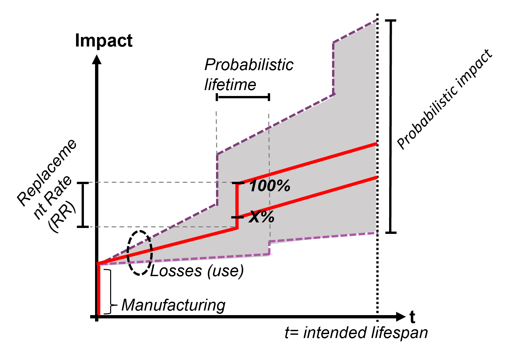

<p align="center">
    
</p>

___


# Latest Versions

We are pleased to announce the availability of the following versions of PELCA:

- **New Version (branch main)**: [v1.3.0](https://github.com/merce-fra/PELCA)
- **Previous Version (branch V1.1.2)**: [v1.1.2](https://github.com/merce-fra/PELCA/tree/v1.1.2)


You can download these versions from the [releases](https://github.com/merce-fra/PELCA/releases) page.

# Introduction

PELCA (Power Electronics Life Cycle Assessment) is an open-source project aimed at assessing the environmental impact over the life cycle of modular and diagnosable power electronics systems. The integration of modularity and diagnosability aligns with circular economy principles, promoting practices such as maintenance, repair and reuse. This project provides a tool to calculate the environmental impacts associated with the manufacturing, usage, and replacement of power electronics products.

This work began as part of the PhD thesis (collaboration between Mitsubishi Electric R&D Centre Europe and SATIE):
Baudais, Briac. *Eco-design in power electronics. Impacts of sizing,
modularity, and diagnosticability*. Electronique. Université Paris-Saclay, 2024. Français. ⟨NNT : 2024UPAST092⟩. ⟨tel-04659788⟩.
[Consult the thesis](https://theses.hal.science/tel-04659788)

The evolution of environmental impacts over time can be illustrated with a staircase curve:
<p align="center">
    
    <br> Fig 1. Staircase curve.
</p>
 
1. Initially, the curve shows the impacts associated with the manufacturing of the product. 
2. The slope of the curve represents the impacts during usage, specifically the operational losses incurred. 
3. When a failure occurs, the impacts rise, reflecting the need to replace the faulty component through curative maintenance (maintenance based on faults & diagnosis). This increase is influenced by the accuracy of diagnostics and by the system's architecture (modularity). More precise and selective diagnostics allow for selective replacements, assuming the modularity supports it. In contrast, an integrated system architecture does not facilitate the separation of the faulty component from the rest of the system. 
4. Preventive maintenance (maintenance based on schedule) allows replacing only part of a product before it breaks down.

For a detailed explanation of the algorithmic functioning of the tool, refer to [Algorithm.md](Details/Algorithm.md).

The tool was developed using the Python librairy Brightway2.

# Table of Contents

- [Update Notes](update_notes.md)
- [Installation Guide](#installation-guide)
   1. [PELCA Installation](#pelca-installation)
       
       - [Windows](#installation-windows) 
       - [Linux](#installation-linux) 
       - [Mac](#installation-macos)

   2. [Plugin Installation](#plugin-installation-)
      - [Downloading Ecoinvent Database](#downloading-ecoinvent-database)
      - [Configuring the Excel File](#configuring-the-excel-file)

   3. [Execution](#execution-)
      - [Windows](#execution-windows-)
      - [Linux](#execution-linux--macos-)
      - [Mac](#execution-linux--macos-)
- [Example Overview](Input%20example/ExampleOverview.md)
- [Explanation of the Algorithm](Details/Algorithm.md)
- [Contribution](#contribution)
- [Disclaimer](#disclaimer)
- [Licence](#license)
- [Contact](#contact)


# Installation Guide

The **PELCA** application is compatible with the following operating systems: **Windows**, **Linux**, and **MacOS**. Below are the installation steps tailored to your operating system.

⚠️ **Note**: Development was primarily carried out on **Windows**, so the application is optimized for this OS.


## PELCA Installation

### Installation Windows
1. **Install Python 3.12**

    First, download and install Python 3.12 from the official website: [👉 Download Python 3.12](https://www.python.org/downloads/release/python-3129/)

2. **Set up the project**

    Once Python is installed, follow these steps:
   - Navigate to the folder where you want to place **PELCA**.
   - Right-click in the file explorer and select `Open in Terminal`.
   - Copy and paste the following commands:
   ```powershell
    # Clone the Git repository
    git clone https://github.com/merce-fra/PELCA.git
    
    # Navigate to the project directory
    cd PELCA
    
    # Create a virtual environment using Python 3.12
    & "$env:LOCALAPPDATA\Programs\Python\Python312\python.exe" -m venv .venv
    
    # Change execution policy to activate the virtual environment
    Set-ExecutionPolicy Unrestricted -Scope Process
    
    # Activate the virtual environment
    .\.venv\Scripts\activate
    
    # Upgrade pip to avoid compatibility issues
    python.exe -m pip install --upgrade pip
    
    # Install the project dependencies
    pip install -r requirements_windows.txt
   ```

### Installation Linux
To install the project on Linux, open a terminal and execute the following commands:

```bash
# Clone the Git repository
git clone https://github.com/merce-fra/PELCA.git

# Navigate to the project directory
cd PELCA

# Install the Python 3.12 venv module if not already installed
sudo apt install python3.12-venv

# Create a virtual environment in the .venv folder
python3.12 -m venv .venv

# Activate the virtual environment
source .venv/bin/activate

# Install the required dependencies specified in the requirements_linux_mac.txt file
pip install -r requirements_linux_mac.txt
```


### Installation MacOS
To install the project on MacOS, open a terminal and execute the following commands:

```bash
# Clone the Git repository
git clone https://github.com/merce-fra/PELCA.git

# Navigate to the project directory
cd PELCA

# Install the Python 3.12 venv module if not already installed
brew install python@3.12

# Create a virtual environment in the .venv folder
python3.11 -m venv .venv

# Activate the virtual environment
source .venv/bin/activate

# Install the required dependencies specified in the requirements_linux_mac.txt file
pip install -r requirements_linux_mac.txt
```

## Plugin Installation  

### Downloading Ecoinvent Database

To assess the environmental impact, the **Ecoinvent** database is used. You need to download the following file:  

📥 **Required file**: `ecoinvent 3.9.1_cutoff_ecoSpold02.7z`  
🔗 **Download link**: [Ecoinvent 3.9.1](https://ecoquery.ecoinvent.org/3.9.1/cutoff/files)  

ℹ️ **Note**: The version used is **3.9.1**. Any version higher than this is not compatible. Indeed, PELCA relies on the Brightway library, which faces compatibility issues with ecoinvent starting from version 3.10. More information here: [StackOverflow Discussion](https://stackoverflow.com/questions/77697351/brightway2-and-ecoinvent-3-10-unlinked-exchanges)

### Configuring the Excel File

Before running the application, you **must configure the paths for data and output**. Refer to the example Excel file:

📂 **Reference file**: `PELCA/Input exemple/inputExample_v1.2.1_PowerModuleAndCapacitor`  
📑 **Sheet**: `LCA`  

The following details must be specified in the Excel sheet:

| Parameter | Example | Description |
|-----------|---------|-------------|
| **LCA result path** | `C:\Users\username\filepath` | Path where the "Results PELCA" folder will be created. If the folder doesn’t exist, it will be created automatically. |
| **Project name (Brightway)** | `inverter_test_02` | Name of the project in Brightway. Databases must be reinstalled for each new project. |
| **Inventory name** | `Example` | Name of the inventory visible in the Activity Browser. |
| **Database ecoinvent** | `ecoinvent 3.9.1_cutoff_ecoSpold02` | Name of the Ecoinvent database used in Brightway. |
| **Ecoinvent path** | `C:\Users\username\Downloads\ecoinvent 3.9.1_cutoff_ecoSpold02\datasets` | Path to the `datasets` folder of the Ecoinvent database. |
| **Type of simulation** | `Monte Carlo` | Environmental analysis mode: `Analysis` (traditional LCA) or `Monte Carlo` (uncertainty analysis + traditional LCA). |
| **Number of iterations (Monte Carlo)** | `5` | Number of iterations for Monte Carlo uncertainty analysis. |

ℹ️ **Note**: Monte Carlo results may be incorrect due to the Brightway library. This issue is being addressed. More details: [Brightway Group Discussion](https://brightway.groups.io/g/development/topic/negative_values_in/105163086)


## Execution  

Once the installation is complete, you can run the application using your preferred code editor by importing the **PELCA** folder.  

If you prefer to use a **terminal**, follow these steps based on your operating system.  

### Execution Windows   

- Go to the **PELCA** folder in the file explorer.  
- Right-click and select **"Open in Terminal"**.  
- Run the following commands:
   ```powershell
   Set-ExecutionPolicy Unrestricted -Scope Process
   .\.venv\Scripts\activate
   python main.py
   ```

The application is now ready to use! 🚀

### Execution Linux & MacOS  

Open a terminal, navigate to the **PELCA** folder, and run:  

```bash
source .venv/bin/activate
python main.py
```

## Contribution
We welcome all kinds of contributions! To contribute to the project, start by forking the repository, make your proposed changes in a new branch, and create a pull request. Make sure your code is readable and well-documented. Include unit tests if possible.

You can also contribute by submitting bug reports, feature requests, and following the issues.

## Disclaimer
This code is intended for use in a research environment only. We disclaim any responsibility for the results obtained and any subsequent use of them.

## License
This code is licensed under LGPL-3.0-only or LGPL-3.0-or-later, and also uses other python libraries which also have their own licenses.

## Contact
PELCA@fr.merce.mee.com
