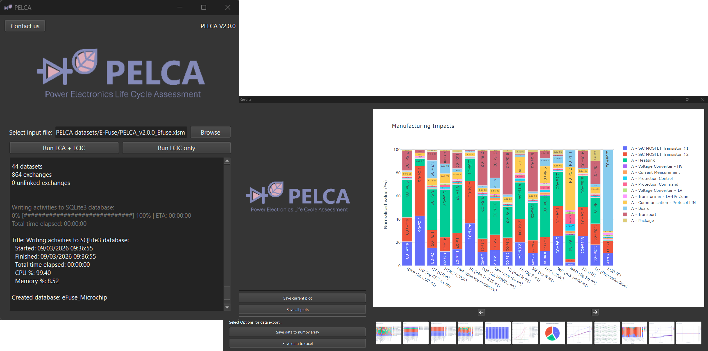
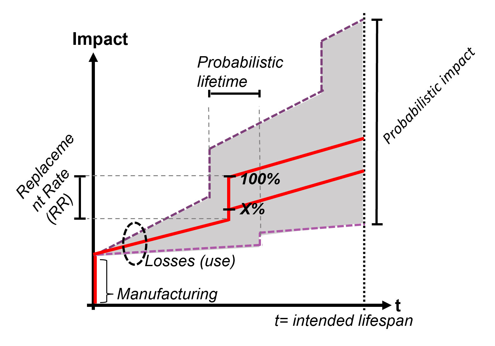

<p align="center">
    
</p>

<p align="center">
    
</p>

<p align="center">
    <a href="https://merce-pelca.github.io/" target="_blank">
        
    </a>
    &nbsp;&nbsp;
    <a href="mailto:PELCA@fr.merce.mee.com">
        
    </a>
</p>

___
# Latest Versions
We are pleased to announce the availability of the following versions of PELCA:

- **🚀 New Version (branch main)**: [v2.0](https://github.com/merce-fra/PELCA)
- **Previous Version (branch V1.4)**: [v1.4](https://github.com/merce-fra/PELCA/tree/Release_PELCA_v1.4)

A brief description of the new features of PELCA 2.0 can be found in the [Change Log](CHANGELOG.md).

📨 INFORMATION : To stay informed about the release of new features and versions, you can subscribe to the PELCA newsletter using this link: [Newsletter PELCA](https://forms.office.com/e/TFM0s2G8ew)

You can download these versions from the [releases](https://github.com/merce-fra/PELCA/releases) page.

---
# Software plugins

The version 2.0 of PELCA includes the following complementary plugins:

- [PELCA Manufacturing Evaluator v1.0.0](Plugins/PELCA_ManufacturingEvaluator/PELCAManufacturingEvaluator_Instructions.md), allowing to assess the manufacturing environmental impacts of power electronics semiconductors ;
- [PELCA Reliability Evaluator v1.0.0](Plugins/PELCA_ReliabilityEvaluator/README.md), allowing to assess the failure rates of power electronics subparts.

Please refer to the associated documentations for more details on the purpose of these plugins and on how to use them.

---
# Introduction
PELCA (Power Electronics Life Cycle Assessment) is an open-source project aimed at assessing the environmental impact over the life cycle of modular and diagnosable power electronics systems. 
The integration of modularity and diagnosability aligns with circular economy principles, promoting practices such as maintenance, repair and reuse. 
This project provides a tool to calculate the environmental impacts associated with the manufacturing, usage, and replacement of power electronics products.

This work began as part of the PhD thesis (collaboration between Mitsubishi Electric R&D Centre Europe and SATIE):
Baudais, Briac. *Eco-design in power electronics. Impacts of sizing,
modularity, and diagnosticability*. Electronique. Université Paris-Saclay, 2024. Français. ⟨NNT : 2024UPAST092⟩. ⟨tel-04659788⟩.
[Consult the thesis](https://theses.hal.science/tel-04659788)

Additional related publications from the PELCA software can be found here: [Publications](https://merce-pelca.github.io/publications.html)

The evolution of environmental impacts over time can be illustrated with a Life Cycle Impact Curve (LCIC):
<p align="center">
    
    <br> Fig 1. Life Cycle Impact Curve (LCIC).
</p>

1. Initially, the curve shows the impacts associated with the manufacturing of the product.
2. The slope of the curve represents the use phase impacts induced by operational power losses.
3. When a failure occurs, the impact rises, reflecting the need to replace the faulty component through curative maintenance (unplanned maintenance based on faults & diagnosis). 
This increase is conditioned by the diagnosticability of the system (its ability to locate a fault) and by its dismountability (ability to selectively replace a faulty part). 
Higher diagnosticability and dismountability allow for accurate and selective replacements, which mitigate the impacts of curative maintenance operations. 
In contrast, a fully integrated system architecture will exhibit low dismountability, which will increase the impacts of curative maintenance operations.
4. Planned maintenance operations (maintenance based on schedule) allows to replace specific parts of the system before they break down.

For more details on the algorithm underlying the PELCA software, please refer to [Algorithm.md](documentations/Algorithm.md).

For more details on the instructions on how to use PELCA, please refer to [PELCA Instructions](documentations/PELCA_Instructions.md).

The tool was developed using the Python library Brightway2.

# Table of Contents
- [Update Notes](CHANGELOG.md)
- [Installation Guide](#installation-guide)
   1. [PELCA Installation](#pelca-installation)
       - [Windows](#installation-windows)
       - [Linux](#installation-linux)
       - [Mac](#installation-macos)

   2. [Datasets Installation](#datasets-installation)
      - [Downloading Ecoinvent Database](#downloading-ecoinvent-database)
      - [Configuring the Excel File](#configuring-the-excel-file)

   3. [Execution](#run-via-application)
      - [Windows](#execution-windows-hmi-mode)
      - [Linux](#execution-linux--macos-hmi-mode)
      - [Mac](#execution-linux--macos-hmi-mode)
   4. [Run via Terminal (CLI Mode)](#run-via-terminal)
      - [Windows](#execution-windows-cli-mode)
      - [Linux](#execution-linux--macos-cli-mode)
      - [Mac](#execution-linux--macos-cli-mode)
- [Example datasets](PELCA%20datasets/)
- [Explanation of the Algorithm](documentations/Algorithm.md)
- [Contribution](#contribution)
- [Disclaimer](#disclaimer)
- [Licence](#license)
- [Contact](#contact)


# Installation Guide
The **PELCA** application is compatible with the following operating systems: **Windows**, **Linux**, and **MacOS**. Below are the installation steps tailored to your operating system.

🎥 Installation videos are available for each operating system: [Installation Videos](https://merce-pelca.github.io/mooc.html)

⚠️ **Note**: Development was primarily carried out on **Windows**, so the application is optimized for this OS.


## PELCA Installation

### Installation Windows
1. **Install Python 3.12**

    First, download and install Python 3.12 from the official website: [👉 Download Python 3.12](https://www.python.org/downloads/release/python-31213/)

2. **Set up the project**

    Once Python is installed, follow these steps:
   - Navigate to the folder where you want to place **PELCA**.
   - Right-click in the file explorer and select `Open in Terminal`.
   - Copy and paste the following commands:
   ```powershell
    # Clone the Git repository
    git clone https://github.com/merce-fra/PELCA.git

    # Navigate to the project directory
    cd PELCA

    # Create a virtual environment using Python 3.12
    & "$env:LOCALAPPDATA\Programs\Python\Python312\python.exe" -m venv .venv

    # Change execution policy to activate the virtual environment
    Set-ExecutionPolicy Unrestricted -Scope Process

    # Activate the virtual environment
    .\.venv\Scripts\activate

    # Upgrade pip to avoid compatibility issues
    python.exe -m pip install --upgrade pip

    # Install the project dependencies
    pip install -r requirements.txt
   ```

### Installation Linux
To install the project on Linux, open a terminal and execute the following commands:

```bash
# Clone the Git repository
git clone https://github.com/merce-fra/PELCA.git

# Navigate to the project directory
cd PELCA

# Install the Python 3.12 venv module if not already installed
sudo apt install python3.12-venv

# Create a virtual environment in the .venv folder
python3.12 -m venv .venv

# Activate the virtual environment
source .venv/bin/activate

# Install the required dependencies
pip install -r requirements.txt
```

### Installation MacOS
To install the project on MacOS, open a terminal and execute the following commands:

```bash
# Clone the Git repository
git clone https://github.com/merce-fra/PELCA.git

# Navigate to the project directory
cd PELCA

# Install the Python 3.12 venv module if not already installed
brew install python@3.12

# Create a virtual environment in the .venv folder
python3.12 -m venv .venv

# Activate the virtual environment
source .venv/bin/activate

# Install the required dependencies
pip install -r requirements.txt
```

> **Developers** — to also install testing and linting tools, use `pip install -r requirements_dev.txt` instead.

## Datasets Installation

### Downloading Ecoinvent Database
To assess the environmental impact, the **Ecoinvent** database is used. You need to download the following file:

📥 **Required file**: `ecoinvent 3.9.1_cutoff_ecoSpold02.7z`
🔗 **Download link**: [Ecoinvent 3.9.1](https://ecoquery.ecoinvent.org/3.9.1/cutoff/files)

ℹ️ **Note**: The version used is **3.9.1**. Any version higher than this is not compatible. Indeed, PELCA relies on the Brightway library, which faces compatibility issues with ecoinvent starting from version 3.10. More information here: [StackOverflow Discussion](https://stackoverflow.com/questions/77697351/brightway2-and-ecoinvent-3-10-unlinked-exchanges)


### Configuring the Excel File
Before running the application, you **must configure the paths for data and output**. Refer to the example Excel file:

📂 **Reference file**: `PELCA datasets/E-Fuse/PELCA_v2.0.0_Efuse.xlsm`
📑 **Sheet**: `LCA`

The following details must be specified in the Excel sheet:

| Parameter | Example | Description |
|-----------|---------|-------------|
| **LCA result path** | `. or C:\Users\username\filepath` | Path where the _'Results PELCA'_ folder will be created. If the folder doesn’t exist, it will be created automatically. By default, the path is indicated by a single dot in the input Excel file, meaning that the folder will be created in the current PELCA directory. |
| **Project name (Brightway)** | `inverter` | Name of the project in Brightway. Databases must be reinstalled for each new project. |
| **Inventory name** | `test_PELCA 2.0` | Name of the inventory database, corresponding to the name of database provided by the user in cell B2 of the 'Inventory - Manufacturing' sheet. |
| **Database ecoinvent** | `ecoinvent 3.9.1_cutoff_ecoSpold02` | Name of the Ecoinvent database used in Brightway. |
| **Ecoinvent path** | `C:\Users\username\Downloads\ecoinvent 3.9.1_cutoff_ecoSpold02\datasets` | Path to the `datasets` folder of the Ecoinvent database. |


## Run via Application
Once the installation is complete, you can run the application using your preferred code editor by importing the **PELCA** folder.

If you prefer to use a **terminal**, follow these steps based on your operating system.


### Execution Windows (HMI Mode)
- Go to the **PELCA** folder in the file explorer.
- Right-click and select **"Open in Terminal"**.
- Run the following commands:
   ```powershell
   Set-ExecutionPolicy Unrestricted -Scope Process
   .\.venv\Scripts\activate
   python main_gui.py
   ```

The application is now ready to use! 🚀


### Execution Linux & MacOS (HMI Mode)
Open a terminal, navigate to the **PELCA** folder, and run:

```bash
source .venv/bin/activate
python main_gui.py
```

## Run via Terminal
In addition to the GUI, PELCA can be executed **directly from the terminal**. This is handy for automation or batch campaigns.

### Execution Windows (CLI Mode)
```powershell
# From the project root
Set-ExecutionPolicy Unrestricted -Scope Process
.\.venv\Scripts\activate

# Full execution: LCA + Life Cycle Impact Curve (LCIC)
python main_cli.py -i "path\to\input.xlsx"

# Life Cycle Impact Curve (LCIC) only (requires existing LCA results)
python main_cli.py -i "path\to\input.xlsx" -t

# Verbose (print all logs to terminal)
python main_cli.py -i "path\to\input.xlsx" -v
```

### Execution Linux & MacOS (CLI Mode)
```bash
# From the project root
source .venv/bin/activate

# Full execution: LCA + Life Cycle Impact Curve (LCIC)
python main_cli.py -i "path/to/input.xlsx"

# Life Cycle Impact Curve (LCIC) only (requires existing LCA results)
python main_cli.py -i "path/to/input.xlsx" -t

# Verbose (print all logs to terminal)
python main_cli.py -i "path/to/input.xlsx" -v
```

**Options (quick reference):** `-i/--input` (required), `-t/--lcic-only`, `-v/--verbose`, `-h/--help`. Outputs are saved in the `LCA result path` defined in your Excel file.


## Contribution
We welcome all kinds of contributions! To contribute to the project, start by forking the repository, make your proposed changes in a new branch, and create a pull request. Make sure your code is readable and well-documented. Include unit tests if possible.

You can also contribute by submitting bug reports, feature requests, and following the issues.

## Disclaimer
This code is intended for use in a research environment only. We disclaim any responsibility for the results obtained and any subsequent use of them.

## License
This code is licensed under LGPL-3.0-only or LGPL-3.0-or-later, and also uses other python libraries which also have their own licenses.

## Contact
PELCA@fr.merce.mee.com
