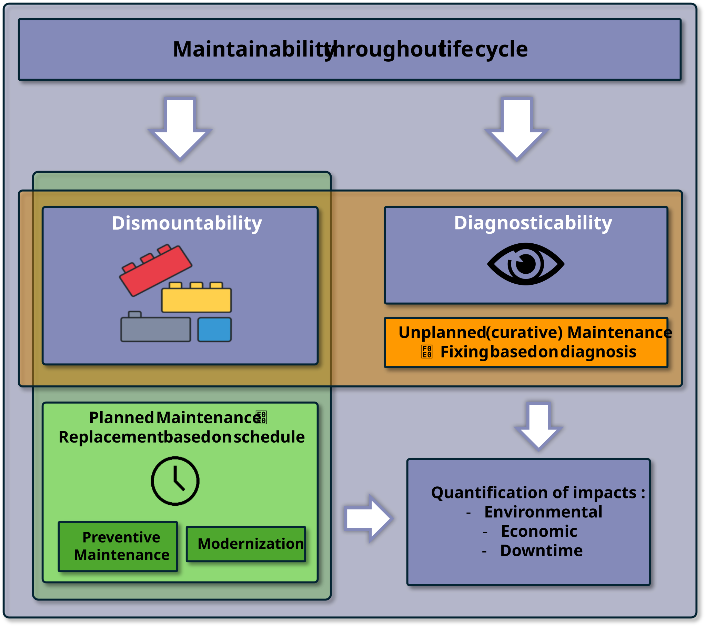
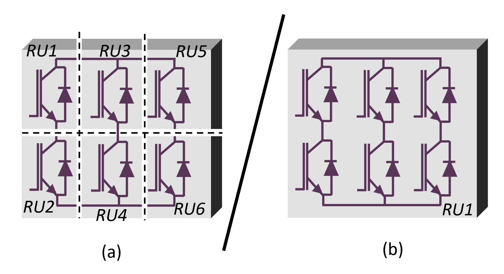
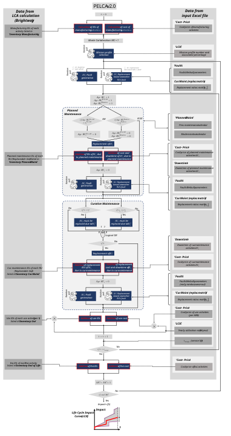
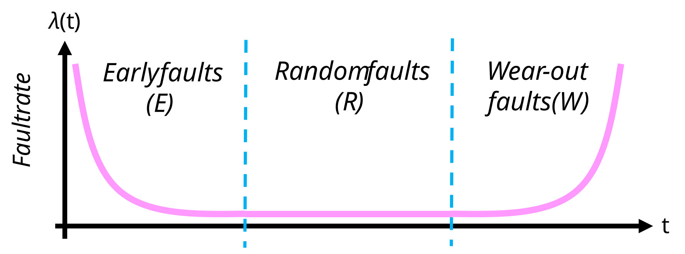
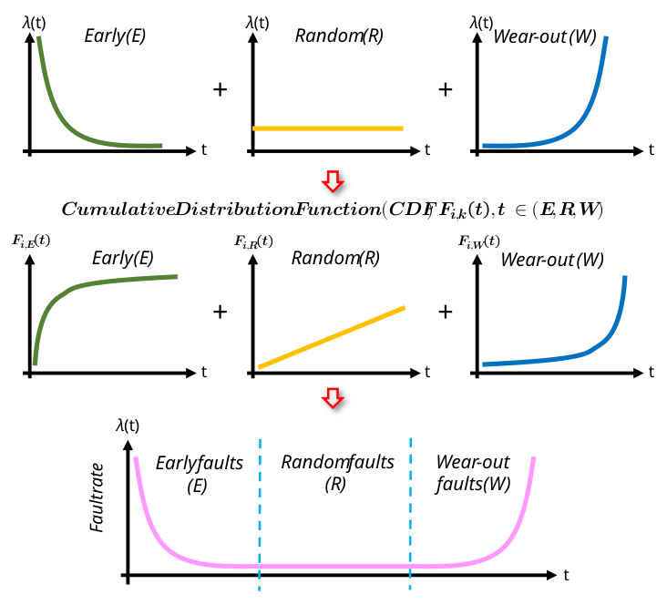
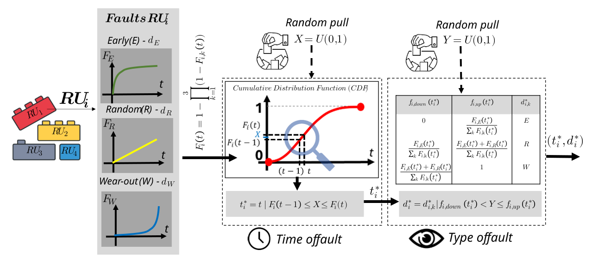
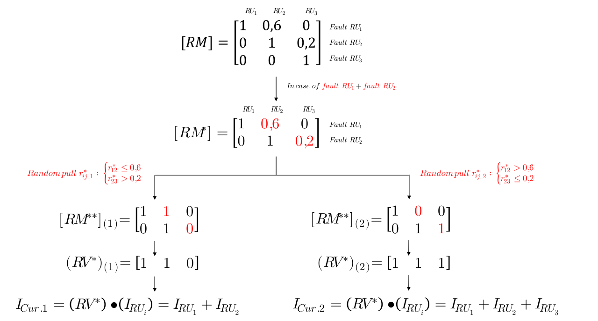

    

# PELCA algorithm

## Table of Contents
- [Overview](#overview)
- [Assessed impacts](#assessed-impacts)
- [PELCA algorithm](#pelca-algorithm-1)
- [Planned maintenance](#planned-maintenance)
- [Curative (unplanned) maintenance](#curative-unplanned-maintenance)
- [Fault model](#fault-model)
- [Fault generation](#fault-generation)
- [Curative Maintenance: replacement matrix (RM) & impacts quantification](#curative-maintenance-replacement-matrix-rm--impacts-quantification)

## Overview
PELCA allows the statistical assessment of the impacts of a system by running a large number of computation iterations based on Monte Carlo simulations. 
At each Monte Carlo iteration, PELCA triggers '_random pulls_' to probabilistically estimate the service life scenario of the system in terms of mission profile, fault rates, and parts replacement due to planned and unplanned maintenance. 

In addition, the version 2.0 of the PELCA software is based on the notion of **'activity'**, which can represent either a part of the system, an energy consumption, a maintenance intervention (planned or unplanned), or an end of life (EoL) scenario.
Each phase of the system's life cycle ('_Manufacturing_', '_Use_', '_Planned Maint._', '_Cur. Maint._', '_End of life_') may include several activities, listed in the corresponding '_Inventory_' sheet of the input Excel file.
The activities related to maintenance interventions are labelled, in PELCA, as **'Replaceable Units' (RUs)** since they aim at representing parts of the system that can be dismounted and replaced in the frame of a maintenance operation, either planned or unplanned.

As shown in Figure 1, PELCA models the maintainability of a system throughout its life cycle based on its dismountability (ability to be dismounted and selectively replaced) and on its diagnosticability (ability of the system to locate a fault when it occurs).

Planned maintenance consists in replacing one or several parts of the system based on a defined maintenance calendar, and only requires the system to be dismountable.
It can either be a 'Preventive Maintenance' operation or a 'Modernization' operation.
Those two types of planned maintenance operations share the same list of activities / RUs included in the '_Inventory - Planned Maint._' sheet of the input Excel file. 
The level of granularity of those activities / RUs can be fine-tuned by the user to represent the level of dismountability of the system in the frame of planned maintenance.
In addition, the calendar, the concerned RUs and the downtime impact associated with each type of planned maintenance operation can be fine-tuned by the user (in the '_Planned Maint._' and '_Downtime_' sheets of the Excel file, respectively). 
See [Planned maintenance](#planned-maintenance) for more details.

Unplanned (or curative) maintenance consists in fixing the system based on faults and diagnosis by replacing one or several parts when one part fails. It requires the system to be both dismountable and diagnosticable.
Similarly to planned maintenance, the level of granularity of the activities / RUs listed in the '_Inventory - Cur. Maint._' sheet represent the level of dismountability of the system in the frame of unplanned maintenance
In addition, the level of curative maintainability of the system can be fine-tuned by adjusting the coefficients of the replacement matrix in the '_Cur. Maint. (replac. matrix)_' sheet, which represents the diagnosticability of the system, e.g. its ability to be selectively replaced.
See [Curative (unplanned) maintenance](#curative-unplanned-maintenance) for more details.

    
      Fig. 1 : Schematic view of planned and unplanned maintenance operations based on system dismountability and/or diagnosticability

Consider the example of an inverter in Figure 2 : in case (a), the inverter has 6 RUs, allowing to replace a specific power switch individually.
In contrast, case (b) consists of a single RU-inverter, meaning that if a fault occurs, the entire system must be replaced.

    
      Fig. 2 : Examplary representation of the concept of Replaceable Unit (RU)

Therefore, the RUs tend to represent the maximum level of modularity of the system.
When a RU is replaced through a maintenance operation, either planned or unplanned, its age is reset to zero.

## Assessed impacts
The version 2.0 of PELCA allows to statistically quantify different types of impacts of a system throughout its life cycle :
- Environmental impacts, based on the 16 environmental impact categories of the Product Environmental Footprint (PEF) impact assessment method ;
- Economic impact, representing the cost / price of a system along its life cycle, and based on the information provided by the user in the '_Cost - Price_' sheet of the input Excel file ;
- Downtime impact, representing the calendar impact of planned and unplanned maintenance operations of a system along its life cycle, and based on the information provided by the user in the '_Downtime_' sheet of the input Excel file. 

Environmental and economic impacts are assessed for all phases of the system's life cycle ('_Manufacturing_', '_Use_', '_Planned Maint._', '_Cur. Maint._', '_End of life_').
Downtime impact is assessed for the '_Planned Maint._' and '_Cur. Maint._' phases of the system's life cycle.

To quantify those impacts, inventories for the different phases of the system life cycle must be provided.
More details on the construction of those inventories and on the structure of the input Excel file they are included in are available in the [PELCA Instructions](PELCA_Instructions.md) documentation.

## PELCA algorithm
The general algorithm of PELCA is presented in Figure 3 and applies to each RUi and Monte-Carlo iteration in parallel.

    
      Fig. 3 : PELCA algorithm - Statistical impacts modelling throughout a system's life cycle

At t = 0, the environmental and economic impacts of the system at the '_Manufacturing_' stage are calculated based on the activities listed in the *‘_Inventory – Manufacturing_’* sheet and on the information from the *‘Cost – Price’* sheet of the input Excel file.

After this initial calculation, the number of Monte Carlo iterations (indicated in cell B15 of the '_LCIC_' sheet of the input Excel file) starts to be incremented.

At each Monte-Carlo iteration, random pulls are performed at different steps of the algorithm to probabilistically determine, for each replaceable unit _i_ (RUi) :
1. The mission profile, when different mission profiles are indicated by the user in the '_LCIC_', '_Inventory - Use_', '_Faults_' and '_Planned Maint._' sheets of the input Excel file (see also [PELCA Instructions](PELCA_Instructions.md)) ;
2. The temporal occurrence of faults _[ti*]_ and the type of fault _[di*]_ (early, random, or wear-out) ; this results in a lifetime vector _[t*]_ and a fault type vector _[d*]_ containing the information for each RUi, which are used to simulate the unplanned (or curative) maintenance operations ;
3. The replacement of RUi when it fails or when other RUs fail, based on the replacement matrix (RM) indicated in the '_Curative Maint. (replac. matrix)_' sheet of the input Excel file ; this results in a replacement ratios vector _[ri,j*]_ containing the curative maintenance information for each RUi.

Those random pulls are performed at the following steps of the PELCA algorithm :
- At the beginning of each Monte Carlo iteration, 3 random pulls are performed : 
  - 1 random pull to select the mission profile 
  - 1 random pull to generate the fault times _[ti*]_ and fault types _[di*]_
  - 1 random pull to generate the replacement ratios vector _[ri,j*]_
- If the RU is replaced due to a planned maintenance (either preventive maintenance or modernization), 2 random pulls are performed at the end of the planned maintenance step :
  - 1 random pull to generate the fault times _[ti*]_ and fault types _[di*]_ of the new RU
  - 1 random pull to generate the replacement ratios vector _[ri,j*]_ of the new RU
- If the RU is replaced due to curative maintenance, 2 random pulls are performed at the end of the curative maintenance step :
  - 1 random pull to generate the fault times _[ti*]_ and fault types _[di*]_ of the new RU
  - 1 random pull to generate the replacement ratios vector _[ri,j*]_ of the new RU
Note that the random pull for mission profile selection is carried out only once at the beginning of each Monte Carlo iteration. 
Therefore, the same mission profile will apply to all activities and RUs considered in the course os a single Monte Carlo loop.

As shown in Figure 3, the PELCA algorithm includes two types of maintenance (carried out sequentially in that order) : planned maintenance and unplanned maintenance.

## Planned maintenance
Based on schedule (year of maintenance), this type of maintenance can either consist in a preventive maintenance operation or a modernization operation. 
Each one can be activated or deactivated in the '_LCIC_' sheet of the input Excel file and fine-tuned in terms of calendar (sheet '_PLanned. Maint._'), induced system downtime (sheet '_Downtime_') and cost (sheet '_Cost - Price_') by the user in the input Excel file (see [PELCA Instructions](PELCA_Instructions.md) for more details).

When a planned maintenance occurs (either preventive maintenance or modernization), the concerned RUs are replaced by the corresponding RUs from the sheet '_Inventory - Planned Maint._' of the input Excel file.
Thus, the environmental, economic, and downtime impacts of the RUs associated with the corresponding planned maintenance activity are appended to their respective totals.

Preventive maintenance and modernization share the same list of exchanges included in the '_Inventory - Planned Maint._' sheet of the input Excel file, which is aimed to represent the impacts of the different '_Planned Maintenance_' activities.
Also, for a given RUi, the same economic impact applies to both preventive maintenance and modernization operations.
However, the user is able to fine tune the respective environmental and economic impacts of preventive maintenance and modernization operations by indicating or not calendar information for each RUi and each type of planned maintenance in the '_Planned Maint._' sheet. 
By indicating calendar information or leaving the cell empty for a given RUi and a given type of planned maintenance operation, the user is able to modulate the number of RUs considered in the frame of both types of planned maintenance operations and thus to adjust their respective environmental and economic impacts.
Complementary, the '_Downtime_' impact of both types of planned maintenance operation can be adjusted in the '_Downtime_' sheet of the input Excel file (see Fig. 8), given that the respective duration of those two types of planned maintenance operation may differ significantly. 

The user should note that :
- If '_Preventive Maintenance_' or '_Modernization_' is deactivated (set to 'False' in the '_LCIC_' sheet of the input Excel file), PELCA will automatically ignore the deactivated type(s) of planned maintenance for all RUs ; 
- If both types of planned maintenance are deactivated, the time loop bypasses the planned maintenance step and moves directly to curative maintenance ;
- If, for a given RUi, both types of planned maintenance have the same calendar, the modernization intervention is prioritary and the preventive maintenance operation is ignored ; thus only the impacts of modernization are appended.

Finally, as shown on Fig. 3, those two types of planned maintenance operations also have different impacts on the maintenance calendar :
- A preventive maintenance operation does not reset the time counter of modernization ;
- A modernization operation automatically resets the time counter of preventive maintenance to 0.

After having been replaced in the frame of a planned maintenance operation : 
- The age of the RUs that have been replaced is reset to 0 ;
- All the RUs that have been replaced are submitted to new random pulls allowing to generate new fault time _[ti*]_, fault type _[di*]_, and replacement ratios _[ri,j*]_ vectors.

## Curative (unplanned) maintenance
Based on fault rates (early, random, wear-out, sheet '_Faults_' of the input Excel file) and on the coefficients of the replacement matrix (RM) (sheet '_Cur. Maint. (replac. matrix)_'), curative maintenance consists in replacing one or several RU(s) when RUi fails (see [PELCA Instructions](PELCA_Instructions.md) for more details).
The replacement matrix is to be seen as a representation of the maintainability of the system in the frame of a curative maintenance, this curative maintainability being a combination of the dismountability (ability of a system to be dismounted) and of the diagnosticability of the system (ability of a system to locate a fault when it occurs).

In the time loop, if at a given moment _ti*_ equals _t_, this means that a fault appears. 
At _t = t*_, a list of all faulty _RUi_, _RU*_, is established. 
Then, depending on the faults and on the replacement matrix, a replacement scenario is defined for the RUs that will be replaced at _t = t*_, forming the vector _RV*_. 
This allows the calculation of the environmental, economic and downtime impacts at the replacement of the faulty part _RUi_.

Similarly to the planned maintenance, when a curative maintenance occurs, the impacted RUs are replaced by the corresponding RUs from the sheet '_Inventory - Cur. Maint._' of the input Excel file based on the coefficients of the replacement matrix (RM).
Thus, the environmental, economic, and downtime impacts of the RUs associated with the corresponding curative maintenance activity are appended to their respective totals.

After having been replaced in the frame of a curative maintenance operation : 
- The age of the RUs that have been replaced is reset to 0 ; 
- All replaced RUs are submitted to new random pulls allowing to generate new fault time _[ti*]_, fault type _[di*]_, and replacement ratios _[ri,j*]_ vectors.

After the curative maintenance step of the time loop, the impacts (environmental and economic) of the use phase of the system are calculated, based on the activities listed in the '_Inventory - Use_' sheet, on the use cost information from the '_Cost - Price_' sheet, and on the annual usage time indicated in the 'LCIC' sheet of the input Excel file, respectively.

Then, the time advances to t + 1. This loop is repeated until the end of the system service life indicated by the user in the '_LCIC_' sheet of the Excel file.

Finally, once the system service life has been reached, the environmental and economic impacts of the activities listed in the '_Inventory - End of Life_' sheet of the input Excel file are appended to the total impacts of the system.

This time loop from '_t = 0_' up to '_t = service life_' is repeated N times, N being the number of Monte Carlo iterations indicated by the user in cell B15 of the '_LCIC_' sheet of the input Excel file, until the final number of Monte Carlo iterations is reached.

## Fault model
It has been observed that the failure rate dynamics of electronic systems follow a trend commonly illustrated by the "bathtub curve", as shown in Figure 4.
This curve characterizes the different failure phases during the service life of an electronic part, encompassing the 'Early' faults (related to issues from inadequate design or manufacturing), the 'Random' faults (where failures occur randomly), and the 'Wear-out' faults (resulting from aging).

    
      Fig. 4 : Bathtub curve representation

To assess component reliability, statistical laws are commonly used. 
The Weibull distribution is one of them and is employed in PELCA to model the occurrence of each type of fault and to replicate the 'bathtub curve'.

The Weibull distribution is defined by two parameters : σ (the scale parameter, in years) and β (the shape paramete, dimensionless). 

The σ parameter aims at representing the temporal occurrence of each type of fault. 
A σ parameter much larger than the system's service life means that this type of fault will never occur.
A σ parameter lower or in the order of the system's service life means that this type of fault is likely to occur during the system's service life.

The β parameter aims at representing the probability of occurrence of each type of fault.
To model the probability of failure of a system's part, a β < 1 is typically associated with the early faults, a β = 1 is associated with the random faults occurring during the part' service life, while a β > 1 is associated with the wear-out faults induced by aging.
Through the above approach, the wear-out faults are modeled as being the most likely to occur during the service life of the part.

Thus, each RU has three Weibull Cumulative Distribution (WCDF) functions, each one associated with a type of fault. 
By combining the three WCDF respectively representing the probability of occurrence of early, random, and wear-out faults, the bathtub curve can be reconstructed, as illustrated in Figure 5.

    
      Fig. 5 : Modeling of the bathtub curve representing the probability of failure using three Weibull functions associated with early, random, and wear-out failures

Each type of fault can be activated / deactivated and the parameters of the corresponding Weibull CDF can be fine-tuned by the user in the ‘_LCIC_’ and ’_Faults_’ sheets of the input Excel file, respectively (see [PELCA Instructions](PELCA_Instructions.md) for more details).

## Fault generation
This section details how are determined the types of fault (_di*_) and their temporal occurrence (_ti*_) for each RUi, triggering curative maintenance operations.
This procedure is illustrated in Figure 6.

    
      Fig. 6 : PELCA fault generation methodology

Initially, the Weibull Cumulative Distribution Function (WCDF) _Fi_ of each _RUi_ representing the probability of occurrence of early, random and wear-out faults are determined based on the σ and β Weibull fault parameters indicated by the user in the _'LCIC_' sheet of the input Excel file. 
Once the CDF _Fi_ of _RUi_ is established, a random number _X_ is pulled between 0 and 1 according to a uniform distribution. 
If the condition _Fi (t −1)_ < _X_ ≤ _Fi (t)_ is satisfied, the time step t is considered to be a fault time for _RUi_, denoted as _ti*_. 
A second random number _Y_ is pulled to determine the fault type (i.e. early, random or wear-out) _di*_, based on the probabilities associated with each fault type at the time of the fault.

This algorithm allows for determining, for each RU, both the time at which a fault occurs (_ti*_) and the type of fault that occurs (_di*_). 
This enables the generation of two vectors, _t*_ and _d*_, of size _m_, representing the occurrence times and fault types for each RU, respectively.

## Curative Maintenance: replacement matrix (RM) & impacts quantification
PELCA allows modelling the ability of a system composed of several RUs to diagnostic a fault and to be repaired based in this diagnosis (curative maintenance) through the replacement matrix (RM).
The numbers in the RM represent the probability to replace each RU when a fault occurs in a specific RU, with values ranging from 0 to 1.

For clarity, consider an example with 3 RUs, resulting in a 3 x 3 matrix, as shown in Figure 7.

    
      Fig. 7 : Replacement Matrix [RM] - Example with 3 RUs

The columns of the matrix represent the RUs and the rows represent the faults. 
In this example, the first row, second column (_Fault RU1_, _RU2_) is 0,6 ; the second row, third column (_Fault RU2_, _RU3_) is 0,2. 
Note that the values in the diagonal of the matrix are always 1 since each _RUi_ is replaced with 100 % probability when _Fault RUi_ occurs.

Those values indicate that :
-	When a fault occurs in _RU1_ &rarr; _RU1_ is replaced with 100 % probability and _RU2_ is replaced with 60 % probability ;
-	When a fault occurs in _RU2_ &rarr; _RU2_ is replaced with 100 % probability and _RU3_ is replaced with 20 % probability ;
-	When a fault occurs in _RU3_ &rarr; _RU3_ is replaced with 100 % probability.

Based on this _RM_, a fault generation random pull and a replacement ratios random pull are carried out in parallel (see Fig. 3).

Based on the result of the fault generation random pull, a reduced replacement matrix [_RM*_] is extracted from replacement matrix [_RM_], which only contains the lines corresponding to faulty RUs. 
In Fig. 6, the result of this random pull is ‘_Fault RU1 + Fault RU2_’, which leads to a 2 x 3 [_RM*_] matrix.

Based on this _RM*_ matrix, Fig. 6 attempts to illustrate the impact of two different replacement ratios random pulls (although only one replacement ratios random pull is carried out at each curative maintenance step) :

1. Random pull _r*ij_1_ :
   - The drawn number for _r*12_ is inferior or equal to 0,6 &rarr; _RU2_ is replaced when _Fault RU1_ occurs &rarr; _RM**12_ = 1
   - The drawn number for _r*23_ is strictly superior to 0,2 &rarr; _RU3_ is not replaced when _Fault RU2_ occurs &rarr; _RM**23_ = 0

2. Random pull _r*ij_2_ :
   - The drawn number for _r*12_ is strictly superior to 0,6 &rarr; _RU2_ is not replaced when _Fault RU1_ occurs &rarr; _RM**12_ = 0
   - The drawn number for _r*23_ is inferior or equal to 0,2 &rarr; _RU3_ is replaced when Fault RU2 occurs &rarr; _RM**23_ = 1

This leads to the calculation of two replacement vectors (_RV*_) of 1 x 3 dimensions ; each column of (_RV*_) is calculated by adding the values in each column of the [_RM**_] matrix. 
If the sum is strictly superior to 1, the value of the corresponding column in (_RV*_) is set to 1.

Based on (_RV*_), the impacts (environmental, economic, and downtime) of the replacement of RUi based on curative maintenance are calculated based, respectively, on : 
- The activities corresponding to all RUs impacted by the curative replacement of RUi, listed in the '_Cur. Maint. (replac. matrix)_' sheet of the input Excel file ;
- The cost of curative maintenance of all RUs impacted by the curative replacement of RUi, indicated in the '_Cost - Price_' sheet of the input Excel file ;
- The downtime induced by curative maintenance of all RUs impacted by the curative replacement of RUi, indicated in the '_Downtime_' sheet of the input Excel file.

For each _RUi_ and each temporal iteration _ti_, such calculation of the impacts of curative maintenance is carried out as many times as there are Monte Carlo iterations to be ran.