<p align="center">
    
</p>

# How to use PELCA ?

## Table of Contents
- [Input Excel file](#input-excel-file)
  - [LCA sheet](#_lca_-sheet)
  - [LCIA sheet](#_lcia_-sheet-life-cycle-impact-assessment)
  - [LCIC sheet](#_lcic_-sheet-life-cycle-impact-curve)
  - [Cost - Price sheet](#_cost---price_-sheet)
  - [Downtime sheet](#_downtime_-sheet)
  - [Faults sheet](#_faults_-sheet)
  - [Planned Maintenance sheet](#_planned-maint_-sheet)
  - [Cur. Maint. (replac. matrix) sheet](#_cur-maint-replac-matrix_-sheet)
- [Running PELCA](#running-pelca)
- [Saving data](#saving-data)
- [Output graphs](#output-graphs)
- [Output Excel files](#output-excel-files)
  - [LCA output](#_lca-output_-)
  - [LCIC output](#_lcic-output_-)

## Input Excel file
As outlined in the [README.md](../README.md), PELCA has been developed based on the Python library Brightway2. The input Excel file therefore follows the specific template of the Brightway library for the inventory sections.
More details on the Brightway library are available in the dedicated online documentation (https://docs.brightway.dev/en/latest/index.html).

Several input Excel files associated with different types of power electronic systems (E-fuse, Power Module & Capacitor) are provided in the [PELCA datasets](../PELCA%20datasets/) folder of the repository for the user to be able to run PELCA with exemplary use cases :
- ```PELCA_v2.0.0_EFuse.xlsm```
- ```PELCA_v2.0.0_PowerModuleAndCapacitor.xlsm```

Note that these input Excel files are in .xlsm format since they embedd macros.
The user is therefore invited to allow the activation of macros when opening the downloaded Excel files.

The section below explains in details the generic structure of the PELCA input Excel file. 
Instructions on how to configure it before running PELCA are also available in the installation guide of PELCA ([README](../README.md)).

The version 2.0 of the PELCA software is based on the notion of **'activity'**, which can represent either a part of the system, an energy consumption, a maintenance intervention, or an end of life (EoL) scenario.
The activities related to maintenance interventions are labelled, in PELCA, as **'Replaceable Units'** (RUs) since they aim at representing parts of the system that can be replaced in the frame of a maintenance operation, either planned or unplanned.

The PELCA input Excel file includes several **'inventory'** sheets, each one composed of different activities :
- **'_Inventory - Manufacturing_'** : activities representing the production of the different parts of the system ;
- **'_Inventory - Use_'** : activities representing the energy consumption of the different parts of the system ;
- **'_Inventory - Planned Maint._'** : activities associated with the planned maintenance of the system (based only on a maintenance calendar, those activities can be either preventive maintenance or system modernization) ;
- **'_Inventory - Cur. Maint._'** : activities associated with the curative (or unplanned) maintenance of the system (based on faults & system diagnosis) ;
- **'_Inventory - End of Life_'** : activities associated with the end of life (EoL) of the system.

It should be noted that the number of RUs in the '_Inventory - Planned Maint._' and '_Inventory - Cur. Maint._' sheets should always be the same for each RU to be maintainable in a planned or unplanned manner.

<p align="center">
    <br>
    <br> Fig. 1: View of the different 'Inventory' sheets of the PELCA input Excel file
</p>

Each activity is composed of a list of exchange flows (either inputs or outputs) corresponding to existing datasets from the ecoinvent v3.9.1 (cut-off, ecospold02 format) or biosphere3 environmental databases.
Details on how to download and install the ecoinvent database can be found in the installation guide of PELCA ([README](../README.md)).

<p align="center">
    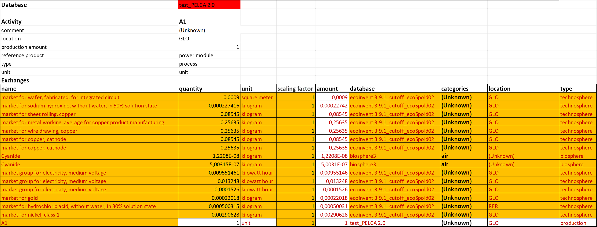
    <br> Fig. 2: View of the 'Inventory - Manufacturing' sheet of the input Excel file, showing a list of exchange flows composing an activity
</p>

In cell B2 of the 'Inventory - Manufacturing' sheet, the user has to indicate the name of the database corresponding to the project.
This database includes all the exchanges from all the activities listed in the different 'Inventory' sheets of the input Excel file.
Therefore, the user should note that each activity must have a unique name since Brightway does not accept different activities from a single database sharing the same name.

Complementary to the inventory sheets, the input Excel file also includes the following sheets:


### **'_LCA_' sheet**:
Sheet in which the user has to modify the red cells before running PELCA (file paths, project name).

<p align="center">
    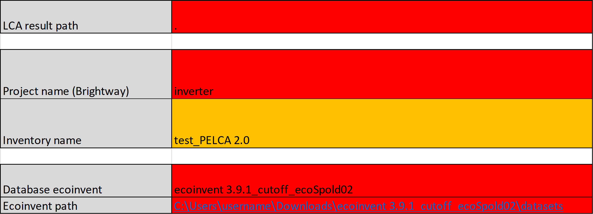
    <br> Fig. 3: View of the 'LCA' sheet of the input Excel file
</p>

| Parameter                    | Example                                                                  | Description                                                                                                                                                                                                                                                                |
|------------------------------|--------------------------------------------------------------------------|----------------------------------------------------------------------------------------------------------------------------------------------------------------------------------------------------------------------------------------------------------------------------|
| **LCA result path**          | `. or C:\Users\username\filepath`                                        | Path where the _'Results PELCA'_ folder will be created. If the folder doesn’t exist, it will be created automatically. By default, the path is indicated by a single dot in the input Excel file, meaning that the folder will be created in the current PELCA directory. |
| **Project name (Brightway)** | `inverter`                                                               | Name of the project in Brightway ; note that databases must be reinstalled for each new project.                                                                                                                                                                           |
| **Inventory name**           | `test_PELCA 2.0`                                                         | Name of the inventory database, corresponding to the name of database provided by the user in cell B2 of the 'Inventory - Manufacturing' sheet.                                                                                                                            |
| **Database ecoinvent**       | `ecoinvent 3.9.1_cutoff_ecoSpold02`                                      | Name of the Ecoinvent database used in Brightway.                                                                                                                                                                                                                          |
| **Ecoinvent path**           | `C:\Users\username\Downloads\ecoinvent 3.9.1_cutoff_ecoSpold02\datasets` | Path to the `datasets` folder of the ecoinvent database.                                                                                                                                                                                                                   |


### **'_LCIA_' sheet** (Life Cycle Impact Assessment):
The table of the '_LCIA_' sheet of the input Excel file provides details on the 16 categories of environmental impact (EI) assessed by PELCA based on the Product Environmental Footprint (PEF) method developed by the Joint Research Center (JRC): acronyms, impact category, impact description, and unit.
The impact assessment method used in PELCA is the EF v3.0 no Long Term (no LT) method.

<p align="center">
    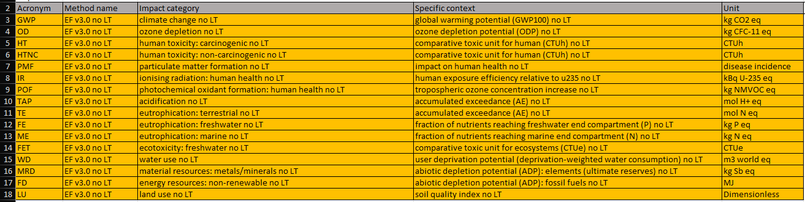
    <br> Fig. 4: 'LCIA' sheet of the input Excel file - Environmental impacts assessed according to the PEF method
</p>


### **'_LCIC_' sheet** (Life Cycle Impact Curve):
The 'LCIC' sheet of the input Excel file is a key item of the PELCA simulation tool since it allows the user to fine-tune different aspects of the system's life cycle : 
- Service life (years)
- Utilization rate (hours/year) 
- Mission profiles (%)
- Number of time steps (step/year)
- Activation/deactivation of failures (early, random, or wear-out) 
- Activation/deactivation of preventive maintenance and modernization 
- Number of Monte Carlo iterations
- Specific EI plotted in the output graphs

<p align="center">
    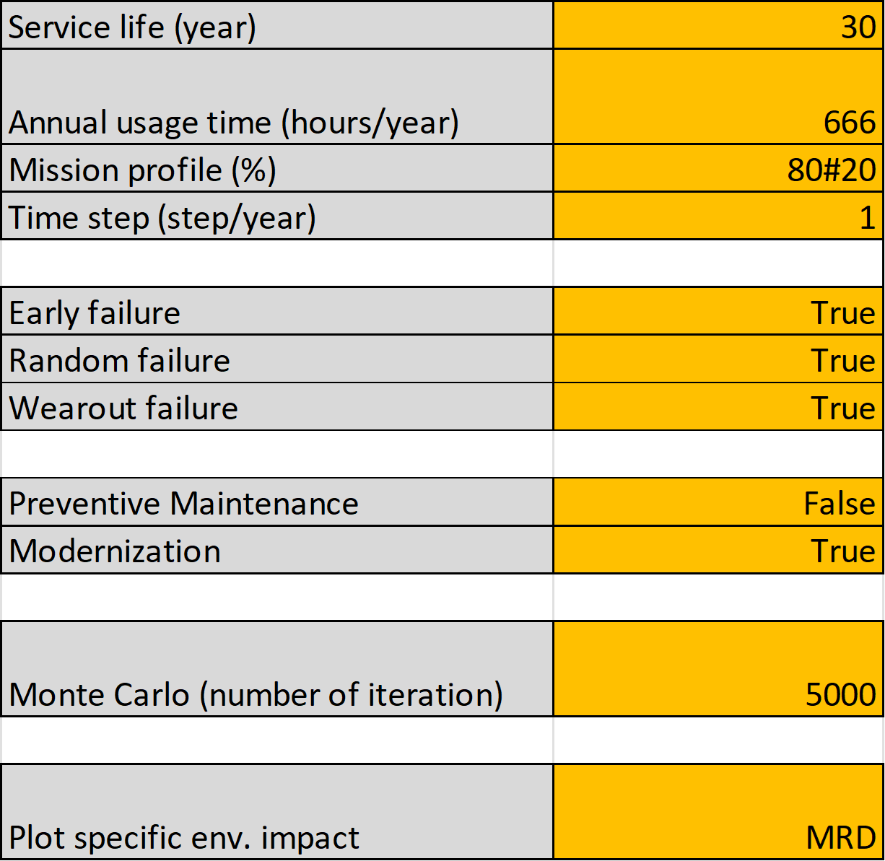
    <br> Fig. 5: View of the 'LCIC' sheet of the input Excel file
</p>

In the above example, the service life of the system is set to 30 years and its annual usage time (or utilization rate) is set to 666 hours per year.

Two mission profiles are indicated in the dedicated 'Mission profile' cell, separated by a dash symbol:
- The first mission profile corresponds to 80% of the total usage time
- The second mission profile represents the remaining 20% of the total usage time.

Note that the sum of the values indicated in the 'Mission profile' cell of the 'LCIC' sheet must always be equal to 100, otherwise PELCA will raise an error.
If only one mission profile is to be simulated, the user should just indicate 100 in the 'Mission profile' cell.
PELCA will then ignore the mission profile aspect of the system' service life and the random pull associated with mission profile selection in the frame of the successive time loops (see also [Algorithm](Algorithm.md)).
Also note that PELCA is not limited to a maximum number of mission profiles, as long as relevant information associated with each mission profile is indicated in the dedicated cells of the input Excel file.
The only practical limit to the number of mission profiles the user can simulate is the computation time, which may increase with the number of mission profiles.

For each mission profile, associated information regarding their respective energy consumption, fault rates, and planned maintenance schedule can be indicated in the '_Inventory - Use_', '_Faults_', and '_Planned Maint._' sheets of the input Excel file, respectively (see Fig. 6, 9, and 10).
Based on the parameters of the different mission profiles, PELCA will automatically compute the environmental, economic, and downtime impacts of the system taking into account, in a probabilistic way, the different mission profiles (see also [Algorithm](Algorithm.md) for more details).
Note that PELCA automatically associates each mission profile to its associated values of energy consumption, fault rates, and planned maintenance schedule based on the order they are indicated in the corresponding cells.

<p align="center">
    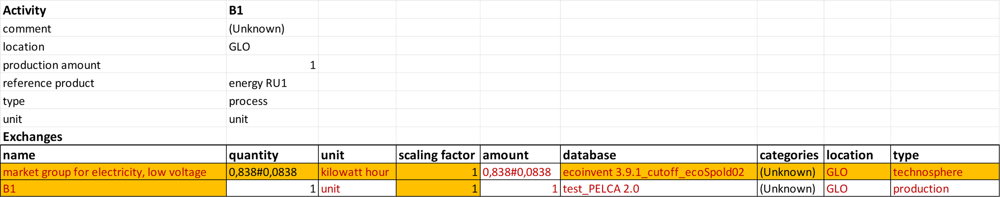
    <br> Fig. 6: View of the 'Inventory - Use' sheet of the input Excel file, including information of energy consumption associated with two mission profiles separated by a dash symbol
</p>

In Figure 6, the activity B1 includes two mission profiles:
- A first mission profile with an electricity consumption of 0.838 kWh/h, associated with the mission profile representing 80% of the total usage time (see '_Mission profile_' cell in Fig. 5) ;
- A second mission profile with an electricity consumption of 0.0838 kWh/h, associated with the mission profile representing 20% of the total usage time (see '_Mission profile_' cell in Fig. 5).

The user should note that :
- If, for a given activity listed in the '_Inventory - Use_', no value of energy consumption is indicated, PELCA will not be able to compute the LCIC curves and will indicate an error ;
- If the energy consumption of an activity is equal to zero, the user should indicate 0 in the corresponding '_quantity_' cell of the '_Inventory - Use_' sheet ;
- If, for a given activity listed in the '_Inventory - Use_', only one value is indicated in the '_quantity_' cell of the '_Inventory - Use_' sheet, PELCA will use the indicated energy consumption value to simulate the impacts of this activity, independently from the number of mission profiles indicated in the '_Mission profile_' cell of the '_LCIC_' sheet ;
- If, for a given activity listed in the '_Inventory - Use_', a number of energy consumption values different from 1 or the number of mission profiles indicated in the '_LCIC_' sheet is indicated in the '_quantity_' cell, PELCA will not be able to compute the LCIC curves and will indicate an error.

Also, in the example of '_LCIC_' sheet of Fig. 5, all type of faults (early, random, wear-out) triggering potential curative maintenance operations are activated since the corresponding yellow boxes are set to '_True_'.
If one type of default si set to '_False_' by the user, this type of default will be ignored for all RUs in the course of the simulation.  

On the other hand, the preventive maintenance is deactivated (the corresponding cell being set to '_False_') while the modernization is activated (the corresponding cell being set to '_True_').
If one type of planned maintenance activity (either preventive maintenance or modernization) is deactivated by the user, this type of maintenance operation will be fully ignored in the course of the simulation and the corresponding bar graph will not be generated by PELCA.

In Figure 5, the number of Monte Carlo iterations, corresponding to the number of random pulls associated with fault generation (see [Algorithm](Algorithm.md) for more details), is set to 5000.

Finally, a specific environmental impact category can be chosen by the user among the 16 assessed impact categories listed in the '_LCIA_' sheet by indicating its corresponding acronym.
In Fig. 5, the Mineral Resource Depletion (MRD) impact category has been selected to plot the specific life cycle impact curve (LCIC) dedicated to this impact category.


### **'_Cost - Price_' sheet**:
In the '_Cost - Price_' sheet of the input Excel file, the user is invited to provide cost or pricing information associated with the different activities and RUs listed in the inventory sheets :
-	Cost / price of '_Manufacturing_' ;
-	Cost / price of '_Use_' ;
-	Cost / price of '_Planned Maintenance_' ;
-	Cost / price of '_Curative Maintenance_' ;
-   Cost / price of '_End of life_' (EoL).
Those cost / price inputs are used by PELCA to generate a life cycle impact curve (LCIC) describing, similarly to the environmental impacts assessment, the evolution of the economic impact of the system throughout the different phases of its life cycle.

<p align="center">
    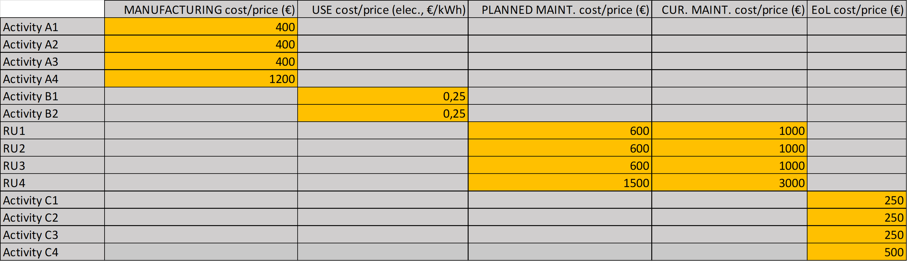
    <br> Fig. 7: View of the 'Cost - Price' sheet of the input Excel file, including economic impact of manufacturing, use, planned maintenance, curative maintenance, and end-of-life activities
</p>

The user should note that the '_Cost - Price_' information of the '_Planned maintenance_' category applies to both preventive maintenance and modernization operations. 
The user should also note that PELCA will associate the order of the information provided by the user in the '_Cost - Price_' table with the order of the activities listed in the different '_Inventory_' sheets of the Excel file, from the top of the '_Inventory - Manufacturing_' sheet down to the bottom of the '_Inventory - End of Life_' sheet.
It is therefore important that the user respects the same names and the same order between the activities listed in the '_Inventory_' sheets and the rows of the 'Cost - Price' information table.
Also, cost / price information relative to manufacturing, use phase, planned maintenance, curative maintenance, and end of life should be indicated in columns B, C, D, E anf F, of the '_Cost - Price_' sheet, respectively.


### **'_Downtime_' sheet**:
The version 2.0 of PELCA integrates a new feature in the form of the downtime impact of maintenance operations.
In the '_Downtime_' sheet of the input Excel file, the user is invited to provide downtimes for all activities associated with curative (unplanned) and planned (preventive maintenance and system modernization) maintenance operations.
Based on his knowledge of the maintenance operations of the system he simulates, the user is thus able to compute the cumulative downtime impact through the entire system's service life.

<p align="center">
    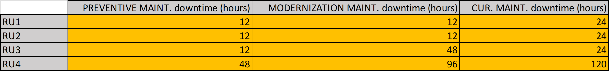
    <br> Fig. 8: View of the 'Downtime' sheet of the input Excel file, including downtime information related to preventive maintenance, modernization, and curative maintenance operations
</p>

For a given RUi, '_Downtime_' impact information must be provided for '_Curative Maintenance_' operations (column D in Fig. 8) as soon as, for this RUi, Weibull parameters (both σ (scale parameter) and β (shape parameter)) are indicated for one type of fault in the '_Faults_' sheet of the Excel file ; otherwise, PELCA will raise an error.
Similarly, for a given RUi, '_Downtime_' impact information must be provided for '_Preventive Maintenance_' and/or '_Modernization_' operations (column B and C in Fig. 8) as soon as, for this RUi, an associated maintenance calendar is indicated in the '_Planned Maint._' sheet of the input Excel file ; otherwise, PELCA will raise an error.

Note that the downtime impact has been thought of as a temporal impact of maintenance operations, considered by the authors to be an interesting complement to the environmental and economic impacts assessed by the software.
Therefore, the downtime impact does not include the economic impact of system downtime induced by maintenance operations ; to do so, the user is invited to use the '_Cost - Price_' sheet of the input Excel file and to include the costs of downtime in those of the planned maintenance and curative maintenance activities (see Fig. 7).


### **'_Faults_' sheet**:
In the '_Faults_' sheet of the input Excel file, the user is invited to indicate, for the different replaceable units (RUs : RU1, RU2, RU3 and RU4 in Fig. 9), the values of their Weibull parameters (σ (scale parameter) and β (shape parameter)) for each type of fault (early, random, and wear-out) (see also [Algorithm](Algorithm.md) for more details).

<p align="center">
    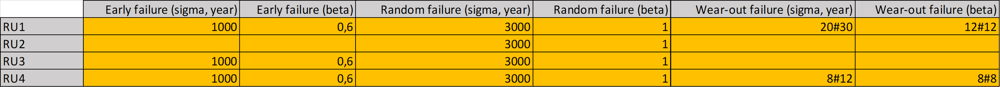
    <br> Fig. 9: View of the 'Faults' sheet of the input Excel file, including sigma and beta parameters
</p>

For a given RU, the curative maintenance operation consists in replacing this RU with the corresponding RU from the '_Inventory - Cur. Maint._' sheet of the input Excel file.

Similarly to the energy consumption parameters in the use phase, PELCA allows the user to simulate different fault rates for the different mission profiles indicated in the '_LCIC_' sheet.
For instance, in Figure 9, RU1 and RU4 have different σ and β Weibull parameters, corresponding to the two mission profiles indicated in the '_LCIC_' sheet (see Fig. 5).

The user should note that :
- If the '_Early_', '_Random_', or '_Wear-out_' type of fault is deactivated in the '_LCIC_' sheet (see Fig. 5), PELCA will automatically ignore the deactivated type of fault for all RUs listed in the inventory sheets ;
- If, for a given RU and a given type of fault in the '_Faults_' sheet, no information is indicated for either one of the two Weibull parameters (sigma or beta), PELCA will indicate an error ;
- If, for a given RU and a given type of fault in the '_Faults_' sheet, no information is indicated for both Weibull parameters (sigma and beta), PELCA will ignore this type of fault for the concerned RU in the frame of the simulation (e.g. '_Early failures_' for RU2 or '_Wear-out failures_' for RU2 and RU3 in Fig. 9) ;
- If, for a given RU and a given type of fault in the '_Faults_' sheet, only one value is indicated for each Weibull parameters (sigma and beta), PELCA will use the indicated Weibull parameters to simulate this type of fault for the given RU, independantly from the number of mission profiles indicated in the '_LCIC_' sheet (e.g. '_Random failures_' for RU1, RU2, and RU3 or '_Early failures_' for RU1 and RU3 in Fig. 9) ;
- If, for a given RU and a given type of fault in the '_Faults_' sheet, a number of Weibull parameters (either sigma or beta) strictly higher than 1 but different from the number of mission profiles indicated in the '_LCIC_' sheet is indicated, PELCA will indicate an error.


### **'_Planned Maint._' sheet**:
In the '_Planned Maint._' sheet of the input Excel file, the user is invited to indicate the calendar (in years) of both preventive maintenance and modernization interventions for the different RUs.

<p align="center">
    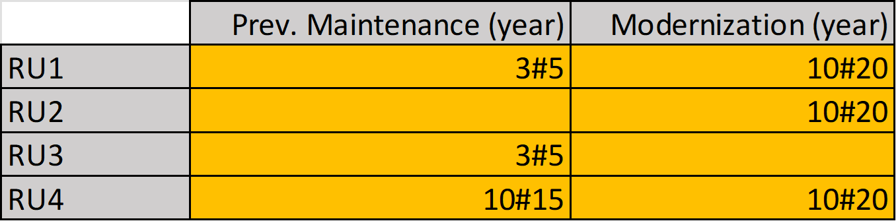
    <br> Fig. 10: View of the 'Planned Maint.' sheet of the input Excel file - Calendar of preventive maintenance and modernization activities for the different RUs.
</p>

For a given RUi, both preventive maintenance and modernization consist in replacing this RUi with the corresponding RUi listed in the '_Inventory - Planned Maint._' sheet of the input Excel file.

Similarly to the energy consumption parameters and fault rates, PELCA allows the user to simulate different planned maintenance calendars for the different mission profiles indicated in the '_LCIC_' sheet.
For instance, in Fig. 10, RU1, RU3 and RU4 have different preventive maintenance calendars and RU1, RU2 and RU4 have different modernization calendars, corresponding to the two mission profiles indicated in the '_LCIC_' sheet (see Fig. 5).

The user should note that :
- If '_Preventive Maintenance_' or '_Modernization_' is deactivated (set to 'False' in the '_LCIC_' sheet (see Fig. 5)), PELCA will automatically ignore the disabled type of planned maintenance for all RUs listed in the '_Inventory - Planned Maintenance_' and '_Inventory - Cur. Maint._' sheets ; if both types of planned maintenance are disabled, the time loop bypasses the planned maintenance step and moves directly to curative maintenance (see also [Algorithm](Algorithm.md)) ;
- If, for a given RUi and a given type of planned maintenance, no calendar information is indicated, PELCA will ignore the type of planned maintenance with missing calendar information for the concerned RU (e.g. '_Preventive Maintenance_' for RU1 in Fig 10) ;
- If, for a given RUi and a given type of planned maintenance, only one calendar information is indicated, PELCA will use the indicated calendar information to simulate this type of planned maintenance for the given RU, independently from the number of mission profiles indicated in the '_LCIC_' sheet ;
- If, for a given RUi, both types of planned maintenance have the same calendar, PELCA considers that the modernization intervention is prioritary and the preventive maintenance operation is ignored for this RU ; thus only the impacts of the modernization operation are appended ;
- If, for a given RUi and a given type of planned maintenance, a number of calendar information strictly higher than 1 but different from the number of mission profiles indicated in the '_LCIC_' sheet is indicated, PELCA will indicate an error.

Therefore, in PELCA 2.0, preventive maintenance and modernization are both considered as '_Planned Maintenance_' operations. 
Those two types of planned maintenance operation share the same list of activities / RUs included in the '_Inventory - Planned Maint._' sheet of the input Excel file, which is aimed to represent the impacts of the different '_Planned Maintenance_' operations.
Also, for a given RUi, the same economic impact applies to both preventive maintenance and modernization operations (see Fig. 7)).
However, the user is able to fine tune the respective environmental and economic impacts of preventive maintenance and modernization operations by indicating or not calendar information for each RUi and each type of planned maintenance in the '_Planned Maint._' sheet. 
By indicating calendar information or leaving the cell empty for a given RUi and a given type of planned maintenance operation, the user is able to modulate the number of RUs considered in the frame of both types of planned maintenance operations and thus to adjust their respective environmental and economic impacts.

Complementary, the '_Downtime_' impact of both types of planned maintenance operation can be adjusted in the '_Downtime_' sheet of the input Excel file (see Fig. 8), given that the respective duration of those two types of planned maintenance operation may differ significantly. 

In addition, the user should note that those two types of planned maintenance operations also have different impacts on the maintenance calendar :
- A preventive maintenance operation does not reset the time counter of modernization ;
- A modernization operation automatically resets the time counter of preventive maintenance to 0.
The user can also refer to [Algorithm](Algorithm.md) for more details.


### **'_Cur. Maint. (replac. matrix)_' sheet**:
In the '_Cur. Maint. (replac. matrix)_' sheet of the input Excel file, the user is invited to fill-out the matrix of the replacement ratios of the system (also called '_replacement matrix_').
This matrix is to be seen as a representation of the maintainability of the system in the frame of a curative maintenance, this curative maintainability being a combination of the dismountability (ability of a system to be dismounted) and of the diagnosticability of the system (ability of a system to locate a fault when it occurs).

<p align="center">
    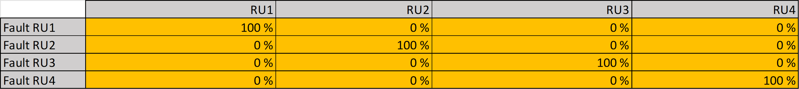
    <br> Fig. 11: View of the 'Cur. Maint. (replac. matrix)' sheet of the input Excel file - Curative maintenance configuration with perfect diagnosticability and fully selective replacement
</p>

The values indicated in the replacement matrix indicate the probability to replace each RU (in the columns) when one of the RUs fails (rows).
Thus, the user can indicate any value between 0 and 100% as replacement ratio.

In Figure 11 above, the replacement matrix is fully diagonal, with 100% in the diagonal and 0 otherwise.
This means that the system exhibits full dismountability and diagnosticability, allowing to precisely locate a fault when it occurs and to selectively replace the faulty part:
- When RUi fails: the probability to replace RUi is 100% but the probability to replace RUj&ne;i is 0%.

In an opposite fashion, Fig. 12 shows the replacement matrix of a system with poor dismountability and diagnosticability :

<p align="center">
    
    <br> Fig. 12: View of the 'Cur. Maint. (replac. matrix)' sheet of the input Excel file - Curative maintenance configuration with poor diagnosticability and no selective replacement
</p>

In the case of Figure 12, the system exhibits poor curative maintainability since when RUi fails, the probability to replace RUi is 100% but the probability to replace RUj&ne;i is different from 0%. For instance :
- When RU1 fails: the probabilities to replace RU1, RU2, RU3 and RU4 are 100%, 80%, 40%, and 80%, respectively.

More details regarding the replacement matrix and the impact of its content on the PELCA simulations can be found in [Algorithm](Algorithm.md).


## Running PELCA
When launching the software (by running the **_main_gui.py_** Python script, see [README](../README.md) for more details), the following splash screen will first appear while PELCA is being loaded :

<p align="center">
    
    <br> Fig. 13 : View of the splash screen of PELCA 2.0
</p>

Then, the graphical user interface (GUI) below will pop-up:

<p align="center">
    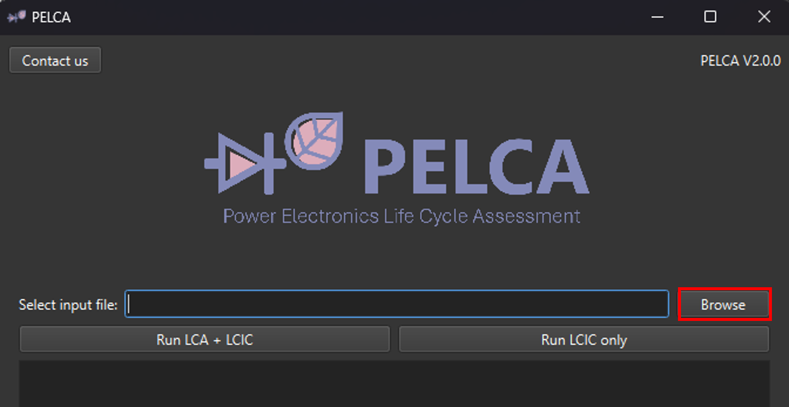
    <br> Fig. 14 : View of the main graphical user interface (GUI) of PELCA 2.0
</p>

Click on **‘_Browse_’** to select the PELCA input Excel file of the system to be simulated.

Once the Excel file has been browsed, the user has two options :
1.	Run PELCA by clicking on the **‘_Run LCA + LCIC_’** button : this option will first launch the LCA calculation of the impacts at t0 of the different phases of the system's life cycle (which will be compiled in the ‘_LCA output_’ results Excel file stored in the ‘_Results PELCA_’ folder, see also [LCA output](#_lca-output_-)) and then will launch the calculation of the life cycle impact curves (LCICs) (which will be compiled in the ‘_LCIC output_’ results Excel file stored in the ‘_Results PELCA_’ folder, see also [LCIC output](#_lcic-output_-)) ;
2.  Run PELCA by clicking on the **‘_Run LCIC only_’** button : this option will launch only the simulation of the LCICs curves, based on an existing ‘_LCA output_’ results Excel file, and leads to the creation of a ‘_LCIC output_’ results Excel file.
This mode of running PELCA is faster since the '_LCA output_' results Excel file has already been computed.
The user should note that the **'_Run LCIC only_'** mode requires that the names of the activities / RUs listed in the '_LCA output_' file match those listed in the different inventory sheets of the input Excel file.

<p align="center">
    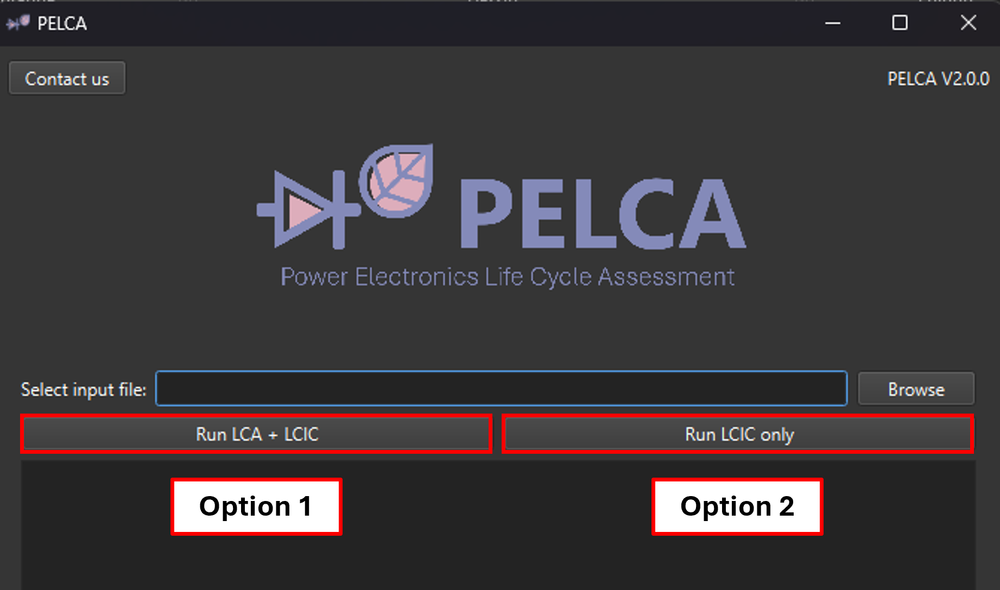
    <br> Fig. 15 : View of the two options to run PELCA once the input Excel file has been browsed
</p>

The terminal will show the script of the execution process. 
When the calculation is complete, a second window will appear displaying various result graphs, as shown below :

<p align="center">
    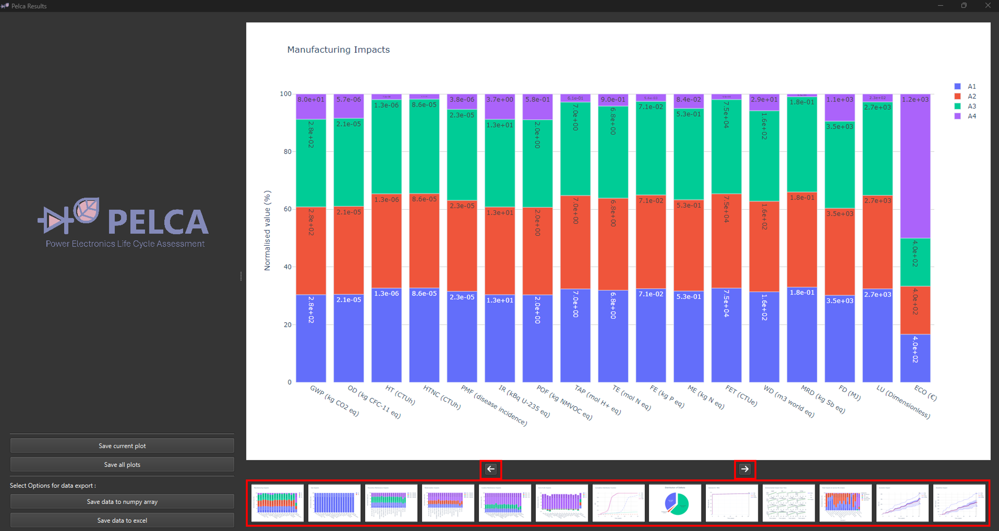
    <br> Fig. 16 : View of the PELCA results window displaying the different graphs generated after execution
</p>

The user can navigate between the plots using the '_Next_' and '_Previous_' arrow buttons or by clicking directly on the plot image.

By circulating the cursor on the different sections of the bar graphs, PELCA will display the type of impact, the impact value, and the corresponding activity or RU responsible for this impact.
Similarly, by navigating the cursor on the Life Cycle Impact Curve (LCIC) of the selected EI, economic impact, or downtime impact, PELCA will display the name of the curve (Max, Min, Mean, or Median) and the (X,Y) coordinates of the targetted point 

<p align="center">
    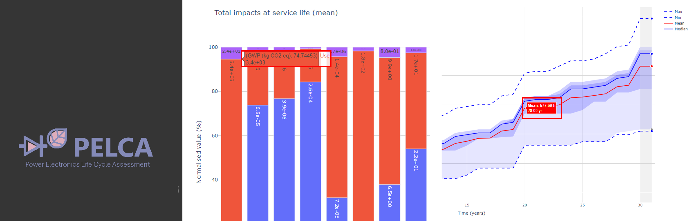
    <br> Fig. 17 : View of the details accessible on the output graphs provided by PELCA
</p>

By using the '_Zoom_' function in the upper right menu of each graph, the user is able to focus on a specific area of the plot and have a finer visual access to the outuput data.
By double-clicking on the zoomed area or by clicking on the '_Reset axes_' function, PELCA will restore the initial graph scaling.

<p align="center">
    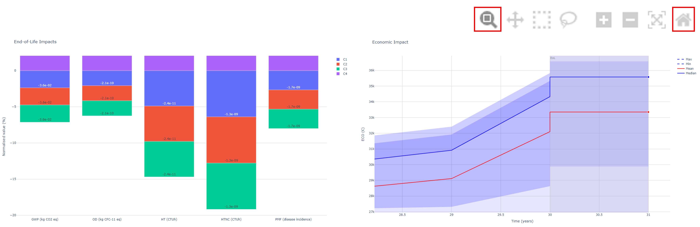
    <br> Fig. 18 : View of zoomed areas on the output graphs provided by PELCA
</p>

The user is also able to focus on the contributions of specific activities or RUs by selecting / deselecting them in the legend of each graph, as shown on Fig. 19.

<p align="center">
    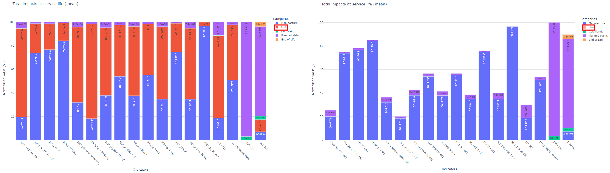
    <br> Fig. 19 : View of an output bar graph with a selected / deselected activity (here, the Use phase impacts are selected or deselected)
</p>


## Saving data
The calculation results Excel files (‘_LCA outpout_’ and ‘_LCIC output_’) and all the data saved from the PELCA simulation will be located in the ‘_Results PELCA_’ folder, of which location has been set by the user in cell B2 of the ‘_LCA_’ sheet of the input Excel file (see Fig. 3).

```Results PELCA```

In the graphical results window of PELCA (Fig. 16), the user can save a specific plot by displaying the chosen plot and clicking on the ‘_Save current plot_’ button.

To save all plots at one time, click on the ‘_Save all plots_’ button.

By default, the plots will be saved in HTML, PNG, and SVG formats, in three dedicated subfolders located in the ‘_plots_’ folder located in the ‘_Results PELCA_’ folder :

```plots```
- [X] ```html```
- [X] ```png```
- [X] ```svg```

The user can also save life cycle data for all RUs across all Monte Carlo iterations by clicking the ‘_Save data to numpy array_’ or ‘_Save data to excel_’ buttons, in either numpy data format or Excel format, respectively.
The data will automatically be saved in dedicated ‘_excel_’ and ‘_numpy_’ folders located in the ‘_Results PELCA_’ folder :

- [X] ```excel```
- [X] ```numpy```

The data options include : distribution of defects (‘_fault_cause.xlsx_’), manufacturing-only impacts (‘_Impact_manu.xlsx_’), usage-only impacts (‘_Impact_use.xlsx_’), total impacts (manufacturing + usage) (‘_Impact_total.xlsx_’), and RU age data (‘_RU_age.xlsx_’) :

- [X] ```fault_cause```
- [X] ```Impact_manu```
- [X] ```Impact_use```
- [X] ```Impact_total```
- [X] ```RU_age```

For this release 2.0 of PELCA, the formating of the output data in Excel format has been optimized.

## Output graphs
Figure 20 presents in more details the different types of results and graphs that can be generated by PELCA.

<p align="center">
    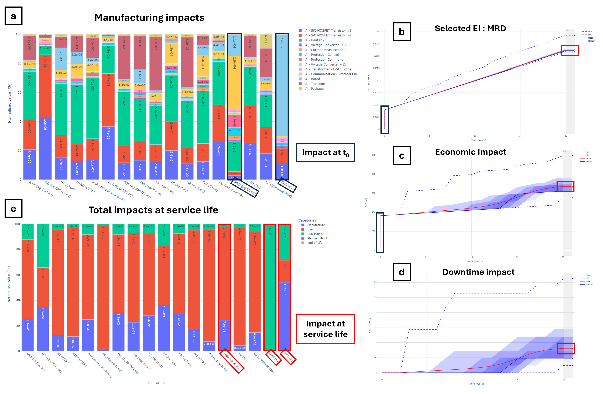
    <br> Fig. 20 :  View of the different types of graphs which can be generated by PELCA
</p>

Below are the graphs details :
- (a) shows the normalized manufacturing impacts (environmental and economic) of the different activities listed in the '_Inventory - Manufacturing_' sheet of the input Excel file ;
- (b) shows the LCIC of the environmental impact category selected in cell B17 of the '_LCIC_' sheet of the input Excel file throughout the system's service life (here : Mineral resource depletion (MRD) ;
- (c) shows, similarly to (b), the LCIC of the system's economic impact throughout its service life, based on the information provided by the user in the '_Cost - Price_' sheet of the input Excel file ;
- (d) shows, similarly to figure (b) and (c), the LCIC of the system's downtime impact throughout its service life, based on the information provided by the user in the '_Downtime_' sheet of the input Excel file.
- (e) shows the total mean impacts (environmental, economic, and downtime) throughout the system's service life, with proportions related to manufacturing, use, planned maintenance, curative maintenance, and end of life (EoL).

As shown in Figure 21, LCIC curves exhibit an initial step corresponding to the impact of the manufacturing phase (for the downtime impact, the LCIC always starts at 0).
The successive steps in the LCIC curve correspond to planned or unplanned maintenance operations triggered by calendar parameters of preventive maintenance and/or modernization (planned maintenance) or by failure of replaceable units (RUs) and their replacement based on the replacement matrix of the '_Cur. Maint._' sheet (unplanned maintenance). 

<p align="center">
    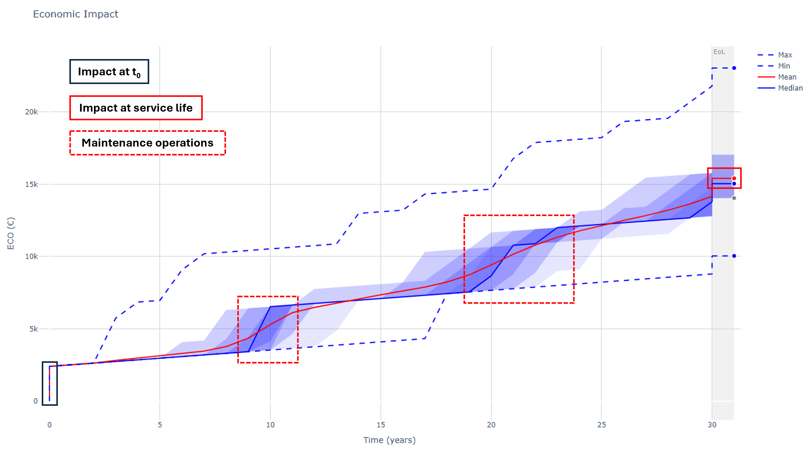
    <br> Fig. 21 :  View of a typical LCIC curve with initial step induced by manufacturing, successive steps triggered by maintenance operations, and end-point at the end of the system's service life
</p>

The bar graphs generated by PELCA always shows, for each activity or RU, the mean value of the computed impact throughout the service life of the system.

Complementary to those graphs, PELCA also provides the breakdown structure of the diffferent types of faults (early, random, and wear-out, see (f) in Fig. 21)) occurring during the system's service life, based on the activation / deactivation of each type of fault and on the associated Weibull parameters, 
and a bar graph detailing the respective contribution of each RU to the environmental, economic, and downtime impacts of curative maintenance operations (see (g) in Fig. 21) :

<p align="center">
    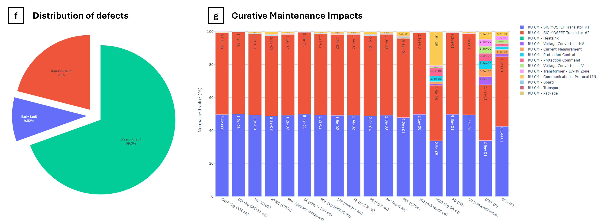
    <br> Fig. 22 :  View of the graphs showing the distribution of faults and the breakdown structure of the impacts of curative maintenance operations 
</p>

Depending on the activation / deactivation of the planned maintenance operations (preventive maintenance and/or modernization) in the '_LCIC_' sheet of the input Excel file, and based on the calendar information provided by the user in the '_Planned Maint._' sheet, 
PELCA can also generate bar graphs detailing the respective contribution of each RU to the environmental, economic, and downtime impacts of preventive maintenance and modernization operations :

<p align="center">
    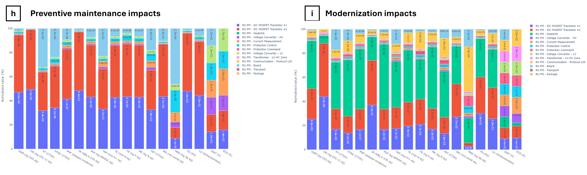
    <br> Fig. 23 :  View of the bar graphs showing the breakdown structure of the impacts of preventive maintenance and modernization operations
</p>

Finally, the following additional graphs are accessible through PELCA :
- Normalized end-of-life (EoL) impacts (environmental and economic) of the different activities listed in the '_Inventory - EoL_' sheet of the input Excel file ;
- Cumulative distribution function (CDF), representing the probability of failure between 0 and 1 over time, plotted for the entire system ;
- LCICs of the 16 environmental impact categories of the PEF method throughout the system's service life.

The economic impact of the simulated system throughout its life cycle is also provided in the '_LCIC output_' results Excel file (see the section below).

## Output Excel files
Complementary to the graphical outputs generated by PELCA, 2 output results Excel files are generated by the software :

### **'_LCA output_'** :
This output Excel file details the assessed environmental impacts (e.g. 16 in total) of the different activities / RUs listed in the inventories at t0 (e.g. at the beginning of the time loop of the algorithm).
The '_LCA output_' Excel file includes 5 sheets corresponding to the '_Manufacturing_', '_Use_', '_Planned Maintenance_', '_Curative Maintenance_', and '_End of Life_' inventories, respectively. 

The impacts of the '_Manufacturing_' sheet of the '_LCA output_' Excel file represent the initial step of the LCICs of the 16 assessed environmental impacts.
The impacts of the '_Use_' sheet of the '_LCA output_' Excel file represent the environmental impacts of 1 hour of energy consumption of the different activities listed in the '_Inventory - Use_' sheet of the Excel file (the unit of energy consumption being kWh/h in PELCA).
If N mission profiles are indicated in the '_LCIC_' sheet of the input Excel file, PELCA will generate N '_Use_' sheets in the '_LCA output_' Excel file, each one corresponding to the environmental impacts of 1 hour of energy consumption of each mission profile.
The impacts of the '_Planned Maintenance_', '_Curative Maintenance_', and '_End-of-Life_' sheets of the -_LCA output_' Excel file represent the initial environmental impacts of the different exchanges listed in the corresponding '_Inventory_' sheets of the input Excel file, not taking into account the service life of the system or its different maintenance operations. 

<p align="center">
    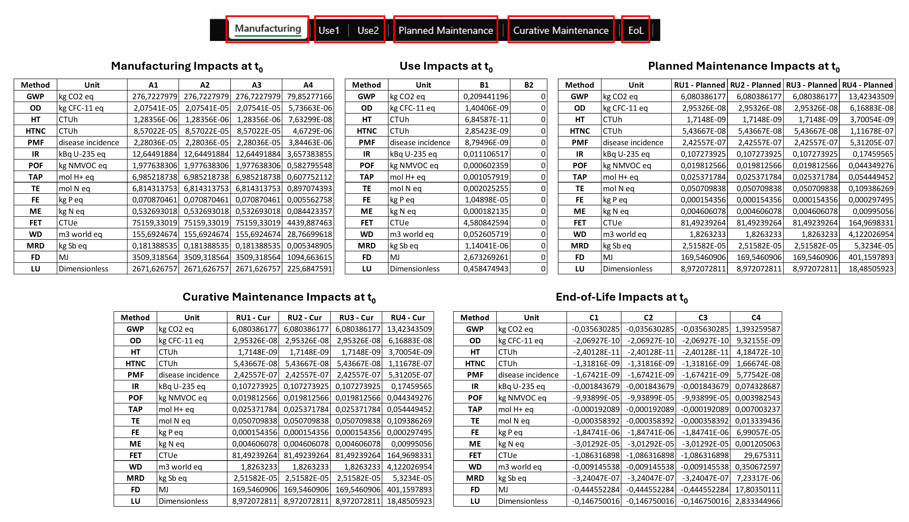
    <br> Fig. 24 : View of the structure of the 'LCA output' Excel file generated by PELCA
</p>

If the user cannot download the ecoinvent database (which requires registration), ready-to-use '_LCA output_' Excel files are provided for the exemplary power electronic systems, containing the LCA impacts assessment results of the two types of exemplary systems :

- ```LCA_v2.0.0_EFuse```
- ```LCA_v2.0.0_PowerModuleAndCapacitor```

Such output Excel files can be used to run PELCA without ecoinvent database registration by clicking the ‘_Run LCIC only_’ button ; it will replace the ‘_LCA output_’ results file that is automatically generated by PELCA when running the full LCA calculation by pressing the ‘_Run LCA + LCIC_’ button.
For this output Excel file to be taken into account by PELCA when launching a calculation using the ‘_Run LCIC only_’ button, it is necessary that the user first copy-paste the Excel file into a folder named ‘_Results PELCA_’, located at the LCA result path location indicated in the '_LCA_' sheet of the input Excel file (see Fig. 2), and rename it ‘_LCA output_’.

Note that the economic impact at t0 is included in the '_Manufacturing Summary_' sheet of the '_LCIC output_' results Excel file (see Fig. 24).
Also, the downtime impact is not included in this ‘_LCA output_’ results Excel file since this impact is only assessed throughout the whole life cycle of the system, and is therefore included in the ‘LCIC output’ results Excel file (see Fig. 24).

### **'_LCIC output_'** :
This output Excel file compiles the total environmental, economic, and downtime impacts (i.e. 18 in total) assessed throughout the different phases of the system's life cycle.
It includes 6 sheets corresponding to the total impacts of each phase of the system's life cycle throughout its service life :
- '_Summary_' : recap of the total cumulated impacts of the 5 phases of the system's life cycle ;
- '_Manufacturing Summary_' : total manufacturing impacts ;
- '_Use Phase Summary_' : total use phase impacts (including all mission profiles) ;
- '_Planned Maint. Summary_' : total impacts of planned maintenance operations (including preventive maintenance and modernization) ;
- '_Curative Maint. Summary_' : total impacts of curative maintenance operations ;
- '_End of Life Summary_' : total end-of-life impacts.
For the 5 sheets dedicated to each phase of the system life cycle, the total impacts are discretized per activity or RU to reflect the respective contributions of the different activities / RUs.

<p align="center">
    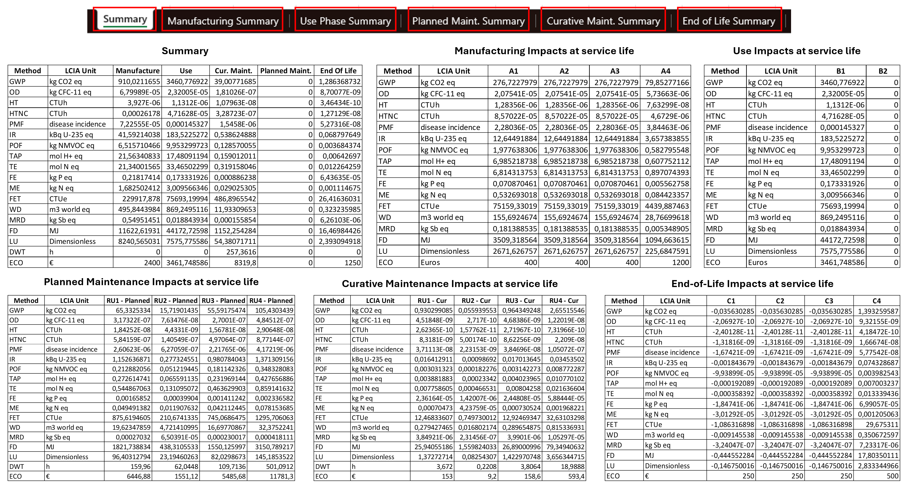
    <br> Fig. 25: View of the structure of the 'LCIC output' Excel file generated by PELCA, including the total assessed impacts (environmental, economic, and downtime) of the system throughout its service life
</p>

More details regarding the calculation of the different impacts along the life cycle of the system can be found in the [Algorithm.md](Algorithm.md) documentation.
